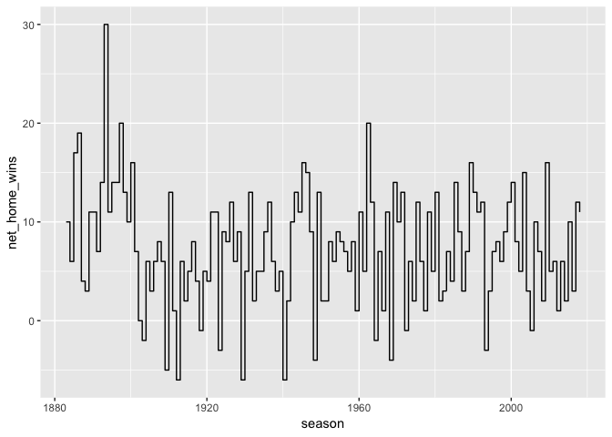

TidyVerse - A Complete History of MLB
================
Stephanie Roark
12/5/2018

### America's Pastime

Let's take a look at the complete history of Major League Baseball from 1871 to present.

The MLB Complete History dataset contains two separate systems for rating teams; the simpler Elo ratings, used for The Complete History Of MLB, and the more involved — and confusingly named — "ratings" that are used in our MLB Predictions. This dataset contains an Elo-based rating system and predictive model for baseball that accounts for home-field advantage, margin of victory, park and era effects, travel, rest and — most importantly — starting pitchers.Elo is a simple way to rate competitors that can be tuned and customized endlessly to incorporate available data.

For baseball fans, all the descriptions for the datasets can be found here: [How Our MLB Predictions Work](https://fivethirtyeight.com/features/how-our-mlb-predictions-work/)

First, we load the data from [FiveThirtyEight.com](%22https://data.fivethirtyeight.com/%22)

``` r
library(tidyverse)
library(knitr)

Url <- "https://projects.fivethirtyeight.com/mlb-api/mlb_elo.csv"
MLBdata <- read.csv(file = Url, header = TRUE, sep = ",")
kable(head(MLBdata))
```

| date       |  season|  neutral| playoff | team1 | team2 |  elo1\_pre|  elo2\_pre|  elo\_prob1|  elo\_prob2|  elo1\_post|  elo2\_post|  rating1\_pre|  rating2\_pre| pitcher1        | pitcher2          |  pitcher1\_rgs|  pitcher2\_rgs|  pitcher1\_adj|  pitcher2\_adj|  rating\_prob1|  rating\_prob2|  rating1\_post|  rating2\_post|  score1|  score2|
|:-----------|-------:|--------:|:--------|:------|:------|----------:|----------:|-----------:|-----------:|-----------:|-----------:|-------------:|-------------:|:----------------|:------------------|--------------:|--------------:|--------------:|--------------:|--------------:|--------------:|--------------:|--------------:|-------:|-------:|
| 2018-10-28 |    2018|        0| w       | LAD   | BOS   |   1572.027|   1603.193|   0.4862531|   0.5137469|    1568.153|    1607.066|      1576.245|      1606.237| Clayton Kershaw | David Price       |       55.72020|       55.90411|       8.777848|     11.1913925|      0.4838771|      0.5161229|       1572.396|       1610.086|       1|       5|
| 2018-10-27 |    2018|        0| w       | LAD   | BOS   |   1575.480|   1599.739|   0.4995027|   0.5004973|    1572.027|    1603.193|      1579.775|      1602.707| Rich Hill       | Eduardo Rodriguez |       54.47421|       53.63815|       3.666228|      0.3866077|      0.5083420|      0.4916580|       1576.245|       1606.237|       6|       9|
| 2018-10-26 |    2018|        0| w       | LAD   | BOS   |   1573.220|   1601.999|   0.4908324|   0.5091676|    1575.480|    1599.739|      1577.877|      1604.605| Walker Buehler  | Rick Porcello     |       57.86924|       51.14604|      20.863039|    -11.1236660|      0.5559070|      0.4440930|       1579.775|       1602.707|       3|       2|
| 2018-10-24 |    2018|        0| w       | BOS   | LAD   |   1600.026|   1575.193|   0.5926204|   0.4073796|    1601.999|    1573.220|      1602.811|      1579.671| David Price     | Hyun-Jin Ryu      |       55.36010|       51.91669|       9.286617|     -7.2494460|      0.6198083|      0.3801917|       1604.605|       1577.877|       4|       2|
| 2018-10-23 |    2018|        0| w       | BOS   | LAD   |   1597.035|   1578.184|   0.5814915|   0.4185085|    1600.026|    1575.193|      1600.469|      1582.014| Chris Sale      | Clayton Kershaw   |       64.08947|       56.62859|      50.165559|     14.1844384|      0.6489541|      0.3510459|       1602.811|       1579.671|       8|       4|
| 2018-10-20 |    2018|        0| l       | MIL   | LAD   |   1561.263|   1574.030|   0.5215406|   0.4784594|    1557.109|    1578.184|      1565.239|      1577.979| Jhoulys Chacin  | Walker Buehler    |       54.69401|       57.92168|      14.107999|     20.4168461|      0.5095001|      0.4904999|       1561.205|       1582.014|       1|       5|

What makes data tidy and clean?

Tiday Data:

1.  Data Structures : data is organized in columns and rows with labels.
2.  Data Semantics : data is a collection of values, usually either numbers (if quantitative) or strings (if qualitative) and every value belongs to a variable and an observation.
3.  A dataset is messy or tidy depending on how rows, columns and tables are matched up with observations, variables and types.

Or more simply put, tidy data means that each variable forms a column; each observation forms a row; each type of observational unit forms a table.

5 Most common problems to find when tidying data:

• Column headers are values, not variable names. • Multiple variables are stored in one column. • Variables are stored in both rows and columns. • Multiple types of observational units are stored in the same table. • A single observational unit is stored in multiple tables.

Once the data is tidy, you need to clean it (just like a house can't be cleaned until everything is tidyied up.) Check the data for missing values, labels that make sense, errors, units, outliers, etc.

Let's start by looking at the structure of the data and to see if there is any missing data:

``` r
#structure of the data - from this we can see that there are both numeric and categorical data
str(MLBdata)
```

    ## 'data.frame':    217544 obs. of  26 variables:
    ##  $ date        : Factor w/ 25902 levels "1871-05-04","1871-05-05",..: 25902 25901 25900 25899 25898 25897 25896 25895 25894 25894 ...
    ##  $ season      : int  2018 2018 2018 2018 2018 2018 2018 2018 2018 2018 ...
    ##  $ neutral     : int  0 0 0 0 0 0 0 0 0 0 ...
    ##  $ playoff     : Factor w/ 5 levels "","c","d","l",..: 5 5 5 5 5 4 4 4 4 4 ...
    ##  $ team1       : Factor w/ 89 levels "ANA","ARI","ATL",..: 40 40 40 9 9 44 44 31 31 40 ...
    ##  $ team2       : Factor w/ 89 levels "ANA","ARI","ATL",..: 9 9 9 40 40 40 40 9 9 44 ...
    ##  $ elo1_pre    : num  1572 1575 1573 1600 1597 ...
    ##  $ elo2_pre    : num  1603 1600 1602 1575 1578 ...
    ##  $ elo_prob1   : num  0.486 0.5 0.491 0.593 0.581 ...
    ##  $ elo_prob2   : num  0.514 0.5 0.509 0.407 0.419 ...
    ##  $ elo1_post   : num  1568 1572 1575 1602 1600 ...
    ##  $ elo2_post   : num  1607 1603 1600 1573 1575 ...
    ##  $ rating1_pre : num  1576 1580 1578 1603 1600 ...
    ##  $ rating2_pre : num  1606 1603 1605 1580 1582 ...
    ##  $ pitcher1    : Factor w/ 5886 levels "","A.J. Burnett",..: 990 4473 5502 1262 949 2624 5483 2772 912 990 ...
    ##  $ pitcher2    : Factor w/ 5840 levels "","A.J. Burnett",..: 1271 1531 4441 2500 999 5470 2500 1271 4441 5450 ...
    ##  $ pitcher1_rgs: num  55.7 54.5 57.9 55.4 64.1 ...
    ##  $ pitcher2_rgs: num  55.9 53.6 51.1 51.9 56.6 ...
    ##  $ pitcher1_adj: num  8.78 3.67 20.86 9.29 50.17 ...
    ##  $ pitcher2_adj: num  11.191 0.387 -11.124 -7.249 14.184 ...
    ##  $ rating_prob1: num  0.484 0.508 0.556 0.62 0.649 ...
    ##  $ rating_prob2: num  0.516 0.492 0.444 0.38 0.351 ...
    ##  $ rating1_post: num  1572 1576 1580 1605 1603 ...
    ##  $ rating2_post: num  1610 1606 1603 1578 1580 ...
    ##  $ score1      : int  1 6 3 4 8 1 7 1 6 5 ...
    ##  $ score2      : int  5 9 2 2 4 5 2 4 8 2 ...

``` r
#are there NA's in the data set
sum(is.na(MLBdata))
```

    ## [1] 136325

We can see that the data consists mostly of numeric values and that there are quite a few NA's.

Let's look to see if there is any missing data or "" values.

``` r
#let's look at one column to see if there are missing entries that do not show up as NA's
MLBdata %>% 
    count(playoff)
```

    ## # A tibble: 5 x 2
    ##   playoff      n
    ##   <fct>    <int>
    ## 1 ""      215964
    ## 2 c           14
    ## 3 d          397
    ## 4 l          504
    ## 5 w          665

``` r
#read the data back in in a different way to automatically convert "" to NA's
#readr converts "" to NA's while reading in the data
MLBdata <- readr::read_csv("https://projects.fivethirtyeight.com/mlb-api/mlb_elo.csv")
```

    ## Parsed with column specification:
    ## cols(
    ##   .default = col_double(),
    ##   date = col_date(format = ""),
    ##   season = col_integer(),
    ##   neutral = col_integer(),
    ##   playoff = col_character(),
    ##   team1 = col_character(),
    ##   team2 = col_character(),
    ##   pitcher1 = col_character(),
    ##   pitcher2 = col_character(),
    ##   score1 = col_integer(),
    ##   score2 = col_integer()
    ## )

    ## See spec(...) for full column specifications.

``` r
sum(is.na(MLBdata))
```

    ## [1] 352365

Now, all of the empty spaces are NA's which helps when performing analysis.

This dataset is already organized in columns and rows, but the names of the columns are confusing. So let's give the variables labels that are easier to understand.

``` r
# do the column names make sense
colnames(MLBdata)
```

    ##  [1] "date"         "season"       "neutral"      "playoff"     
    ##  [5] "team1"        "team2"        "elo1_pre"     "elo2_pre"    
    ##  [9] "elo_prob1"    "elo_prob2"    "elo1_post"    "elo2_post"   
    ## [13] "rating1_pre"  "rating2_pre"  "pitcher1"     "pitcher2"    
    ## [17] "pitcher1_rgs" "pitcher2_rgs" "pitcher1_adj" "pitcher2_adj"
    ## [21] "rating_prob1" "rating_prob2" "rating1_post" "rating2_post"
    ## [25] "score1"       "score2"

``` r
# let's rename the columns so that we can understand their meaning
newcolnames <- c("date", "season", "neutral", "playoff", "home_team", "away_team", 
                 "home_pre-elo", "away_pre-elo", "home_probability", 
                 "away_probability", "home_post-elo", "away_post-elo", 
                 "home_pre-rating", "away_pre-rating", "home_pitcher", "away_pitcher", 
                 "home_pitcher-rgs", "away_pitcher-rgs", "home_pitcher-adj",
                 "away_pitcher-adj", "home_rating-probability", "away_rating-probability",
                 "home_post-rating", "away_post-rating", "home_score", "away_score")

colnames(MLBdata) <- newcolnames
#now we have a better understanding of what each variable represents
colnames(MLBdata)
```

    ##  [1] "date"                    "season"                 
    ##  [3] "neutral"                 "playoff"                
    ##  [5] "home_team"               "away_team"              
    ##  [7] "home_pre-elo"            "away_pre-elo"           
    ##  [9] "home_probability"        "away_probability"       
    ## [11] "home_post-elo"           "away_post-elo"          
    ## [13] "home_pre-rating"         "away_pre-rating"        
    ## [15] "home_pitcher"            "away_pitcher"           
    ## [17] "home_pitcher-rgs"        "away_pitcher-rgs"       
    ## [19] "home_pitcher-adj"        "away_pitcher-adj"       
    ## [21] "home_rating-probability" "away_rating-probability"
    ## [23] "home_post-rating"        "away_post-rating"       
    ## [25] "home_score"              "away_score"

Next let's look at the numeric values using skimr.

``` r
#let's look at summaries of the numeric columns
MLBdata %>%
    select_if(is.numeric) %>%
    skimr::skim()
```

    ## Skim summary statistics
    ##  n obs: 217544 
    ##  n variables: 20 
    ## 
    ## ── Variable type:integer ───────────────────────────────────────────────────────────────────────────────
    ##    variable missing complete      n       mean      sd   p0  p25  p50  p75
    ##  away_score       0   217544 217544    4.4      3.25      0    2    4    6
    ##  home_score       0   217544 217544    4.65     3.29      0    2    4    6
    ##     neutral       0   217544 217544    9.7e-05  0.0098    0    0    0    0
    ##      season       0   217544 217544 1961.58    39.78   1871 1929 1970 1996
    ##  p100     hist
    ##    49 ▇▂▁▁▁▁▁▁
    ##    38 ▇▅▁▁▁▁▁▁
    ##     1 ▇▁▁▁▁▁▁▁
    ##  2018 ▂▃▃▃▃▆▆▇
    ## 
    ## ── Variable type:numeric ───────────────────────────────────────────────────────────────────────────────
    ##                 variable missing complete      n    mean     sd      p0
    ##         away_pitcher-adj   34421   183123 217544    6.61  8      -66.67
    ##         away_pitcher-rgs   33741   183803 217544   50.31  4.18    35.83
    ##            away_post-elo       0   217544 217544 1503.41 38.12  1333.07
    ##         away_post-rating       0   217544 217544 1503.42 38.34  1333.14
    ##             away_pre-elo       0   217544 217544 1503.39 38.01  1334.93
    ##          away_pre-rating       0   217544 217544 1503.39 38.23  1335   
    ##         away_probability       0   217544 217544    0.47  0.077    0.18
    ##  away_rating-probability       0   217544 217544    0.47  0.079    0.18
    ##         home_pitcher-adj   34422   183122 217544    6.58  8.04   -63.32
    ##         home_pitcher-rgs   33741   183803 217544   50.34  4.18    35.44
    ##            home_post-elo       0   217544 217544 1503.77 37.93  1346.22
    ##         home_post-rating       0   217544 217544 1503.76 38.16  1346.38
    ##             home_pre-elo       0   217544 217544 1503.79 37.85  1347.37
    ##          home_pre-rating       0   217544 217544 1503.79 38.07  1347.53
    ##         home_probability       0   217544 217544    0.53  0.077    0.21
    ##  home_rating-probability       0   217544 217544    0.53  0.079    0.2 
    ##      p25     p50     p75    p100     hist
    ##     3.82    7.54    9.82   79.4  ▁▁▁▅▇▁▁▁
    ##    47.4    49.73   52.8    78.05 ▁▂▇▅▁▁▁▁
    ##  1478.73 1505.34 1529.24 1657.99 ▁▁▂▆▇▃▁▁
    ##  1478.73 1505.41 1529.25 1659.34 ▁▁▂▆▇▃▁▁
    ##  1478.77 1505.31 1529.16 1657.99 ▁▁▂▆▇▃▁▁
    ##  1478.77 1505.4  1529.13 1659.34 ▁▁▂▆▇▃▁▁
    ##     0.41    0.46    0.52    0.79 ▁▁▅▇▆▂▁▁
    ##     0.41    0.46    0.52    0.8  ▁▁▅▇▆▂▁▁
    ##     3.82    7.54    9.82   76.3  ▁▁▁▅▇▁▁▁
    ##    47.4    49.75   52.8    77.67 ▁▂▇▅▁▁▁▁
    ##  1478.95 1505.63 1529.62 1657.62 ▁▁▂▆▇▃▁▁
    ##  1478.95 1505.67 1529.53 1658.98 ▁▁▃▇▇▃▁▁
    ##  1479.05 1505.65 1529.57 1656.64 ▁▁▂▇▇▃▁▁
    ##  1479.04 1505.68 1529.5  1658.01 ▁▁▃▇▇▃▁▁
    ##     0.48    0.54    0.59    0.82 ▁▁▂▆▇▅▁▁
    ##     0.48    0.54    0.59    0.82 ▁▁▂▆▇▅▁▁

``` r
#we can see that some variables are shown as numeric but are really ordinal, like season for example
#what are the variables classified as
```

We can see from the histogram that some of the numeric values, like season for example, are really ordinal and not continuously numeric. We could change season to be not numeric(others too maybe) if this would help in analysis, but I will leave it for now.

I want to see if the San Francisco Giants win more games home or away as I often hear announcers discussing teams struggling at one vs. another.

Let's separate out the home games and the away games to see where they win more often. We will look at the net wins and losses for each season.

``` r
#create tables for giants home and giants away to see if they play better at either
MLB_GiantsHome <- MLBdata  %>% 
    filter(home_team == "SFG") %>%
    mutate(sfg_win = ifelse(home_score > away_score, 1, 0)) %>%
    group_by(season) %>%
    summarise(home_wins = sum(sfg_win))


MLB_GiantsAway <- MLBdata  %>% 
    filter(away_team == "SFG") %>%
    mutate(sfg_win = ifelse(away_score > home_score, 1, 0)) %>%
    group_by(season) %>%
    summarise(away_wins = sum(sfg_win))


MLB_GiantsAll <- full_join(MLB_GiantsHome, MLB_GiantsAway, by="season") %>%
    mutate(net_home_wins = home_wins - away_wins)

kable(head(MLB_GiantsAll))
```

|  season|  home\_wins|  away\_wins|  net\_home\_wins|
|-------:|-----------:|-----------:|----------------:|
|    1883|          28|          18|               10|
|    1884|          34|          28|                6|
|    1885|          51|          34|               17|
|    1886|          47|          28|               19|
|    1887|          36|          32|                4|
|    1888|          43|          40|                3|

Now we will plot the net wins and losses by season to see where they win most often and if it's true that they might struggle to win at home.

``` r
#create visualization for giants home and for giants away
ggplot(MLB_GiantsAll, aes(season, net_home_wins) ) +
    geom_step()
```



We can see from the plot of net wins per season, that there were 13 seasons where the San Francisco Giants did actually win more games away than at home. It could be interesting to investigate those seasons to understand why that may have occured.

Also, further analysis could examine the net wins by proportion of games per year and the number of home games vs. away games accounted for.
