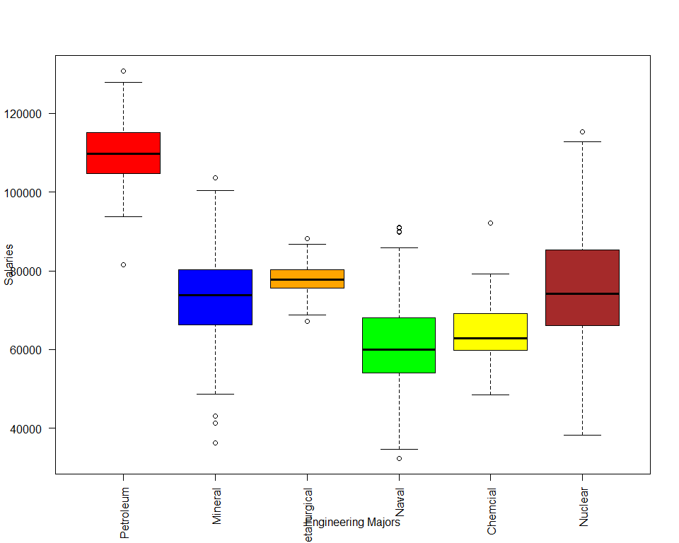

Tidyverse - Box Plot of Salaries of Top 6 Majors
================

## Authors

  - **Initial** - Romerl Elizes

## Summary

In this interesting exercise, I used the college-majors 538 datasets
\[COL\] and used the recent-grads.csv for the basis of my initial
contribution. Using my previous knowledge of DATA 606 Statistics and
usage of tidverse libraries dplyr and ggplot2, I developed a Simple Box
Plot displaying the Salary distributions of the top 6 College Majors.
Since the mean and the standard deviation was not available in the data
set, I had to use good, old-fashioned Statistics to calculate the mean
and the standard deviation base on a sample of the data given its size,
minimum value, and maximum value for each college major.

## Load Libraries

``` r
library(stringr)
library(XML)
library(RCurl)
library(rlist)
library(RJSONIO)
library(tidyr)
library(tidyverse)
library(dplyr)
library(ggplot2)
library(knitr)
library(kableExtra)

options(knitr.table.format = "html")
```

## Define Functions

I defined some functions to help me calculate the mean and the standard
deviation of the data. Since we do not know the mean and the standard
deviation for row of data, I had to create a rough calculation. Given
the size, 25th percentile, and 75th percentile values, I used them to
create a random set of numbers using the runif function. Since we do not
know the minimum value and the maximum value of the data, I had to use
the 25th and 75th percentile values as the them respectively. The
biggest caveat in using these functions is that the mean and sd
functions will generate random set of numbers. That means that the mean
and standard deviation may not be accurate based on the random sample.

``` r
calculateMean <- function(Size, minval, maxval) {
    calcvalue <- mean(runif(Size, minval, maxval))
    return(calcvalue)
}

calculateSD <- function(Size, minval, maxval) {
    calcvalue <- sd(runif(Size, minval, maxval))
    return(calcvalue)
}
```

## Work Being Done

For this part of the assignment, I did the following steps:

  - I read the raw file of recent-grads.csv and outputed to a table.

  - I used kable to display the resulting table.

  - I stored the Major, Median Salary, Size, 25th Percentile, and 75th
    Percentile values in a smaller data frame.

  - I sorted the data frame by descending median salary and only used
    the top 6 salaries for this assignment.

  - I added Mean and SD variables and used the mapply function to
    calculate the mean and standard deviation based on the sample size
    of each row.

  - I used kable to display the resulting table.

  - I created a brand new data frame that creates a normalized
    distribution of 100 points of data based on the calculated mean and
    standard deviation for each of the top 6 majors by salary.

  - I created a box chart that shows a visual representation of the
    data.

<!-- end list -->

``` r
urlfile <- "https://raw.githubusercontent.com/fivethirtyeight/data/master/college-majors/recent-grads.csv"
rgData <- read.table(file = urlfile, header = TRUE, sep = ",")
rgData %>% 
  kable() %>% 
  kable_styling(bootstrap_options = c("striped", "hover", "condensed", "responsive")) %>% 
  scroll_box(width="100%",height="300px")
```

<div style="border: 1px solid #ddd; padding: 5px; overflow-y: scroll; height:300px; overflow-x: scroll; width:100%; ">

<table class="table table-striped table-hover table-condensed table-responsive" style="margin-left: auto; margin-right: auto;">

<thead>

<tr>

<th style="text-align:right;">

Rank

</th>

<th style="text-align:right;">

Major\_code

</th>

<th style="text-align:left;">

Major

</th>

<th style="text-align:right;">

Total

</th>

<th style="text-align:right;">

Men

</th>

<th style="text-align:right;">

Women

</th>

<th style="text-align:left;">

Major\_category

</th>

<th style="text-align:right;">

ShareWomen

</th>

<th style="text-align:right;">

Sample\_size

</th>

<th style="text-align:right;">

Employed

</th>

<th style="text-align:right;">

Full\_time

</th>

<th style="text-align:right;">

Part\_time

</th>

<th style="text-align:right;">

Full\_time\_year\_round

</th>

<th style="text-align:right;">

Unemployed

</th>

<th style="text-align:right;">

Unemployment\_rate

</th>

<th style="text-align:right;">

Median

</th>

<th style="text-align:right;">

P25th

</th>

<th style="text-align:right;">

P75th

</th>

<th style="text-align:right;">

College\_jobs

</th>

<th style="text-align:right;">

Non\_college\_jobs

</th>

<th style="text-align:right;">

Low\_wage\_jobs

</th>

</tr>

</thead>

<tbody>

<tr>

<td style="text-align:right;">

1

</td>

<td style="text-align:right;">

2419

</td>

<td style="text-align:left;">

PETROLEUM ENGINEERING

</td>

<td style="text-align:right;">

2339

</td>

<td style="text-align:right;">

2057

</td>

<td style="text-align:right;">

282

</td>

<td style="text-align:left;">

Engineering

</td>

<td style="text-align:right;">

0.1205643

</td>

<td style="text-align:right;">

36

</td>

<td style="text-align:right;">

1976

</td>

<td style="text-align:right;">

1849

</td>

<td style="text-align:right;">

270

</td>

<td style="text-align:right;">

1207

</td>

<td style="text-align:right;">

37

</td>

<td style="text-align:right;">

0.0183805

</td>

<td style="text-align:right;">

110000

</td>

<td style="text-align:right;">

95000

</td>

<td style="text-align:right;">

125000

</td>

<td style="text-align:right;">

1534

</td>

<td style="text-align:right;">

364

</td>

<td style="text-align:right;">

193

</td>

</tr>

<tr>

<td style="text-align:right;">

2

</td>

<td style="text-align:right;">

2416

</td>

<td style="text-align:left;">

MINING AND MINERAL ENGINEERING

</td>

<td style="text-align:right;">

756

</td>

<td style="text-align:right;">

679

</td>

<td style="text-align:right;">

77

</td>

<td style="text-align:left;">

Engineering

</td>

<td style="text-align:right;">

0.1018519

</td>

<td style="text-align:right;">

7

</td>

<td style="text-align:right;">

640

</td>

<td style="text-align:right;">

556

</td>

<td style="text-align:right;">

170

</td>

<td style="text-align:right;">

388

</td>

<td style="text-align:right;">

85

</td>

<td style="text-align:right;">

0.1172414

</td>

<td style="text-align:right;">

75000

</td>

<td style="text-align:right;">

55000

</td>

<td style="text-align:right;">

90000

</td>

<td style="text-align:right;">

350

</td>

<td style="text-align:right;">

257

</td>

<td style="text-align:right;">

50

</td>

</tr>

<tr>

<td style="text-align:right;">

3

</td>

<td style="text-align:right;">

2415

</td>

<td style="text-align:left;">

METALLURGICAL ENGINEERING

</td>

<td style="text-align:right;">

856

</td>

<td style="text-align:right;">

725

</td>

<td style="text-align:right;">

131

</td>

<td style="text-align:left;">

Engineering

</td>

<td style="text-align:right;">

0.1530374

</td>

<td style="text-align:right;">

3

</td>

<td style="text-align:right;">

648

</td>

<td style="text-align:right;">

558

</td>

<td style="text-align:right;">

133

</td>

<td style="text-align:right;">

340

</td>

<td style="text-align:right;">

16

</td>

<td style="text-align:right;">

0.0240964

</td>

<td style="text-align:right;">

73000

</td>

<td style="text-align:right;">

50000

</td>

<td style="text-align:right;">

105000

</td>

<td style="text-align:right;">

456

</td>

<td style="text-align:right;">

176

</td>

<td style="text-align:right;">

0

</td>

</tr>

<tr>

<td style="text-align:right;">

4

</td>

<td style="text-align:right;">

2417

</td>

<td style="text-align:left;">

NAVAL ARCHITECTURE AND MARINE ENGINEERING

</td>

<td style="text-align:right;">

1258

</td>

<td style="text-align:right;">

1123

</td>

<td style="text-align:right;">

135

</td>

<td style="text-align:left;">

Engineering

</td>

<td style="text-align:right;">

0.1073132

</td>

<td style="text-align:right;">

16

</td>

<td style="text-align:right;">

758

</td>

<td style="text-align:right;">

1069

</td>

<td style="text-align:right;">

150

</td>

<td style="text-align:right;">

692

</td>

<td style="text-align:right;">

40

</td>

<td style="text-align:right;">

0.0501253

</td>

<td style="text-align:right;">

70000

</td>

<td style="text-align:right;">

43000

</td>

<td style="text-align:right;">

80000

</td>

<td style="text-align:right;">

529

</td>

<td style="text-align:right;">

102

</td>

<td style="text-align:right;">

0

</td>

</tr>

<tr>

<td style="text-align:right;">

5

</td>

<td style="text-align:right;">

2405

</td>

<td style="text-align:left;">

CHEMICAL ENGINEERING

</td>

<td style="text-align:right;">

32260

</td>

<td style="text-align:right;">

21239

</td>

<td style="text-align:right;">

11021

</td>

<td style="text-align:left;">

Engineering

</td>

<td style="text-align:right;">

0.3416305

</td>

<td style="text-align:right;">

289

</td>

<td style="text-align:right;">

25694

</td>

<td style="text-align:right;">

23170

</td>

<td style="text-align:right;">

5180

</td>

<td style="text-align:right;">

16697

</td>

<td style="text-align:right;">

1672

</td>

<td style="text-align:right;">

0.0610977

</td>

<td style="text-align:right;">

65000

</td>

<td style="text-align:right;">

50000

</td>

<td style="text-align:right;">

75000

</td>

<td style="text-align:right;">

18314

</td>

<td style="text-align:right;">

4440

</td>

<td style="text-align:right;">

972

</td>

</tr>

<tr>

<td style="text-align:right;">

6

</td>

<td style="text-align:right;">

2418

</td>

<td style="text-align:left;">

NUCLEAR ENGINEERING

</td>

<td style="text-align:right;">

2573

</td>

<td style="text-align:right;">

2200

</td>

<td style="text-align:right;">

373

</td>

<td style="text-align:left;">

Engineering

</td>

<td style="text-align:right;">

0.1449670

</td>

<td style="text-align:right;">

17

</td>

<td style="text-align:right;">

1857

</td>

<td style="text-align:right;">

2038

</td>

<td style="text-align:right;">

264

</td>

<td style="text-align:right;">

1449

</td>

<td style="text-align:right;">

400

</td>

<td style="text-align:right;">

0.1772264

</td>

<td style="text-align:right;">

65000

</td>

<td style="text-align:right;">

50000

</td>

<td style="text-align:right;">

102000

</td>

<td style="text-align:right;">

1142

</td>

<td style="text-align:right;">

657

</td>

<td style="text-align:right;">

244

</td>

</tr>

<tr>

<td style="text-align:right;">

7

</td>

<td style="text-align:right;">

6202

</td>

<td style="text-align:left;">

ACTUARIAL SCIENCE

</td>

<td style="text-align:right;">

3777

</td>

<td style="text-align:right;">

2110

</td>

<td style="text-align:right;">

1667

</td>

<td style="text-align:left;">

Business

</td>

<td style="text-align:right;">

0.4413556

</td>

<td style="text-align:right;">

51

</td>

<td style="text-align:right;">

2912

</td>

<td style="text-align:right;">

2924

</td>

<td style="text-align:right;">

296

</td>

<td style="text-align:right;">

2482

</td>

<td style="text-align:right;">

308

</td>

<td style="text-align:right;">

0.0956522

</td>

<td style="text-align:right;">

62000

</td>

<td style="text-align:right;">

53000

</td>

<td style="text-align:right;">

72000

</td>

<td style="text-align:right;">

1768

</td>

<td style="text-align:right;">

314

</td>

<td style="text-align:right;">

259

</td>

</tr>

<tr>

<td style="text-align:right;">

8

</td>

<td style="text-align:right;">

5001

</td>

<td style="text-align:left;">

ASTRONOMY AND ASTROPHYSICS

</td>

<td style="text-align:right;">

1792

</td>

<td style="text-align:right;">

832

</td>

<td style="text-align:right;">

960

</td>

<td style="text-align:left;">

Physical Sciences

</td>

<td style="text-align:right;">

0.5357143

</td>

<td style="text-align:right;">

10

</td>

<td style="text-align:right;">

1526

</td>

<td style="text-align:right;">

1085

</td>

<td style="text-align:right;">

553

</td>

<td style="text-align:right;">

827

</td>

<td style="text-align:right;">

33

</td>

<td style="text-align:right;">

0.0211674

</td>

<td style="text-align:right;">

62000

</td>

<td style="text-align:right;">

31500

</td>

<td style="text-align:right;">

109000

</td>

<td style="text-align:right;">

972

</td>

<td style="text-align:right;">

500

</td>

<td style="text-align:right;">

220

</td>

</tr>

<tr>

<td style="text-align:right;">

9

</td>

<td style="text-align:right;">

2414

</td>

<td style="text-align:left;">

MECHANICAL ENGINEERING

</td>

<td style="text-align:right;">

91227

</td>

<td style="text-align:right;">

80320

</td>

<td style="text-align:right;">

10907

</td>

<td style="text-align:left;">

Engineering

</td>

<td style="text-align:right;">

0.1195589

</td>

<td style="text-align:right;">

1029

</td>

<td style="text-align:right;">

76442

</td>

<td style="text-align:right;">

71298

</td>

<td style="text-align:right;">

13101

</td>

<td style="text-align:right;">

54639

</td>

<td style="text-align:right;">

4650

</td>

<td style="text-align:right;">

0.0573423

</td>

<td style="text-align:right;">

60000

</td>

<td style="text-align:right;">

48000

</td>

<td style="text-align:right;">

70000

</td>

<td style="text-align:right;">

52844

</td>

<td style="text-align:right;">

16384

</td>

<td style="text-align:right;">

3253

</td>

</tr>

<tr>

<td style="text-align:right;">

10

</td>

<td style="text-align:right;">

2408

</td>

<td style="text-align:left;">

ELECTRICAL ENGINEERING

</td>

<td style="text-align:right;">

81527

</td>

<td style="text-align:right;">

65511

</td>

<td style="text-align:right;">

16016

</td>

<td style="text-align:left;">

Engineering

</td>

<td style="text-align:right;">

0.1964503

</td>

<td style="text-align:right;">

631

</td>

<td style="text-align:right;">

61928

</td>

<td style="text-align:right;">

55450

</td>

<td style="text-align:right;">

12695

</td>

<td style="text-align:right;">

41413

</td>

<td style="text-align:right;">

3895

</td>

<td style="text-align:right;">

0.0591738

</td>

<td style="text-align:right;">

60000

</td>

<td style="text-align:right;">

45000

</td>

<td style="text-align:right;">

72000

</td>

<td style="text-align:right;">

45829

</td>

<td style="text-align:right;">

10874

</td>

<td style="text-align:right;">

3170

</td>

</tr>

<tr>

<td style="text-align:right;">

11

</td>

<td style="text-align:right;">

2407

</td>

<td style="text-align:left;">

COMPUTER ENGINEERING

</td>

<td style="text-align:right;">

41542

</td>

<td style="text-align:right;">

33258

</td>

<td style="text-align:right;">

8284

</td>

<td style="text-align:left;">

Engineering

</td>

<td style="text-align:right;">

0.1994126

</td>

<td style="text-align:right;">

399

</td>

<td style="text-align:right;">

32506

</td>

<td style="text-align:right;">

30315

</td>

<td style="text-align:right;">

5146

</td>

<td style="text-align:right;">

23621

</td>

<td style="text-align:right;">

2275

</td>

<td style="text-align:right;">

0.0654093

</td>

<td style="text-align:right;">

60000

</td>

<td style="text-align:right;">

45000

</td>

<td style="text-align:right;">

75000

</td>

<td style="text-align:right;">

23694

</td>

<td style="text-align:right;">

5721

</td>

<td style="text-align:right;">

980

</td>

</tr>

<tr>

<td style="text-align:right;">

12

</td>

<td style="text-align:right;">

2401

</td>

<td style="text-align:left;">

AEROSPACE ENGINEERING

</td>

<td style="text-align:right;">

15058

</td>

<td style="text-align:right;">

12953

</td>

<td style="text-align:right;">

2105

</td>

<td style="text-align:left;">

Engineering

</td>

<td style="text-align:right;">

0.1397928

</td>

<td style="text-align:right;">

147

</td>

<td style="text-align:right;">

11391

</td>

<td style="text-align:right;">

11106

</td>

<td style="text-align:right;">

2724

</td>

<td style="text-align:right;">

8790

</td>

<td style="text-align:right;">

794

</td>

<td style="text-align:right;">

0.0651621

</td>

<td style="text-align:right;">

60000

</td>

<td style="text-align:right;">

42000

</td>

<td style="text-align:right;">

70000

</td>

<td style="text-align:right;">

8184

</td>

<td style="text-align:right;">

2425

</td>

<td style="text-align:right;">

372

</td>

</tr>

<tr>

<td style="text-align:right;">

13

</td>

<td style="text-align:right;">

2404

</td>

<td style="text-align:left;">

BIOMEDICAL ENGINEERING

</td>

<td style="text-align:right;">

14955

</td>

<td style="text-align:right;">

8407

</td>

<td style="text-align:right;">

6548

</td>

<td style="text-align:left;">

Engineering

</td>

<td style="text-align:right;">

0.4378469

</td>

<td style="text-align:right;">

79

</td>

<td style="text-align:right;">

10047

</td>

<td style="text-align:right;">

9017

</td>

<td style="text-align:right;">

2694

</td>

<td style="text-align:right;">

5986

</td>

<td style="text-align:right;">

1019

</td>

<td style="text-align:right;">

0.0920839

</td>

<td style="text-align:right;">

60000

</td>

<td style="text-align:right;">

36000

</td>

<td style="text-align:right;">

70000

</td>

<td style="text-align:right;">

6439

</td>

<td style="text-align:right;">

2471

</td>

<td style="text-align:right;">

789

</td>

</tr>

<tr>

<td style="text-align:right;">

14

</td>

<td style="text-align:right;">

5008

</td>

<td style="text-align:left;">

MATERIALS SCIENCE

</td>

<td style="text-align:right;">

4279

</td>

<td style="text-align:right;">

2949

</td>

<td style="text-align:right;">

1330

</td>

<td style="text-align:left;">

Engineering

</td>

<td style="text-align:right;">

0.3108203

</td>

<td style="text-align:right;">

22

</td>

<td style="text-align:right;">

3307

</td>

<td style="text-align:right;">

2751

</td>

<td style="text-align:right;">

878

</td>

<td style="text-align:right;">

1967

</td>

<td style="text-align:right;">

78

</td>

<td style="text-align:right;">

0.0230428

</td>

<td style="text-align:right;">

60000

</td>

<td style="text-align:right;">

39000

</td>

<td style="text-align:right;">

65000

</td>

<td style="text-align:right;">

2626

</td>

<td style="text-align:right;">

391

</td>

<td style="text-align:right;">

81

</td>

</tr>

<tr>

<td style="text-align:right;">

15

</td>

<td style="text-align:right;">

2409

</td>

<td style="text-align:left;">

ENGINEERING MECHANICS PHYSICS AND SCIENCE

</td>

<td style="text-align:right;">

4321

</td>

<td style="text-align:right;">

3526

</td>

<td style="text-align:right;">

795

</td>

<td style="text-align:left;">

Engineering

</td>

<td style="text-align:right;">

0.1839852

</td>

<td style="text-align:right;">

30

</td>

<td style="text-align:right;">

3608

</td>

<td style="text-align:right;">

2999

</td>

<td style="text-align:right;">

811

</td>

<td style="text-align:right;">

2004

</td>

<td style="text-align:right;">

23

</td>

<td style="text-align:right;">

0.0063343

</td>

<td style="text-align:right;">

58000

</td>

<td style="text-align:right;">

25000

</td>

<td style="text-align:right;">

74000

</td>

<td style="text-align:right;">

2439

</td>

<td style="text-align:right;">

947

</td>

<td style="text-align:right;">

263

</td>

</tr>

<tr>

<td style="text-align:right;">

16

</td>

<td style="text-align:right;">

2402

</td>

<td style="text-align:left;">

BIOLOGICAL ENGINEERING

</td>

<td style="text-align:right;">

8925

</td>

<td style="text-align:right;">

6062

</td>

<td style="text-align:right;">

2863

</td>

<td style="text-align:left;">

Engineering

</td>

<td style="text-align:right;">

0.3207843

</td>

<td style="text-align:right;">

55

</td>

<td style="text-align:right;">

6170

</td>

<td style="text-align:right;">

5455

</td>

<td style="text-align:right;">

1983

</td>

<td style="text-align:right;">

3413

</td>

<td style="text-align:right;">

589

</td>

<td style="text-align:right;">

0.0871431

</td>

<td style="text-align:right;">

57100

</td>

<td style="text-align:right;">

40000

</td>

<td style="text-align:right;">

76000

</td>

<td style="text-align:right;">

3603

</td>

<td style="text-align:right;">

1595

</td>

<td style="text-align:right;">

524

</td>

</tr>

<tr>

<td style="text-align:right;">

17

</td>

<td style="text-align:right;">

2412

</td>

<td style="text-align:left;">

INDUSTRIAL AND MANUFACTURING ENGINEERING

</td>

<td style="text-align:right;">

18968

</td>

<td style="text-align:right;">

12453

</td>

<td style="text-align:right;">

6515

</td>

<td style="text-align:left;">

Engineering

</td>

<td style="text-align:right;">

0.3434732

</td>

<td style="text-align:right;">

183

</td>

<td style="text-align:right;">

15604

</td>

<td style="text-align:right;">

14879

</td>

<td style="text-align:right;">

2243

</td>

<td style="text-align:right;">

11326

</td>

<td style="text-align:right;">

699

</td>

<td style="text-align:right;">

0.0428755

</td>

<td style="text-align:right;">

57000

</td>

<td style="text-align:right;">

37900

</td>

<td style="text-align:right;">

67000

</td>

<td style="text-align:right;">

8306

</td>

<td style="text-align:right;">

3235

</td>

<td style="text-align:right;">

640

</td>

</tr>

<tr>

<td style="text-align:right;">

18

</td>

<td style="text-align:right;">

2400

</td>

<td style="text-align:left;">

GENERAL ENGINEERING

</td>

<td style="text-align:right;">

61152

</td>

<td style="text-align:right;">

45683

</td>

<td style="text-align:right;">

15469

</td>

<td style="text-align:left;">

Engineering

</td>

<td style="text-align:right;">

0.2529598

</td>

<td style="text-align:right;">

425

</td>

<td style="text-align:right;">

44931

</td>

<td style="text-align:right;">

41235

</td>

<td style="text-align:right;">

7199

</td>

<td style="text-align:right;">

33540

</td>

<td style="text-align:right;">

2859

</td>

<td style="text-align:right;">

0.0598242

</td>

<td style="text-align:right;">

56000

</td>

<td style="text-align:right;">

36000

</td>

<td style="text-align:right;">

69000

</td>

<td style="text-align:right;">

26898

</td>

<td style="text-align:right;">

11734

</td>

<td style="text-align:right;">

3192

</td>

</tr>

<tr>

<td style="text-align:right;">

19

</td>

<td style="text-align:right;">

2403

</td>

<td style="text-align:left;">

ARCHITECTURAL ENGINEERING

</td>

<td style="text-align:right;">

2825

</td>

<td style="text-align:right;">

1835

</td>

<td style="text-align:right;">

990

</td>

<td style="text-align:left;">

Engineering

</td>

<td style="text-align:right;">

0.3504425

</td>

<td style="text-align:right;">

26

</td>

<td style="text-align:right;">

2575

</td>

<td style="text-align:right;">

2277

</td>

<td style="text-align:right;">

343

</td>

<td style="text-align:right;">

1848

</td>

<td style="text-align:right;">

170

</td>

<td style="text-align:right;">

0.0619308

</td>

<td style="text-align:right;">

54000

</td>

<td style="text-align:right;">

38000

</td>

<td style="text-align:right;">

65000

</td>

<td style="text-align:right;">

1665

</td>

<td style="text-align:right;">

649

</td>

<td style="text-align:right;">

137

</td>

</tr>

<tr>

<td style="text-align:right;">

20

</td>

<td style="text-align:right;">

3201

</td>

<td style="text-align:left;">

COURT REPORTING

</td>

<td style="text-align:right;">

1148

</td>

<td style="text-align:right;">

877

</td>

<td style="text-align:right;">

271

</td>

<td style="text-align:left;">

Law & Public Policy

</td>

<td style="text-align:right;">

0.2360627

</td>

<td style="text-align:right;">

14

</td>

<td style="text-align:right;">

930

</td>

<td style="text-align:right;">

808

</td>

<td style="text-align:right;">

223

</td>

<td style="text-align:right;">

808

</td>

<td style="text-align:right;">

11

</td>

<td style="text-align:right;">

0.0116897

</td>

<td style="text-align:right;">

54000

</td>

<td style="text-align:right;">

50000

</td>

<td style="text-align:right;">

54000

</td>

<td style="text-align:right;">

402

</td>

<td style="text-align:right;">

528

</td>

<td style="text-align:right;">

144

</td>

</tr>

<tr>

<td style="text-align:right;">

21

</td>

<td style="text-align:right;">

2102

</td>

<td style="text-align:left;">

COMPUTER SCIENCE

</td>

<td style="text-align:right;">

128319

</td>

<td style="text-align:right;">

99743

</td>

<td style="text-align:right;">

28576

</td>

<td style="text-align:left;">

Computers & Mathematics

</td>

<td style="text-align:right;">

0.2226950

</td>

<td style="text-align:right;">

1196

</td>

<td style="text-align:right;">

102087

</td>

<td style="text-align:right;">

91485

</td>

<td style="text-align:right;">

18726

</td>

<td style="text-align:right;">

70932

</td>

<td style="text-align:right;">

6884

</td>

<td style="text-align:right;">

0.0631728

</td>

<td style="text-align:right;">

53000

</td>

<td style="text-align:right;">

39000

</td>

<td style="text-align:right;">

70000

</td>

<td style="text-align:right;">

68622

</td>

<td style="text-align:right;">

25667

</td>

<td style="text-align:right;">

5144

</td>

</tr>

<tr>

<td style="text-align:right;">

22

</td>

<td style="text-align:right;">

1104

</td>

<td style="text-align:left;">

FOOD SCIENCE

</td>

<td style="text-align:right;">

NA

</td>

<td style="text-align:right;">

NA

</td>

<td style="text-align:right;">

NA

</td>

<td style="text-align:left;">

Agriculture & Natural Resources

</td>

<td style="text-align:right;">

NA

</td>

<td style="text-align:right;">

36

</td>

<td style="text-align:right;">

3149

</td>

<td style="text-align:right;">

2558

</td>

<td style="text-align:right;">

1121

</td>

<td style="text-align:right;">

1735

</td>

<td style="text-align:right;">

338

</td>

<td style="text-align:right;">

0.0969315

</td>

<td style="text-align:right;">

53000

</td>

<td style="text-align:right;">

32000

</td>

<td style="text-align:right;">

70000

</td>

<td style="text-align:right;">

1183

</td>

<td style="text-align:right;">

1274

</td>

<td style="text-align:right;">

485

</td>

</tr>

<tr>

<td style="text-align:right;">

23

</td>

<td style="text-align:right;">

2502

</td>

<td style="text-align:left;">

ELECTRICAL ENGINEERING TECHNOLOGY

</td>

<td style="text-align:right;">

11565

</td>

<td style="text-align:right;">

8181

</td>

<td style="text-align:right;">

3384

</td>

<td style="text-align:left;">

Engineering

</td>

<td style="text-align:right;">

0.2926070

</td>

<td style="text-align:right;">

97

</td>

<td style="text-align:right;">

8587

</td>

<td style="text-align:right;">

7530

</td>

<td style="text-align:right;">

1873

</td>

<td style="text-align:right;">

5681

</td>

<td style="text-align:right;">

824

</td>

<td style="text-align:right;">

0.0875571

</td>

<td style="text-align:right;">

52000

</td>

<td style="text-align:right;">

35000

</td>

<td style="text-align:right;">

60000

</td>

<td style="text-align:right;">

5126

</td>

<td style="text-align:right;">

2686

</td>

<td style="text-align:right;">

696

</td>

</tr>

<tr>

<td style="text-align:right;">

24

</td>

<td style="text-align:right;">

2413

</td>

<td style="text-align:left;">

MATERIALS ENGINEERING AND MATERIALS SCIENCE

</td>

<td style="text-align:right;">

2993

</td>

<td style="text-align:right;">

2020

</td>

<td style="text-align:right;">

973

</td>

<td style="text-align:left;">

Engineering

</td>

<td style="text-align:right;">

0.3250919

</td>

<td style="text-align:right;">

22

</td>

<td style="text-align:right;">

2449

</td>

<td style="text-align:right;">

1658

</td>

<td style="text-align:right;">

1040

</td>

<td style="text-align:right;">

1151

</td>

<td style="text-align:right;">

70

</td>

<td style="text-align:right;">

0.0277888

</td>

<td style="text-align:right;">

52000

</td>

<td style="text-align:right;">

35000

</td>

<td style="text-align:right;">

62000

</td>

<td style="text-align:right;">

1911

</td>

<td style="text-align:right;">

305

</td>

<td style="text-align:right;">

70

</td>

</tr>

<tr>

<td style="text-align:right;">

25

</td>

<td style="text-align:right;">

6212

</td>

<td style="text-align:left;">

MANAGEMENT INFORMATION SYSTEMS AND STATISTICS

</td>

<td style="text-align:right;">

18713

</td>

<td style="text-align:right;">

13496

</td>

<td style="text-align:right;">

5217

</td>

<td style="text-align:left;">

Business

</td>

<td style="text-align:right;">

0.2787901

</td>

<td style="text-align:right;">

278

</td>

<td style="text-align:right;">

16413

</td>

<td style="text-align:right;">

15141

</td>

<td style="text-align:right;">

2420

</td>

<td style="text-align:right;">

13017

</td>

<td style="text-align:right;">

1015

</td>

<td style="text-align:right;">

0.0582396

</td>

<td style="text-align:right;">

51000

</td>

<td style="text-align:right;">

38000

</td>

<td style="text-align:right;">

60000

</td>

<td style="text-align:right;">

6342

</td>

<td style="text-align:right;">

5741

</td>

<td style="text-align:right;">

708

</td>

</tr>

<tr>

<td style="text-align:right;">

26

</td>

<td style="text-align:right;">

2406

</td>

<td style="text-align:left;">

CIVIL ENGINEERING

</td>

<td style="text-align:right;">

53153

</td>

<td style="text-align:right;">

41081

</td>

<td style="text-align:right;">

12072

</td>

<td style="text-align:left;">

Engineering

</td>

<td style="text-align:right;">

0.2271179

</td>

<td style="text-align:right;">

565

</td>

<td style="text-align:right;">

43041

</td>

<td style="text-align:right;">

38302

</td>

<td style="text-align:right;">

10080

</td>

<td style="text-align:right;">

29196

</td>

<td style="text-align:right;">

3270

</td>

<td style="text-align:right;">

0.0706096

</td>

<td style="text-align:right;">

50000

</td>

<td style="text-align:right;">

40000

</td>

<td style="text-align:right;">

60000

</td>

<td style="text-align:right;">

28526

</td>

<td style="text-align:right;">

9356

</td>

<td style="text-align:right;">

2899

</td>

</tr>

<tr>

<td style="text-align:right;">

27

</td>

<td style="text-align:right;">

5601

</td>

<td style="text-align:left;">

CONSTRUCTION SERVICES

</td>

<td style="text-align:right;">

18498

</td>

<td style="text-align:right;">

16820

</td>

<td style="text-align:right;">

1678

</td>

<td style="text-align:left;">

Industrial Arts & Consumer Services

</td>

<td style="text-align:right;">

0.0907125

</td>

<td style="text-align:right;">

295

</td>

<td style="text-align:right;">

16318

</td>

<td style="text-align:right;">

15690

</td>

<td style="text-align:right;">

1751

</td>

<td style="text-align:right;">

12313

</td>

<td style="text-align:right;">

1042

</td>

<td style="text-align:right;">

0.0600230

</td>

<td style="text-align:right;">

50000

</td>

<td style="text-align:right;">

36000

</td>

<td style="text-align:right;">

60000

</td>

<td style="text-align:right;">

3275

</td>

<td style="text-align:right;">

5351

</td>

<td style="text-align:right;">

703

</td>

</tr>

<tr>

<td style="text-align:right;">

28

</td>

<td style="text-align:right;">

6204

</td>

<td style="text-align:left;">

OPERATIONS LOGISTICS AND E-COMMERCE

</td>

<td style="text-align:right;">

11732

</td>

<td style="text-align:right;">

7921

</td>

<td style="text-align:right;">

3811

</td>

<td style="text-align:left;">

Business

</td>

<td style="text-align:right;">

0.3248380

</td>

<td style="text-align:right;">

156

</td>

<td style="text-align:right;">

10027

</td>

<td style="text-align:right;">

9639

</td>

<td style="text-align:right;">

1183

</td>

<td style="text-align:right;">

7724

</td>

<td style="text-align:right;">

504

</td>

<td style="text-align:right;">

0.0478587

</td>

<td style="text-align:right;">

50000

</td>

<td style="text-align:right;">

40000

</td>

<td style="text-align:right;">

60000

</td>

<td style="text-align:right;">

1466

</td>

<td style="text-align:right;">

3629

</td>

<td style="text-align:right;">

285

</td>

</tr>

<tr>

<td style="text-align:right;">

29

</td>

<td style="text-align:right;">

2499

</td>

<td style="text-align:left;">

MISCELLANEOUS ENGINEERING

</td>

<td style="text-align:right;">

9133

</td>

<td style="text-align:right;">

7398

</td>

<td style="text-align:right;">

1735

</td>

<td style="text-align:left;">

Engineering

</td>

<td style="text-align:right;">

0.1899704

</td>

<td style="text-align:right;">

118

</td>

<td style="text-align:right;">

7428

</td>

<td style="text-align:right;">

6811

</td>

<td style="text-align:right;">

1662

</td>

<td style="text-align:right;">

5476

</td>

<td style="text-align:right;">

597

</td>

<td style="text-align:right;">

0.0743925

</td>

<td style="text-align:right;">

50000

</td>

<td style="text-align:right;">

39000

</td>

<td style="text-align:right;">

65000

</td>

<td style="text-align:right;">

3445

</td>

<td style="text-align:right;">

2426

</td>

<td style="text-align:right;">

365

</td>

</tr>

<tr>

<td style="text-align:right;">

30

</td>

<td style="text-align:right;">

5402

</td>

<td style="text-align:left;">

PUBLIC POLICY

</td>

<td style="text-align:right;">

5978

</td>

<td style="text-align:right;">

2639

</td>

<td style="text-align:right;">

3339

</td>

<td style="text-align:left;">

Law & Public Policy

</td>

<td style="text-align:right;">

0.5585480

</td>

<td style="text-align:right;">

55

</td>

<td style="text-align:right;">

4547

</td>

<td style="text-align:right;">

4163

</td>

<td style="text-align:right;">

1306

</td>

<td style="text-align:right;">

2776

</td>

<td style="text-align:right;">

670

</td>

<td style="text-align:right;">

0.1284263

</td>

<td style="text-align:right;">

50000

</td>

<td style="text-align:right;">

35000

</td>

<td style="text-align:right;">

70000

</td>

<td style="text-align:right;">

1550

</td>

<td style="text-align:right;">

1871

</td>

<td style="text-align:right;">

340

</td>

</tr>

<tr>

<td style="text-align:right;">

31

</td>

<td style="text-align:right;">

2410

</td>

<td style="text-align:left;">

ENVIRONMENTAL ENGINEERING

</td>

<td style="text-align:right;">

4047

</td>

<td style="text-align:right;">

2662

</td>

<td style="text-align:right;">

1385

</td>

<td style="text-align:left;">

Engineering

</td>

<td style="text-align:right;">

0.3422288

</td>

<td style="text-align:right;">

26

</td>

<td style="text-align:right;">

2983

</td>

<td style="text-align:right;">

2384

</td>

<td style="text-align:right;">

930

</td>

<td style="text-align:right;">

1951

</td>

<td style="text-align:right;">

308

</td>

<td style="text-align:right;">

0.0935886

</td>

<td style="text-align:right;">

50000

</td>

<td style="text-align:right;">

42000

</td>

<td style="text-align:right;">

56000

</td>

<td style="text-align:right;">

2028

</td>

<td style="text-align:right;">

830

</td>

<td style="text-align:right;">

260

</td>

</tr>

<tr>

<td style="text-align:right;">

32

</td>

<td style="text-align:right;">

2500

</td>

<td style="text-align:left;">

ENGINEERING TECHNOLOGIES

</td>

<td style="text-align:right;">

3600

</td>

<td style="text-align:right;">

2695

</td>

<td style="text-align:right;">

905

</td>

<td style="text-align:left;">

Engineering

</td>

<td style="text-align:right;">

0.2513889

</td>

<td style="text-align:right;">

39

</td>

<td style="text-align:right;">

2799

</td>

<td style="text-align:right;">

2257

</td>

<td style="text-align:right;">

689

</td>

<td style="text-align:right;">

1723

</td>

<td style="text-align:right;">

163

</td>

<td style="text-align:right;">

0.0550304

</td>

<td style="text-align:right;">

50000

</td>

<td style="text-align:right;">

43000

</td>

<td style="text-align:right;">

60000

</td>

<td style="text-align:right;">

1017

</td>

<td style="text-align:right;">

1269

</td>

<td style="text-align:right;">

142

</td>

</tr>

<tr>

<td style="text-align:right;">

33

</td>

<td style="text-align:right;">

6099

</td>

<td style="text-align:left;">

MISCELLANEOUS FINE ARTS

</td>

<td style="text-align:right;">

3340

</td>

<td style="text-align:right;">

1970

</td>

<td style="text-align:right;">

1370

</td>

<td style="text-align:left;">

Arts

</td>

<td style="text-align:right;">

0.4101796

</td>

<td style="text-align:right;">

30

</td>

<td style="text-align:right;">

2914

</td>

<td style="text-align:right;">

2049

</td>

<td style="text-align:right;">

1067

</td>

<td style="text-align:right;">

1200

</td>

<td style="text-align:right;">

286

</td>

<td style="text-align:right;">

0.0893750

</td>

<td style="text-align:right;">

50000

</td>

<td style="text-align:right;">

25000

</td>

<td style="text-align:right;">

66000

</td>

<td style="text-align:right;">

693

</td>

<td style="text-align:right;">

1714

</td>

<td style="text-align:right;">

755

</td>

</tr>

<tr>

<td style="text-align:right;">

34

</td>

<td style="text-align:right;">

2411

</td>

<td style="text-align:left;">

GEOLOGICAL AND GEOPHYSICAL ENGINEERING

</td>

<td style="text-align:right;">

720

</td>

<td style="text-align:right;">

488

</td>

<td style="text-align:right;">

232

</td>

<td style="text-align:left;">

Engineering

</td>

<td style="text-align:right;">

0.3222222

</td>

<td style="text-align:right;">

5

</td>

<td style="text-align:right;">

604

</td>

<td style="text-align:right;">

524

</td>

<td style="text-align:right;">

126

</td>

<td style="text-align:right;">

396

</td>

<td style="text-align:right;">

49

</td>

<td style="text-align:right;">

0.0750383

</td>

<td style="text-align:right;">

50000

</td>

<td style="text-align:right;">

42800

</td>

<td style="text-align:right;">

57000

</td>

<td style="text-align:right;">

501

</td>

<td style="text-align:right;">

50

</td>

<td style="text-align:right;">

49

</td>

</tr>

<tr>

<td style="text-align:right;">

35

</td>

<td style="text-align:right;">

6107

</td>

<td style="text-align:left;">

NURSING

</td>

<td style="text-align:right;">

209394

</td>

<td style="text-align:right;">

21773

</td>

<td style="text-align:right;">

187621

</td>

<td style="text-align:left;">

Health

</td>

<td style="text-align:right;">

0.8960190

</td>

<td style="text-align:right;">

2554

</td>

<td style="text-align:right;">

180903

</td>

<td style="text-align:right;">

151191

</td>

<td style="text-align:right;">

40818

</td>

<td style="text-align:right;">

122817

</td>

<td style="text-align:right;">

8497

</td>

<td style="text-align:right;">

0.0448627

</td>

<td style="text-align:right;">

48000

</td>

<td style="text-align:right;">

39000

</td>

<td style="text-align:right;">

58000

</td>

<td style="text-align:right;">

151643

</td>

<td style="text-align:right;">

26146

</td>

<td style="text-align:right;">

6193

</td>

</tr>

<tr>

<td style="text-align:right;">

36

</td>

<td style="text-align:right;">

6207

</td>

<td style="text-align:left;">

FINANCE

</td>

<td style="text-align:right;">

174506

</td>

<td style="text-align:right;">

115030

</td>

<td style="text-align:right;">

59476

</td>

<td style="text-align:left;">

Business

</td>

<td style="text-align:right;">

0.3408250

</td>

<td style="text-align:right;">

2189

</td>

<td style="text-align:right;">

145696

</td>

<td style="text-align:right;">

137921

</td>

<td style="text-align:right;">

21463

</td>

<td style="text-align:right;">

108595

</td>

<td style="text-align:right;">

9413

</td>

<td style="text-align:right;">

0.0606864

</td>

<td style="text-align:right;">

47000

</td>

<td style="text-align:right;">

35000

</td>

<td style="text-align:right;">

64000

</td>

<td style="text-align:right;">

24243

</td>

<td style="text-align:right;">

48447

</td>

<td style="text-align:right;">

9910

</td>

</tr>

<tr>

<td style="text-align:right;">

37

</td>

<td style="text-align:right;">

5501

</td>

<td style="text-align:left;">

ECONOMICS

</td>

<td style="text-align:right;">

139247

</td>

<td style="text-align:right;">

89749

</td>

<td style="text-align:right;">

49498

</td>

<td style="text-align:left;">

Social Science

</td>

<td style="text-align:right;">

0.3554691

</td>

<td style="text-align:right;">

1322

</td>

<td style="text-align:right;">

104117

</td>

<td style="text-align:right;">

96567

</td>

<td style="text-align:right;">

25325

</td>

<td style="text-align:right;">

70740

</td>

<td style="text-align:right;">

11452

</td>

<td style="text-align:right;">

0.0990923

</td>

<td style="text-align:right;">

47000

</td>

<td style="text-align:right;">

35000

</td>

<td style="text-align:right;">

65000

</td>

<td style="text-align:right;">

25582

</td>

<td style="text-align:right;">

37057

</td>

<td style="text-align:right;">

10653

</td>

</tr>

<tr>

<td style="text-align:right;">

38

</td>

<td style="text-align:right;">

6205

</td>

<td style="text-align:left;">

BUSINESS ECONOMICS

</td>

<td style="text-align:right;">

13302

</td>

<td style="text-align:right;">

7575

</td>

<td style="text-align:right;">

5727

</td>

<td style="text-align:left;">

Business

</td>

<td style="text-align:right;">

0.4305368

</td>

<td style="text-align:right;">

199

</td>

<td style="text-align:right;">

10914

</td>

<td style="text-align:right;">

10048

</td>

<td style="text-align:right;">

1937

</td>

<td style="text-align:right;">

8000

</td>

<td style="text-align:right;">

1165

</td>

<td style="text-align:right;">

0.0964484

</td>

<td style="text-align:right;">

46000

</td>

<td style="text-align:right;">

33000

</td>

<td style="text-align:right;">

58000

</td>

<td style="text-align:right;">

1578

</td>

<td style="text-align:right;">

4612

</td>

<td style="text-align:right;">

1284

</td>

</tr>

<tr>

<td style="text-align:right;">

39

</td>

<td style="text-align:right;">

2503

</td>

<td style="text-align:left;">

INDUSTRIAL PRODUCTION TECHNOLOGIES

</td>

<td style="text-align:right;">

4631

</td>

<td style="text-align:right;">

3477

</td>

<td style="text-align:right;">

1154

</td>

<td style="text-align:left;">

Engineering

</td>

<td style="text-align:right;">

0.2491902

</td>

<td style="text-align:right;">

73

</td>

<td style="text-align:right;">

4428

</td>

<td style="text-align:right;">

3988

</td>

<td style="text-align:right;">

597

</td>

<td style="text-align:right;">

3242

</td>

<td style="text-align:right;">

129

</td>

<td style="text-align:right;">

0.0283081

</td>

<td style="text-align:right;">

46000

</td>

<td style="text-align:right;">

35000

</td>

<td style="text-align:right;">

65000

</td>

<td style="text-align:right;">

1394

</td>

<td style="text-align:right;">

2454

</td>

<td style="text-align:right;">

480

</td>

</tr>

<tr>

<td style="text-align:right;">

40

</td>

<td style="text-align:right;">

5102

</td>

<td style="text-align:left;">

NUCLEAR, INDUSTRIAL RADIOLOGY, AND BIOLOGICAL TECHNOLOGIES

</td>

<td style="text-align:right;">

2116

</td>

<td style="text-align:right;">

528

</td>

<td style="text-align:right;">

1588

</td>

<td style="text-align:left;">

Physical Sciences

</td>

<td style="text-align:right;">

0.7504726

</td>

<td style="text-align:right;">

31

</td>

<td style="text-align:right;">

1778

</td>

<td style="text-align:right;">

1392

</td>

<td style="text-align:right;">

579

</td>

<td style="text-align:right;">

1115

</td>

<td style="text-align:right;">

137

</td>

<td style="text-align:right;">

0.0715405

</td>

<td style="text-align:right;">

46000

</td>

<td style="text-align:right;">

38000

</td>

<td style="text-align:right;">

53000

</td>

<td style="text-align:right;">

162

</td>

<td style="text-align:right;">

1475

</td>

<td style="text-align:right;">

124

</td>

</tr>

<tr>

<td style="text-align:right;">

41

</td>

<td style="text-align:right;">

6201

</td>

<td style="text-align:left;">

ACCOUNTING

</td>

<td style="text-align:right;">

198633

</td>

<td style="text-align:right;">

94519

</td>

<td style="text-align:right;">

104114

</td>

<td style="text-align:left;">

Business

</td>

<td style="text-align:right;">

0.5241526

</td>

<td style="text-align:right;">

2042

</td>

<td style="text-align:right;">

165527

</td>

<td style="text-align:right;">

151967

</td>

<td style="text-align:right;">

27693

</td>

<td style="text-align:right;">

123169

</td>

<td style="text-align:right;">

12411

</td>

<td style="text-align:right;">

0.0697490

</td>

<td style="text-align:right;">

45000

</td>

<td style="text-align:right;">

34000

</td>

<td style="text-align:right;">

56000

</td>

<td style="text-align:right;">

11417

</td>

<td style="text-align:right;">

39323

</td>

<td style="text-align:right;">

10886

</td>

</tr>

<tr>

<td style="text-align:right;">

42

</td>

<td style="text-align:right;">

3700

</td>

<td style="text-align:left;">

MATHEMATICS

</td>

<td style="text-align:right;">

72397

</td>

<td style="text-align:right;">

39956

</td>

<td style="text-align:right;">

32441

</td>

<td style="text-align:left;">

Computers & Mathematics

</td>

<td style="text-align:right;">

0.4480987

</td>

<td style="text-align:right;">

541

</td>

<td style="text-align:right;">

58118

</td>

<td style="text-align:right;">

46399

</td>

<td style="text-align:right;">

18079

</td>

<td style="text-align:right;">

33738

</td>

<td style="text-align:right;">

2884

</td>

<td style="text-align:right;">

0.0472771

</td>

<td style="text-align:right;">

45000

</td>

<td style="text-align:right;">

33000

</td>

<td style="text-align:right;">

60000

</td>

<td style="text-align:right;">

34800

</td>

<td style="text-align:right;">

14829

</td>

<td style="text-align:right;">

4569

</td>

</tr>

<tr>

<td style="text-align:right;">

43

</td>

<td style="text-align:right;">

2100

</td>

<td style="text-align:left;">

COMPUTER AND INFORMATION SYSTEMS

</td>

<td style="text-align:right;">

36698

</td>

<td style="text-align:right;">

27392

</td>

<td style="text-align:right;">

9306

</td>

<td style="text-align:left;">

Computers & Mathematics

</td>

<td style="text-align:right;">

0.2535833

</td>

<td style="text-align:right;">

425

</td>

<td style="text-align:right;">

28459

</td>

<td style="text-align:right;">

26348

</td>

<td style="text-align:right;">

4332

</td>

<td style="text-align:right;">

21130

</td>

<td style="text-align:right;">

2934

</td>

<td style="text-align:right;">

0.0934603

</td>

<td style="text-align:right;">

45000

</td>

<td style="text-align:right;">

30000

</td>

<td style="text-align:right;">

60000

</td>

<td style="text-align:right;">

13344

</td>

<td style="text-align:right;">

11783

</td>

<td style="text-align:right;">

1672

</td>

</tr>

<tr>

<td style="text-align:right;">

44

</td>

<td style="text-align:right;">

5007

</td>

<td style="text-align:left;">

PHYSICS

</td>

<td style="text-align:right;">

32142

</td>

<td style="text-align:right;">

23080

</td>

<td style="text-align:right;">

9062

</td>

<td style="text-align:left;">

Physical Sciences

</td>

<td style="text-align:right;">

0.2819364

</td>

<td style="text-align:right;">

142

</td>

<td style="text-align:right;">

25302

</td>

<td style="text-align:right;">

19428

</td>

<td style="text-align:right;">

8721

</td>

<td style="text-align:right;">

14389

</td>

<td style="text-align:right;">

1282

</td>

<td style="text-align:right;">

0.0482245

</td>

<td style="text-align:right;">

45000

</td>

<td style="text-align:right;">

30000

</td>

<td style="text-align:right;">

68000

</td>

<td style="text-align:right;">

18674

</td>

<td style="text-align:right;">

4576

</td>

<td style="text-align:right;">

1823

</td>

</tr>

<tr>

<td style="text-align:right;">

45

</td>

<td style="text-align:right;">

6105

</td>

<td style="text-align:left;">

MEDICAL TECHNOLOGIES TECHNICIANS

</td>

<td style="text-align:right;">

15914

</td>

<td style="text-align:right;">

3916

</td>

<td style="text-align:right;">

11998

</td>

<td style="text-align:left;">

Health

</td>

<td style="text-align:right;">

0.7539274

</td>

<td style="text-align:right;">

190

</td>

<td style="text-align:right;">

13150

</td>

<td style="text-align:right;">

11510

</td>

<td style="text-align:right;">

2665

</td>

<td style="text-align:right;">

9005

</td>

<td style="text-align:right;">

505

</td>

<td style="text-align:right;">

0.0369828

</td>

<td style="text-align:right;">

45000

</td>

<td style="text-align:right;">

36000

</td>

<td style="text-align:right;">

50000

</td>

<td style="text-align:right;">

5546

</td>

<td style="text-align:right;">

7176

</td>

<td style="text-align:right;">

1002

</td>

</tr>

<tr>

<td style="text-align:right;">

46

</td>

<td style="text-align:right;">

2105

</td>

<td style="text-align:left;">

INFORMATION SCIENCES

</td>

<td style="text-align:right;">

11913

</td>

<td style="text-align:right;">

9005

</td>

<td style="text-align:right;">

2908

</td>

<td style="text-align:left;">

Computers & Mathematics

</td>

<td style="text-align:right;">

0.2441031

</td>

<td style="text-align:right;">

158

</td>

<td style="text-align:right;">

9881

</td>

<td style="text-align:right;">

9105

</td>

<td style="text-align:right;">

1468

</td>

<td style="text-align:right;">

7378

</td>

<td style="text-align:right;">

639

</td>

<td style="text-align:right;">

0.0607414

</td>

<td style="text-align:right;">

45000

</td>

<td style="text-align:right;">

32500

</td>

<td style="text-align:right;">

58000

</td>

<td style="text-align:right;">

4390

</td>

<td style="text-align:right;">

4102

</td>

<td style="text-align:right;">

608

</td>

</tr>

<tr>

<td style="text-align:right;">

47

</td>

<td style="text-align:right;">

3702

</td>

<td style="text-align:left;">

STATISTICS AND DECISION SCIENCE

</td>

<td style="text-align:right;">

6251

</td>

<td style="text-align:right;">

2960

</td>

<td style="text-align:right;">

3291

</td>

<td style="text-align:left;">

Computers & Mathematics

</td>

<td style="text-align:right;">

0.5264758

</td>

<td style="text-align:right;">

37

</td>

<td style="text-align:right;">

4247

</td>

<td style="text-align:right;">

3190

</td>

<td style="text-align:right;">

1840

</td>

<td style="text-align:right;">

2151

</td>

<td style="text-align:right;">

401

</td>

<td style="text-align:right;">

0.0862737

</td>

<td style="text-align:right;">

45000

</td>

<td style="text-align:right;">

26700

</td>

<td style="text-align:right;">

60000

</td>

<td style="text-align:right;">

2298

</td>

<td style="text-align:right;">

1200

</td>

<td style="text-align:right;">

343

</td>

</tr>

<tr>

<td style="text-align:right;">

48

</td>

<td style="text-align:right;">

3701

</td>

<td style="text-align:left;">

APPLIED MATHEMATICS

</td>

<td style="text-align:right;">

4939

</td>

<td style="text-align:right;">

2794

</td>

<td style="text-align:right;">

2145

</td>

<td style="text-align:left;">

Computers & Mathematics

</td>

<td style="text-align:right;">

0.4342984

</td>

<td style="text-align:right;">

45

</td>

<td style="text-align:right;">

3854

</td>

<td style="text-align:right;">

3465

</td>

<td style="text-align:right;">

1176

</td>

<td style="text-align:right;">

2593

</td>

<td style="text-align:right;">

385

</td>

<td style="text-align:right;">

0.0908233

</td>

<td style="text-align:right;">

45000

</td>

<td style="text-align:right;">

34000

</td>

<td style="text-align:right;">

63000

</td>

<td style="text-align:right;">

2437

</td>

<td style="text-align:right;">

803

</td>

<td style="text-align:right;">

357

</td>

</tr>

<tr>

<td style="text-align:right;">

49

</td>

<td style="text-align:right;">

3607

</td>

<td style="text-align:left;">

PHARMACOLOGY

</td>

<td style="text-align:right;">

1762

</td>

<td style="text-align:right;">

515

</td>

<td style="text-align:right;">

1247

</td>

<td style="text-align:left;">

Biology & Life Science

</td>

<td style="text-align:right;">

0.7077185

</td>

<td style="text-align:right;">

3

</td>

<td style="text-align:right;">

1144

</td>

<td style="text-align:right;">

657

</td>

<td style="text-align:right;">

532

</td>

<td style="text-align:right;">

565

</td>

<td style="text-align:right;">

107

</td>

<td style="text-align:right;">

0.0855316

</td>

<td style="text-align:right;">

45000

</td>

<td style="text-align:right;">

40000

</td>

<td style="text-align:right;">

45000

</td>

<td style="text-align:right;">

603

</td>

<td style="text-align:right;">

478

</td>

<td style="text-align:right;">

93

</td>

</tr>

<tr>

<td style="text-align:right;">

50

</td>

<td style="text-align:right;">

5006

</td>

<td style="text-align:left;">

OCEANOGRAPHY

</td>

<td style="text-align:right;">

2418

</td>

<td style="text-align:right;">

752

</td>

<td style="text-align:right;">

1666

</td>

<td style="text-align:left;">

Physical Sciences

</td>

<td style="text-align:right;">

0.6889992

</td>

<td style="text-align:right;">

36

</td>

<td style="text-align:right;">

1638

</td>

<td style="text-align:right;">

1931

</td>

<td style="text-align:right;">

379

</td>

<td style="text-align:right;">

1595

</td>

<td style="text-align:right;">

99

</td>

<td style="text-align:right;">

0.0569948

</td>

<td style="text-align:right;">

44700

</td>

<td style="text-align:right;">

23000

</td>

<td style="text-align:right;">

50000

</td>

<td style="text-align:right;">

459

</td>

<td style="text-align:right;">

996

</td>

<td style="text-align:right;">

186

</td>

</tr>

<tr>

<td style="text-align:right;">

51

</td>

<td style="text-align:right;">

2501

</td>

<td style="text-align:left;">

ENGINEERING AND INDUSTRIAL MANAGEMENT

</td>

<td style="text-align:right;">

2906

</td>

<td style="text-align:right;">

2400

</td>

<td style="text-align:right;">

506

</td>

<td style="text-align:left;">

Engineering

</td>

<td style="text-align:right;">

0.1741225

</td>

<td style="text-align:right;">

29

</td>

<td style="text-align:right;">

2125

</td>

<td style="text-align:right;">

1992

</td>

<td style="text-align:right;">

462

</td>

<td style="text-align:right;">

1358

</td>

<td style="text-align:right;">

74

</td>

<td style="text-align:right;">

0.0336517

</td>

<td style="text-align:right;">

44000

</td>

<td style="text-align:right;">

30000

</td>

<td style="text-align:right;">

50000

</td>

<td style="text-align:right;">

482

</td>

<td style="text-align:right;">

844

</td>

<td style="text-align:right;">

245

</td>

</tr>

<tr>

<td style="text-align:right;">

52

</td>

<td style="text-align:right;">

6104

</td>

<td style="text-align:left;">

MEDICAL ASSISTING SERVICES

</td>

<td style="text-align:right;">

11123

</td>

<td style="text-align:right;">

803

</td>

<td style="text-align:right;">

10320

</td>

<td style="text-align:left;">

Health

</td>

<td style="text-align:right;">

0.9278072

</td>

<td style="text-align:right;">

67

</td>

<td style="text-align:right;">

9168

</td>

<td style="text-align:right;">

5643

</td>

<td style="text-align:right;">

4107

</td>

<td style="text-align:right;">

4290

</td>

<td style="text-align:right;">

407

</td>

<td style="text-align:right;">

0.0425065

</td>

<td style="text-align:right;">

42000

</td>

<td style="text-align:right;">

30000

</td>

<td style="text-align:right;">

65000

</td>

<td style="text-align:right;">

2091

</td>

<td style="text-align:right;">

6948

</td>

<td style="text-align:right;">

1270

</td>

</tr>

<tr>

<td style="text-align:right;">

53

</td>

<td style="text-align:right;">

4005

</td>

<td style="text-align:left;">

MATHEMATICS AND COMPUTER SCIENCE

</td>

<td style="text-align:right;">

609

</td>

<td style="text-align:right;">

500

</td>

<td style="text-align:right;">

109

</td>

<td style="text-align:left;">

Computers & Mathematics

</td>

<td style="text-align:right;">

0.1789819

</td>

<td style="text-align:right;">

7

</td>

<td style="text-align:right;">

559

</td>

<td style="text-align:right;">

584

</td>

<td style="text-align:right;">

0

</td>

<td style="text-align:right;">

391

</td>

<td style="text-align:right;">

0

</td>

<td style="text-align:right;">

0.0000000

</td>

<td style="text-align:right;">

42000

</td>

<td style="text-align:right;">

30000

</td>

<td style="text-align:right;">

78000

</td>

<td style="text-align:right;">

452

</td>

<td style="text-align:right;">

67

</td>

<td style="text-align:right;">

25

</td>

</tr>

<tr>

<td style="text-align:right;">

54

</td>

<td style="text-align:right;">

2101

</td>

<td style="text-align:left;">

COMPUTER PROGRAMMING AND DATA PROCESSING

</td>

<td style="text-align:right;">

4168

</td>

<td style="text-align:right;">

3046

</td>

<td style="text-align:right;">

1122

</td>

<td style="text-align:left;">

Computers & Mathematics

</td>

<td style="text-align:right;">

0.2691939

</td>

<td style="text-align:right;">

43

</td>

<td style="text-align:right;">

3257

</td>

<td style="text-align:right;">

3204

</td>

<td style="text-align:right;">

482

</td>

<td style="text-align:right;">

2453

</td>

<td style="text-align:right;">

419

</td>

<td style="text-align:right;">

0.1139826

</td>

<td style="text-align:right;">

41300

</td>

<td style="text-align:right;">

20000

</td>

<td style="text-align:right;">

46000

</td>

<td style="text-align:right;">

2024

</td>

<td style="text-align:right;">

1033

</td>

<td style="text-align:right;">

263

</td>

</tr>

<tr>

<td style="text-align:right;">

55

</td>

<td style="text-align:right;">

4006

</td>

<td style="text-align:left;">

COGNITIVE SCIENCE AND BIOPSYCHOLOGY

</td>

<td style="text-align:right;">

3831

</td>

<td style="text-align:right;">

1667

</td>

<td style="text-align:right;">

2164

</td>

<td style="text-align:left;">

Biology & Life Science

</td>

<td style="text-align:right;">

0.5648656

</td>

<td style="text-align:right;">

25

</td>

<td style="text-align:right;">

2741

</td>

<td style="text-align:right;">

2470

</td>

<td style="text-align:right;">

711

</td>

<td style="text-align:right;">

1584

</td>

<td style="text-align:right;">

223

</td>

<td style="text-align:right;">

0.0752362

</td>

<td style="text-align:right;">

41000

</td>

<td style="text-align:right;">

20000

</td>

<td style="text-align:right;">

60000

</td>

<td style="text-align:right;">

1369

</td>

<td style="text-align:right;">

921

</td>

<td style="text-align:right;">

135

</td>

</tr>

<tr>

<td style="text-align:right;">

56

</td>

<td style="text-align:right;">

2303

</td>

<td style="text-align:left;">

SCHOOL STUDENT COUNSELING

</td>

<td style="text-align:right;">

818

</td>

<td style="text-align:right;">

119

</td>

<td style="text-align:right;">

699

</td>

<td style="text-align:left;">

Education

</td>

<td style="text-align:right;">

0.8545232

</td>

<td style="text-align:right;">

4

</td>

<td style="text-align:right;">

730

</td>

<td style="text-align:right;">

595

</td>

<td style="text-align:right;">

135

</td>

<td style="text-align:right;">

545

</td>

<td style="text-align:right;">

88

</td>

<td style="text-align:right;">

0.1075795

</td>

<td style="text-align:right;">

41000

</td>

<td style="text-align:right;">

41000

</td>

<td style="text-align:right;">

43000

</td>

<td style="text-align:right;">

509

</td>

<td style="text-align:right;">

221

</td>

<td style="text-align:right;">

0

</td>

</tr>

<tr>

<td style="text-align:right;">

57

</td>

<td style="text-align:right;">

5505

</td>

<td style="text-align:left;">

INTERNATIONAL RELATIONS

</td>

<td style="text-align:right;">

28187

</td>

<td style="text-align:right;">

10345

</td>

<td style="text-align:right;">

17842

</td>

<td style="text-align:left;">

Social Science

</td>

<td style="text-align:right;">

0.6329868

</td>

<td style="text-align:right;">

219

</td>

<td style="text-align:right;">

21190

</td>

<td style="text-align:right;">

18681

</td>

<td style="text-align:right;">

5563

</td>

<td style="text-align:right;">

13583

</td>

<td style="text-align:right;">

2271

</td>

<td style="text-align:right;">

0.0967989

</td>

<td style="text-align:right;">

40100

</td>

<td style="text-align:right;">

31200

</td>

<td style="text-align:right;">

53000

</td>

<td style="text-align:right;">

6774

</td>

<td style="text-align:right;">

9570

</td>

<td style="text-align:right;">

2499

</td>

</tr>

<tr>

<td style="text-align:right;">

58

</td>

<td style="text-align:right;">

6200

</td>

<td style="text-align:left;">

GENERAL BUSINESS

</td>

<td style="text-align:right;">

234590

</td>

<td style="text-align:right;">

132238

</td>

<td style="text-align:right;">

102352

</td>

<td style="text-align:left;">

Business

</td>

<td style="text-align:right;">

0.4363016

</td>

<td style="text-align:right;">

2380

</td>

<td style="text-align:right;">

190183

</td>

<td style="text-align:right;">

171385

</td>

<td style="text-align:right;">

36241

</td>

<td style="text-align:right;">

138299

</td>

<td style="text-align:right;">

14946

</td>

<td style="text-align:right;">

0.0728615

</td>

<td style="text-align:right;">

40000

</td>

<td style="text-align:right;">

30000

</td>

<td style="text-align:right;">

55000

</td>

<td style="text-align:right;">

29334

</td>

<td style="text-align:right;">

100831

</td>

<td style="text-align:right;">

27320

</td>

</tr>

<tr>

<td style="text-align:right;">

59

</td>

<td style="text-align:right;">

1401

</td>

<td style="text-align:left;">

ARCHITECTURE

</td>

<td style="text-align:right;">

46420

</td>

<td style="text-align:right;">

25463

</td>

<td style="text-align:right;">

20957

</td>

<td style="text-align:left;">

Engineering

</td>

<td style="text-align:right;">

0.4514649

</td>

<td style="text-align:right;">

362

</td>

<td style="text-align:right;">

34158

</td>

<td style="text-align:right;">

29223

</td>

<td style="text-align:right;">

10206

</td>

<td style="text-align:right;">

20026

</td>

<td style="text-align:right;">

4366

</td>

<td style="text-align:right;">

0.1133319

</td>

<td style="text-align:right;">

40000

</td>

<td style="text-align:right;">

31000

</td>

<td style="text-align:right;">

50000

</td>

<td style="text-align:right;">

16178

</td>

<td style="text-align:right;">

13724

</td>

<td style="text-align:right;">

4221

</td>

</tr>

<tr>

<td style="text-align:right;">

60

</td>

<td style="text-align:right;">

6210

</td>

<td style="text-align:left;">

INTERNATIONAL BUSINESS

</td>

<td style="text-align:right;">

25894

</td>

<td style="text-align:right;">

10624

</td>

<td style="text-align:right;">

15270

</td>

<td style="text-align:left;">

Business

</td>

<td style="text-align:right;">

0.5897119

</td>

<td style="text-align:right;">

260

</td>

<td style="text-align:right;">

19660

</td>

<td style="text-align:right;">

17563

</td>

<td style="text-align:right;">

4890

</td>

<td style="text-align:right;">

12823

</td>

<td style="text-align:right;">

2092

</td>

<td style="text-align:right;">

0.0961751

</td>

<td style="text-align:right;">

40000

</td>

<td style="text-align:right;">

30000

</td>

<td style="text-align:right;">

50000

</td>

<td style="text-align:right;">

3383

</td>

<td style="text-align:right;">

9482

</td>

<td style="text-align:right;">

3046

</td>

</tr>

<tr>

<td style="text-align:right;">

61

</td>

<td style="text-align:right;">

6108

</td>

<td style="text-align:left;">

PHARMACY PHARMACEUTICAL SCIENCES AND ADMINISTRATION

</td>

<td style="text-align:right;">

23551

</td>

<td style="text-align:right;">

8697

</td>

<td style="text-align:right;">

14854

</td>

<td style="text-align:left;">

Health

</td>

<td style="text-align:right;">

0.6307163

</td>

<td style="text-align:right;">

38

</td>

<td style="text-align:right;">

16620

</td>

<td style="text-align:right;">

12537

</td>

<td style="text-align:right;">

5346

</td>

<td style="text-align:right;">

9131

</td>

<td style="text-align:right;">

977

</td>

<td style="text-align:right;">

0.0555208

</td>

<td style="text-align:right;">

40000

</td>

<td style="text-align:right;">

20000

</td>

<td style="text-align:right;">

90000

</td>

<td style="text-align:right;">

11573

</td>

<td style="text-align:right;">

4493

</td>

<td style="text-align:right;">

1121

</td>

</tr>

<tr>

<td style="text-align:right;">

62

</td>

<td style="text-align:right;">

3603

</td>

<td style="text-align:left;">

MOLECULAR BIOLOGY

</td>

<td style="text-align:right;">

18300

</td>

<td style="text-align:right;">

7426

</td>

<td style="text-align:right;">

10874

</td>

<td style="text-align:left;">

Biology & Life Science

</td>

<td style="text-align:right;">

0.5942076

</td>

<td style="text-align:right;">

90

</td>

<td style="text-align:right;">

11581

</td>

<td style="text-align:right;">

9441

</td>

<td style="text-align:right;">

4590

</td>

<td style="text-align:right;">

6183

</td>

<td style="text-align:right;">

1067

</td>

<td style="text-align:right;">

0.0843612

</td>

<td style="text-align:right;">

40000

</td>

<td style="text-align:right;">

29000

</td>

<td style="text-align:right;">

47000

</td>

<td style="text-align:right;">

7225

</td>

<td style="text-align:right;">

3145

</td>

<td style="text-align:right;">

1168

</td>

</tr>

<tr>

<td style="text-align:right;">

63

</td>

<td style="text-align:right;">

6299

</td>

<td style="text-align:left;">

MISCELLANEOUS BUSINESS & MEDICAL ADMINISTRATION

</td>

<td style="text-align:right;">

17947

</td>

<td style="text-align:right;">

10285

</td>

<td style="text-align:right;">

7662

</td>

<td style="text-align:left;">

Business

</td>

<td style="text-align:right;">

0.4269237

</td>

<td style="text-align:right;">

244

</td>

<td style="text-align:right;">

14826

</td>

<td style="text-align:right;">

13364

</td>

<td style="text-align:right;">

3366

</td>

<td style="text-align:right;">

10637

</td>

<td style="text-align:right;">

1150

</td>

<td style="text-align:right;">

0.0719830

</td>

<td style="text-align:right;">

40000

</td>

<td style="text-align:right;">

30000

</td>

<td style="text-align:right;">

51000

</td>

<td style="text-align:right;">

2236

</td>

<td style="text-align:right;">

8937

</td>

<td style="text-align:right;">

1758

</td>

</tr>

<tr>

<td style="text-align:right;">

64

</td>

<td style="text-align:right;">

1101

</td>

<td style="text-align:left;">

AGRICULTURE PRODUCTION AND MANAGEMENT

</td>

<td style="text-align:right;">

14240

</td>

<td style="text-align:right;">

9658

</td>

<td style="text-align:right;">

4582

</td>

<td style="text-align:left;">

Agriculture & Natural Resources

</td>

<td style="text-align:right;">

0.3217697

</td>

<td style="text-align:right;">

273

</td>

<td style="text-align:right;">

12323

</td>

<td style="text-align:right;">

11119

</td>

<td style="text-align:right;">

2196

</td>

<td style="text-align:right;">

9093

</td>

<td style="text-align:right;">

649

</td>

<td style="text-align:right;">

0.0500308

</td>

<td style="text-align:right;">

40000

</td>

<td style="text-align:right;">

25000

</td>

<td style="text-align:right;">

50000

</td>

<td style="text-align:right;">

1925

</td>

<td style="text-align:right;">

6221

</td>

<td style="text-align:right;">

1362

</td>

</tr>

<tr>

<td style="text-align:right;">

65

</td>

<td style="text-align:right;">

1100

</td>

<td style="text-align:left;">

GENERAL AGRICULTURE

</td>

<td style="text-align:right;">

10399

</td>

<td style="text-align:right;">

6053

</td>

<td style="text-align:right;">

4346

</td>

<td style="text-align:left;">

Agriculture & Natural Resources

</td>

<td style="text-align:right;">

0.4179248

</td>

<td style="text-align:right;">

158

</td>

<td style="text-align:right;">

8884

</td>

<td style="text-align:right;">

7589

</td>

<td style="text-align:right;">

2031

</td>

<td style="text-align:right;">

5888

</td>

<td style="text-align:right;">

178

</td>

<td style="text-align:right;">

0.0196425

</td>

<td style="text-align:right;">

40000

</td>

<td style="text-align:right;">

30000

</td>

<td style="text-align:right;">

50000

</td>

<td style="text-align:right;">

2418

</td>

<td style="text-align:right;">

4717

</td>

<td style="text-align:right;">

839

</td>

</tr>

<tr>

<td style="text-align:right;">

66

</td>

<td style="text-align:right;">

2599

</td>

<td style="text-align:left;">

MISCELLANEOUS ENGINEERING TECHNOLOGIES

</td>

<td style="text-align:right;">

8804

</td>

<td style="text-align:right;">

7043

</td>

<td style="text-align:right;">

1761

</td>

<td style="text-align:left;">

Engineering

</td>

<td style="text-align:right;">

0.2000227

</td>

<td style="text-align:right;">

125

</td>

<td style="text-align:right;">

7502

</td>

<td style="text-align:right;">

7001

</td>

<td style="text-align:right;">

1240

</td>

<td style="text-align:right;">

5825

</td>

<td style="text-align:right;">

416

</td>

<td style="text-align:right;">

0.0525385

</td>

<td style="text-align:right;">

40000

</td>

<td style="text-align:right;">

30400

</td>

<td style="text-align:right;">

56000

</td>

<td style="text-align:right;">

2446

</td>

<td style="text-align:right;">

3896

</td>

<td style="text-align:right;">

386

</td>

</tr>

<tr>

<td style="text-align:right;">

67

</td>

<td style="text-align:right;">

2504

</td>

<td style="text-align:left;">

MECHANICAL ENGINEERING RELATED TECHNOLOGIES

</td>

<td style="text-align:right;">

4790

</td>

<td style="text-align:right;">

4419

</td>

<td style="text-align:right;">

371

</td>

<td style="text-align:left;">

Engineering

</td>

<td style="text-align:right;">

0.0774530

</td>

<td style="text-align:right;">

71

</td>

<td style="text-align:right;">

4186

</td>

<td style="text-align:right;">

4175

</td>

<td style="text-align:right;">

247

</td>

<td style="text-align:right;">

3607

</td>

<td style="text-align:right;">

250

</td>

<td style="text-align:right;">

0.0563571

</td>

<td style="text-align:right;">

40000

</td>

<td style="text-align:right;">

27000

</td>

<td style="text-align:right;">

52000

</td>

<td style="text-align:right;">

1861

</td>

<td style="text-align:right;">

2121

</td>

<td style="text-align:right;">

406

</td>

</tr>

<tr>

<td style="text-align:right;">

68

</td>

<td style="text-align:right;">

3605

</td>

<td style="text-align:left;">

GENETICS

</td>

<td style="text-align:right;">

3635

</td>

<td style="text-align:right;">

1761

</td>

<td style="text-align:right;">

1874

</td>

<td style="text-align:left;">

Biology & Life Science

</td>

<td style="text-align:right;">

0.5155433

</td>

<td style="text-align:right;">

11

</td>

<td style="text-align:right;">

2463

</td>

<td style="text-align:right;">

1787

</td>

<td style="text-align:right;">

847

</td>

<td style="text-align:right;">

1487

</td>

<td style="text-align:right;">

87

</td>

<td style="text-align:right;">

0.0341176

</td>

<td style="text-align:right;">

40000

</td>

<td style="text-align:right;">

34000

</td>

<td style="text-align:right;">

45000

</td>

<td style="text-align:right;">

1675

</td>

<td style="text-align:right;">

678

</td>

<td style="text-align:right;">

201

</td>

</tr>

<tr>

<td style="text-align:right;">

69

</td>

<td style="text-align:right;">

5599

</td>

<td style="text-align:left;">

MISCELLANEOUS SOCIAL SCIENCES

</td>

<td style="text-align:right;">

3283

</td>

<td style="text-align:right;">

1499

</td>

<td style="text-align:right;">

1784

</td>

<td style="text-align:left;">

Social Science

</td>

<td style="text-align:right;">

0.5434054

</td>

<td style="text-align:right;">

28

</td>

<td style="text-align:right;">

2727

</td>

<td style="text-align:right;">

2183

</td>

<td style="text-align:right;">

907

</td>

<td style="text-align:right;">

1530

</td>

<td style="text-align:right;">

215

</td>

<td style="text-align:right;">

0.0730795

</td>

<td style="text-align:right;">

40000

</td>

<td style="text-align:right;">

30000

</td>

<td style="text-align:right;">

54000

</td>

<td style="text-align:right;">

744

</td>

<td style="text-align:right;">

1654

</td>

<td style="text-align:right;">

573

</td>

</tr>

<tr>

<td style="text-align:right;">

70

</td>

<td style="text-align:right;">

6403

</td>

<td style="text-align:left;">

UNITED STATES HISTORY

</td>

<td style="text-align:right;">

3079

</td>

<td style="text-align:right;">

1756

</td>

<td style="text-align:right;">

1323

</td>

<td style="text-align:left;">

Humanities & Liberal Arts

</td>

<td style="text-align:right;">

0.4296850

</td>

<td style="text-align:right;">

22

</td>

<td style="text-align:right;">

2787

</td>

<td style="text-align:right;">

2103

</td>

<td style="text-align:right;">

839

</td>

<td style="text-align:right;">

1274

</td>

<td style="text-align:right;">

138

</td>

<td style="text-align:right;">

0.0471795

</td>

<td style="text-align:right;">

40000

</td>

<td style="text-align:right;">

30000

</td>

<td style="text-align:right;">

42000

</td>

<td style="text-align:right;">

801

</td>

<td style="text-align:right;">

1591

</td>

<td style="text-align:right;">

302

</td>

</tr>

<tr>

<td style="text-align:right;">

71

</td>

<td style="text-align:right;">

5205

</td>

<td style="text-align:left;">

INDUSTRIAL AND ORGANIZATIONAL PSYCHOLOGY

</td>

<td style="text-align:right;">

3014

</td>

<td style="text-align:right;">

1075

</td>

<td style="text-align:right;">

1939

</td>

<td style="text-align:left;">

Psychology & Social Work

</td>

<td style="text-align:right;">

0.6433311

</td>

<td style="text-align:right;">

24

</td>

<td style="text-align:right;">

2343

</td>

<td style="text-align:right;">

1644

</td>

<td style="text-align:right;">

1095

</td>

<td style="text-align:right;">

1409

</td>

<td style="text-align:right;">

286

</td>

<td style="text-align:right;">

0.1087866

</td>

<td style="text-align:right;">

40000

</td>

<td style="text-align:right;">

32000

</td>

<td style="text-align:right;">

53000

</td>

<td style="text-align:right;">

559

</td>

<td style="text-align:right;">

1224

</td>

<td style="text-align:right;">

272

</td>

</tr>

<tr>

<td style="text-align:right;">

72

</td>

<td style="text-align:right;">

1102

</td>

<td style="text-align:left;">

AGRICULTURAL ECONOMICS

</td>

<td style="text-align:right;">

2439

</td>

<td style="text-align:right;">

1749

</td>

<td style="text-align:right;">

690

</td>

<td style="text-align:left;">

Agriculture & Natural Resources

</td>

<td style="text-align:right;">

0.2829028

</td>

<td style="text-align:right;">

44

</td>

<td style="text-align:right;">

2174

</td>

<td style="text-align:right;">

1819

</td>

<td style="text-align:right;">

620

</td>

<td style="text-align:right;">

1528

</td>

<td style="text-align:right;">

182

</td>

<td style="text-align:right;">

0.0772496

</td>

<td style="text-align:right;">

40000

</td>

<td style="text-align:right;">

27000

</td>

<td style="text-align:right;">

54000

</td>

<td style="text-align:right;">

535

</td>

<td style="text-align:right;">

893

</td>

<td style="text-align:right;">

94

</td>

</tr>

<tr>

<td style="text-align:right;">

73

</td>

<td style="text-align:right;">

5000

</td>

<td style="text-align:left;">

PHYSICAL SCIENCES

</td>

<td style="text-align:right;">

1436

</td>

<td style="text-align:right;">

894

</td>

<td style="text-align:right;">

542

</td>

<td style="text-align:left;">

Physical Sciences

</td>

<td style="text-align:right;">

0.3774373

</td>

<td style="text-align:right;">

10

</td>

<td style="text-align:right;">

1146

</td>

<td style="text-align:right;">

768

</td>

<td style="text-align:right;">

437

</td>

<td style="text-align:right;">

653

</td>

<td style="text-align:right;">

42

</td>

<td style="text-align:right;">

0.0353535

</td>

<td style="text-align:right;">

40000

</td>

<td style="text-align:right;">

30000

</td>

<td style="text-align:right;">

55000

</td>

<td style="text-align:right;">

530

</td>

<td style="text-align:right;">

465

</td>

<td style="text-align:right;">

269

</td>

</tr>

<tr>

<td style="text-align:right;">

74

</td>

<td style="text-align:right;">

3801

</td>

<td style="text-align:left;">

MILITARY TECHNOLOGIES

</td>

<td style="text-align:right;">

124

</td>

<td style="text-align:right;">

124

</td>

<td style="text-align:right;">

0

</td>

<td style="text-align:left;">

Industrial Arts & Consumer Services

</td>

<td style="text-align:right;">

0.0000000

</td>

<td style="text-align:right;">

4

</td>

<td style="text-align:right;">

0

</td>

<td style="text-align:right;">

111

</td>

<td style="text-align:right;">

0

</td>

<td style="text-align:right;">

111

</td>

<td style="text-align:right;">

0

</td>

<td style="text-align:right;">

0.0000000

</td>

<td style="text-align:right;">

40000

</td>

<td style="text-align:right;">

40000

</td>

<td style="text-align:right;">

40000

</td>

<td style="text-align:right;">

0

</td>

<td style="text-align:right;">

0

</td>

<td style="text-align:right;">

0

</td>

</tr>

<tr>

<td style="text-align:right;">

75

</td>

<td style="text-align:right;">

5003

</td>

<td style="text-align:left;">

CHEMISTRY

</td>

<td style="text-align:right;">

66530

</td>

<td style="text-align:right;">

32923

</td>

<td style="text-align:right;">

33607

</td>

<td style="text-align:left;">

Physical Sciences

</td>

<td style="text-align:right;">

0.5051405

</td>

<td style="text-align:right;">

353

</td>

<td style="text-align:right;">

48535

</td>

<td style="text-align:right;">

39509

</td>

<td style="text-align:right;">

15066

</td>

<td style="text-align:right;">

29910

</td>

<td style="text-align:right;">

2769

</td>

<td style="text-align:right;">

0.0539724

</td>

<td style="text-align:right;">

39000

</td>

<td style="text-align:right;">

30000

</td>

<td style="text-align:right;">

49900

</td>

<td style="text-align:right;">

30382

</td>

<td style="text-align:right;">

14718

</td>

<td style="text-align:right;">

4288

</td>

</tr>

<tr>

<td style="text-align:right;">

76

</td>

<td style="text-align:right;">

5701

</td>

<td style="text-align:left;">

ELECTRICAL, MECHANICAL, AND PRECISION TECHNOLOGIES AND PRODUCTION

</td>

<td style="text-align:right;">

2435

</td>

<td style="text-align:right;">

1869

</td>

<td style="text-align:right;">

566

</td>

<td style="text-align:left;">

Industrial Arts & Consumer Services

</td>

<td style="text-align:right;">

0.2324435

</td>

<td style="text-align:right;">

37

</td>

<td style="text-align:right;">

2107

</td>

<td style="text-align:right;">

2057

</td>

<td style="text-align:right;">

287

</td>

<td style="text-align:right;">

1752

</td>

<td style="text-align:right;">

64

</td>

<td style="text-align:right;">

0.0294795

</td>

<td style="text-align:right;">

38400

</td>

<td style="text-align:right;">

22500

</td>

<td style="text-align:right;">

45000

</td>

<td style="text-align:right;">

221

</td>

<td style="text-align:right;">

1659

</td>

<td style="text-align:right;">

81

</td>

</tr>

<tr>

<td style="text-align:right;">

77

</td>

<td style="text-align:right;">

6203

</td>

<td style="text-align:left;">

BUSINESS MANAGEMENT AND ADMINISTRATION

</td>

<td style="text-align:right;">

329927

</td>

<td style="text-align:right;">

173809

</td>

<td style="text-align:right;">

156118

</td>

<td style="text-align:left;">

Business

</td>

<td style="text-align:right;">

0.4731895

</td>

<td style="text-align:right;">

4212

</td>

<td style="text-align:right;">

276234

</td>

<td style="text-align:right;">

251540

</td>

<td style="text-align:right;">

50357

</td>

<td style="text-align:right;">

199897

</td>

<td style="text-align:right;">

21502

</td>

<td style="text-align:right;">

0.0722183

</td>

<td style="text-align:right;">

38000

</td>

<td style="text-align:right;">

29000

</td>

<td style="text-align:right;">

50000

</td>

<td style="text-align:right;">

36720

</td>

<td style="text-align:right;">

148395

</td>

<td style="text-align:right;">

32395

</td>

</tr>

<tr>

<td style="text-align:right;">

78

</td>

<td style="text-align:right;">

6206

</td>

<td style="text-align:left;">

MARKETING AND MARKETING RESEARCH

</td>

<td style="text-align:right;">

205211

</td>

<td style="text-align:right;">

78857

</td>

<td style="text-align:right;">

126354

</td>

<td style="text-align:left;">

Business

</td>

<td style="text-align:right;">

0.6157272

</td>

<td style="text-align:right;">

2684

</td>

<td style="text-align:right;">

178862

</td>

<td style="text-align:right;">

156668

</td>

<td style="text-align:right;">

35829

</td>

<td style="text-align:right;">

127230

</td>

<td style="text-align:right;">

11663

</td>

<td style="text-align:right;">

0.0612151

</td>

<td style="text-align:right;">

38000

</td>

<td style="text-align:right;">

30000

</td>

<td style="text-align:right;">

50000

</td>

<td style="text-align:right;">

25320

</td>

<td style="text-align:right;">

93889

</td>

<td style="text-align:right;">

27968

</td>

</tr>

<tr>

<td style="text-align:right;">

79

</td>

<td style="text-align:right;">

5506

</td>

<td style="text-align:left;">

POLITICAL SCIENCE AND GOVERNMENT

</td>

<td style="text-align:right;">

182621

</td>

<td style="text-align:right;">

93880

</td>

<td style="text-align:right;">

88741

</td>

<td style="text-align:left;">

Social Science

</td>

<td style="text-align:right;">

0.4859299

</td>

<td style="text-align:right;">

1387

</td>

<td style="text-align:right;">

133454

</td>

<td style="text-align:right;">

117709

</td>

<td style="text-align:right;">

43711

</td>

<td style="text-align:right;">

83236

</td>

<td style="text-align:right;">

15022

</td>

<td style="text-align:right;">

0.1011746

</td>

<td style="text-align:right;">

38000

</td>

<td style="text-align:right;">

28000

</td>

<td style="text-align:right;">

50000

</td>

<td style="text-align:right;">

36854

</td>

<td style="text-align:right;">

66947

</td>

<td style="text-align:right;">

19803

</td>

</tr>

<tr>

<td style="text-align:right;">

80

</td>

<td style="text-align:right;">

5504

</td>

<td style="text-align:left;">

GEOGRAPHY

</td>

<td style="text-align:right;">

18480

</td>

<td style="text-align:right;">

11404

</td>

<td style="text-align:right;">

7076

</td>

<td style="text-align:left;">

Social Science

</td>

<td style="text-align:right;">

0.3829004

</td>

<td style="text-align:right;">

179

</td>

<td style="text-align:right;">

14057

</td>

<td style="text-align:right;">

11367

</td>

<td style="text-align:right;">

5651

</td>

<td style="text-align:right;">

8628

</td>

<td style="text-align:right;">

1799

</td>

<td style="text-align:right;">

0.1134586

</td>

<td style="text-align:right;">

38000

</td>

<td style="text-align:right;">

30000

</td>

<td style="text-align:right;">

50000

</td>

<td style="text-align:right;">

5350

</td>

<td style="text-align:right;">

6830

</td>

<td style="text-align:right;">

1905

</td>

</tr>

<tr>

<td style="text-align:right;">

81

</td>

<td style="text-align:right;">

3606

</td>

<td style="text-align:left;">

MICROBIOLOGY

</td>

<td style="text-align:right;">

15232

</td>

<td style="text-align:right;">

6383

</td>

<td style="text-align:right;">

8849

</td>

<td style="text-align:left;">

Biology & Life Science

</td>

<td style="text-align:right;">

0.5809480

</td>

<td style="text-align:right;">

62

</td>

<td style="text-align:right;">

9685

</td>

<td style="text-align:right;">

7453

</td>

<td style="text-align:right;">

3379

</td>

<td style="text-align:right;">

5080

</td>

<td style="text-align:right;">

693

</td>

<td style="text-align:right;">

0.0667759

</td>

<td style="text-align:right;">

38000

</td>

<td style="text-align:right;">

29600

</td>

<td style="text-align:right;">

50000

</td>

<td style="text-align:right;">

5577

</td>

<td style="text-align:right;">

3174

</td>

<td style="text-align:right;">

1246

</td>

</tr>

<tr>

<td style="text-align:right;">

82

</td>

<td style="text-align:right;">

2106

</td>

<td style="text-align:left;">

COMPUTER ADMINISTRATION MANAGEMENT AND SECURITY

</td>

<td style="text-align:right;">

8066

</td>

<td style="text-align:right;">

6607

</td>

<td style="text-align:right;">

1459

</td>

<td style="text-align:left;">

Computers & Mathematics

</td>

<td style="text-align:right;">

0.1808827

</td>

<td style="text-align:right;">

103

</td>

<td style="text-align:right;">

6509

</td>

<td style="text-align:right;">

6289

</td>

<td style="text-align:right;">

1030

</td>

<td style="text-align:right;">

4936

</td>

<td style="text-align:right;">

721

</td>

<td style="text-align:right;">

0.0997234

</td>

<td style="text-align:right;">

37500

</td>

<td style="text-align:right;">

25000

</td>

<td style="text-align:right;">

50000

</td>

<td style="text-align:right;">

2354

</td>

<td style="text-align:right;">

3244

</td>

<td style="text-align:right;">

308

</td>

</tr>

<tr>

<td style="text-align:right;">

83

</td>

<td style="text-align:right;">

3601

</td>

<td style="text-align:left;">

BIOCHEMICAL SCIENCES

</td>

<td style="text-align:right;">

39107

</td>

<td style="text-align:right;">

18951

</td>

<td style="text-align:right;">

20156

</td>

<td style="text-align:left;">

Biology & Life Science

</td>

<td style="text-align:right;">

0.5154064

</td>

<td style="text-align:right;">

174

</td>

<td style="text-align:right;">

25678

</td>

<td style="text-align:right;">

20643

</td>

<td style="text-align:right;">

9948

</td>

<td style="text-align:right;">

13785

</td>

<td style="text-align:right;">

2249

</td>

<td style="text-align:right;">

0.0805314

</td>

<td style="text-align:right;">

37400

</td>

<td style="text-align:right;">

29000

</td>

<td style="text-align:right;">

50000

</td>

<td style="text-align:right;">

15654

</td>

<td style="text-align:right;">

8394

</td>

<td style="text-align:right;">

3012

</td>

</tr>

<tr>

<td style="text-align:right;">

84

</td>

<td style="text-align:right;">

3602

</td>

<td style="text-align:left;">

BOTANY

</td>

<td style="text-align:right;">

1329

</td>

<td style="text-align:right;">

626

</td>

<td style="text-align:right;">

703

</td>

<td style="text-align:left;">

Biology & Life Science

</td>

<td style="text-align:right;">

0.5289692

</td>

<td style="text-align:right;">

9

</td>

<td style="text-align:right;">

1010

</td>

<td style="text-align:right;">

946

</td>

<td style="text-align:right;">

169

</td>

<td style="text-align:right;">

740

</td>

<td style="text-align:right;">

0

</td>

<td style="text-align:right;">

0.0000000

</td>

<td style="text-align:right;">

37000

</td>

<td style="text-align:right;">

26000

</td>

<td style="text-align:right;">

40000

</td>

<td style="text-align:right;">

677

</td>

<td style="text-align:right;">

184

</td>

<td style="text-align:right;">

56

</td>

</tr>

<tr>

<td style="text-align:right;">

85

</td>

<td style="text-align:right;">

2107

</td>

<td style="text-align:left;">

COMPUTER NETWORKING AND TELECOMMUNICATIONS

</td>

<td style="text-align:right;">

7613

</td>

<td style="text-align:right;">

5291

</td>

<td style="text-align:right;">

2322

</td>

<td style="text-align:left;">

Computers & Mathematics

</td>

<td style="text-align:right;">

0.3050046

</td>

<td style="text-align:right;">

97

</td>

<td style="text-align:right;">

6144

</td>

<td style="text-align:right;">

5495

</td>

<td style="text-align:right;">

1447

</td>

<td style="text-align:right;">

4369

</td>

<td style="text-align:right;">

1100

</td>

<td style="text-align:right;">

0.1518498

</td>

<td style="text-align:right;">

36400

</td>

<td style="text-align:right;">

27000

</td>

<td style="text-align:right;">

49000

</td>

<td style="text-align:right;">

2593

</td>

<td style="text-align:right;">

2941

</td>

<td style="text-align:right;">

352

</td>

</tr>

<tr>

<td style="text-align:right;">

86

</td>

<td style="text-align:right;">

5004

</td>

<td style="text-align:left;">

GEOLOGY AND EARTH SCIENCE

</td>

<td style="text-align:right;">

10972

</td>

<td style="text-align:right;">

5813

</td>

<td style="text-align:right;">

5159

</td>

<td style="text-align:left;">

Physical Sciences

</td>

<td style="text-align:right;">

0.4701969

</td>

<td style="text-align:right;">

78

</td>

<td style="text-align:right;">

8296

</td>

<td style="text-align:right;">

6966

</td>

<td style="text-align:right;">

2913

</td>

<td style="text-align:right;">

5008

</td>

<td style="text-align:right;">

677

</td>

<td style="text-align:right;">

0.0754486

</td>

<td style="text-align:right;">

36200

</td>

<td style="text-align:right;">

28000

</td>

<td style="text-align:right;">

47000

</td>

<td style="text-align:right;">

4858

</td>

<td style="text-align:right;">

2792

</td>

<td style="text-align:right;">

959

</td>

</tr>

<tr>

<td style="text-align:right;">

87

</td>

<td style="text-align:right;">

6209

</td>

<td style="text-align:left;">

HUMAN RESOURCES AND PERSONNEL MANAGEMENT

</td>

<td style="text-align:right;">

24497

</td>

<td style="text-align:right;">

6184

</td>

<td style="text-align:right;">

18313

</td>

<td style="text-align:left;">

Business

</td>

<td style="text-align:right;">

0.7475609

</td>

<td style="text-align:right;">

264

</td>

<td style="text-align:right;">

20760

</td>

<td style="text-align:right;">

18550

</td>

<td style="text-align:right;">

3767

</td>

<td style="text-align:right;">

15446

</td>

<td style="text-align:right;">

1315

</td>

<td style="text-align:right;">

0.0595696

</td>

<td style="text-align:right;">

36000

</td>

<td style="text-align:right;">

28000

</td>

<td style="text-align:right;">

45000

</td>

<td style="text-align:right;">

2406

</td>

<td style="text-align:right;">

9629

</td>

<td style="text-align:right;">

1906

</td>

</tr>

<tr>

<td style="text-align:right;">

88

</td>

<td style="text-align:right;">

3202

</td>

<td style="text-align:left;">

PRE-LAW AND LEGAL STUDIES

</td>

<td style="text-align:right;">

13528

</td>

<td style="text-align:right;">

4435

</td>

<td style="text-align:right;">

9093

</td>

<td style="text-align:left;">

Law & Public Policy

</td>

<td style="text-align:right;">

0.6721614

</td>

<td style="text-align:right;">

92

</td>

<td style="text-align:right;">

9762

</td>

<td style="text-align:right;">

7851

</td>

<td style="text-align:right;">

3595

</td>

<td style="text-align:right;">

5370

</td>

<td style="text-align:right;">

757

</td>

<td style="text-align:right;">

0.0719650

</td>

<td style="text-align:right;">

36000

</td>

<td style="text-align:right;">

29200

</td>

<td style="text-align:right;">

46000

</td>

<td style="text-align:right;">

2002

</td>

<td style="text-align:right;">

6454

</td>

<td style="text-align:right;">

1336

</td>

</tr>

<tr>

<td style="text-align:right;">

89

</td>

<td style="text-align:right;">

6199

</td>

<td style="text-align:left;">

MISCELLANEOUS HEALTH MEDICAL PROFESSIONS

</td>

<td style="text-align:right;">

13386

</td>

<td style="text-align:right;">

1589

</td>

<td style="text-align:right;">

11797

</td>

<td style="text-align:left;">

Health

</td>

<td style="text-align:right;">

0.8812939

</td>

<td style="text-align:right;">

81

</td>

<td style="text-align:right;">

10076

</td>

<td style="text-align:right;">

7514

</td>

<td style="text-align:right;">

4145

</td>

<td style="text-align:right;">

5868

</td>

<td style="text-align:right;">

893

</td>

<td style="text-align:right;">

0.0814112

</td>

<td style="text-align:right;">

36000

</td>

<td style="text-align:right;">

23000

</td>

<td style="text-align:right;">

42000

</td>

<td style="text-align:right;">

5652

</td>

<td style="text-align:right;">

3835

</td>

<td style="text-align:right;">

1422

</td>

</tr>

<tr>

<td style="text-align:right;">

90

</td>

<td style="text-align:right;">

5401

</td>

<td style="text-align:left;">

PUBLIC ADMINISTRATION

</td>

<td style="text-align:right;">

5629

</td>

<td style="text-align:right;">

2947

</td>

<td style="text-align:right;">

2682

</td>

<td style="text-align:left;">

Law & Public Policy

</td>

<td style="text-align:right;">

0.4764612

</td>

<td style="text-align:right;">

46

</td>

<td style="text-align:right;">

4158

</td>

<td style="text-align:right;">

4148

</td>

<td style="text-align:right;">

847

</td>

<td style="text-align:right;">

2952

</td>

<td style="text-align:right;">

789

</td>

<td style="text-align:right;">

0.1594906

</td>

<td style="text-align:right;">

36000

</td>

<td style="text-align:right;">

23000

</td>

<td style="text-align:right;">

60000

</td>

<td style="text-align:right;">

919

</td>

<td style="text-align:right;">

2313

</td>

<td style="text-align:right;">

496

</td>

</tr>

<tr>

<td style="text-align:right;">

91

</td>

<td style="text-align:right;">

5005

</td>

<td style="text-align:left;">

GEOSCIENCES

</td>

<td style="text-align:right;">

1978

</td>

<td style="text-align:right;">

809

</td>

<td style="text-align:right;">

1169

</td>

<td style="text-align:left;">

Physical Sciences

</td>

<td style="text-align:right;">

0.5910010

</td>

<td style="text-align:right;">

18

</td>

<td style="text-align:right;">

1441

</td>

<td style="text-align:right;">

1264

</td>

<td style="text-align:right;">

354

</td>

<td style="text-align:right;">

1011

</td>

<td style="text-align:right;">

36

</td>

<td style="text-align:right;">

0.0243737

</td>

<td style="text-align:right;">

36000

</td>

<td style="text-align:right;">

21000

</td>

<td style="text-align:right;">

41000

</td>

<td style="text-align:right;">

784

</td>

<td style="text-align:right;">

591

</td>

<td style="text-align:right;">

221

</td>

</tr>

<tr>

<td style="text-align:right;">

92

</td>

<td style="text-align:right;">

5206

</td>

<td style="text-align:left;">

SOCIAL PSYCHOLOGY

</td>

<td style="text-align:right;">

1386

</td>

<td style="text-align:right;">

413

</td>

<td style="text-align:right;">

973

</td>

<td style="text-align:left;">

Psychology & Social Work

</td>

<td style="text-align:right;">

0.7020202

</td>

<td style="text-align:right;">

8

</td>

<td style="text-align:right;">

1080

</td>

<td style="text-align:right;">

828

</td>

<td style="text-align:right;">

433

</td>

<td style="text-align:right;">

529

</td>

<td style="text-align:right;">

33

</td>

<td style="text-align:right;">

0.0296496

</td>

<td style="text-align:right;">

36000

</td>

<td style="text-align:right;">

34000

</td>

<td style="text-align:right;">

45000

</td>

<td style="text-align:right;">

434

</td>

<td style="text-align:right;">

593

</td>

<td style="text-align:right;">

37

</td>

</tr>

<tr>

<td style="text-align:right;">

93

</td>

<td style="text-align:right;">

1301

</td>

<td style="text-align:left;">

ENVIRONMENTAL SCIENCE

</td>

<td style="text-align:right;">

25965

</td>

<td style="text-align:right;">

10787

</td>

<td style="text-align:right;">

15178

</td>

<td style="text-align:left;">

Biology & Life Science

</td>

<td style="text-align:right;">

0.5845561

</td>

<td style="text-align:right;">

225

</td>

<td style="text-align:right;">

20859

</td>

<td style="text-align:right;">

16987

</td>

<td style="text-align:right;">

7071

</td>

<td style="text-align:right;">

10916

</td>

<td style="text-align:right;">

1779

</td>

<td style="text-align:right;">

0.0785847

</td>

<td style="text-align:right;">

35600

</td>

<td style="text-align:right;">

25000

</td>

<td style="text-align:right;">

40200

</td>

<td style="text-align:right;">

8149

</td>

<td style="text-align:right;">

10076

</td>

<td style="text-align:right;">

3175

</td>

</tr>

<tr>

<td style="text-align:right;">

94

</td>

<td style="text-align:right;">

1901

</td>

<td style="text-align:left;">

COMMUNICATIONS

</td>

<td style="text-align:right;">

213996

</td>

<td style="text-align:right;">

70619

</td>

<td style="text-align:right;">

143377

</td>

<td style="text-align:left;">

Communications & Journalism

</td>

<td style="text-align:right;">

0.6699985

</td>

<td style="text-align:right;">

2394

</td>

<td style="text-align:right;">

179633

</td>

<td style="text-align:right;">

147335

</td>

<td style="text-align:right;">

49889

</td>

<td style="text-align:right;">

116251

</td>

<td style="text-align:right;">

14602

</td>

<td style="text-align:right;">

0.0751770

</td>

<td style="text-align:right;">

35000

</td>

<td style="text-align:right;">

27000

</td>

<td style="text-align:right;">

45000

</td>

<td style="text-align:right;">

40763

</td>

<td style="text-align:right;">

97964

</td>

<td style="text-align:right;">

27440

</td>

</tr>

<tr>

<td style="text-align:right;">

95

</td>

<td style="text-align:right;">

5301

</td>

<td style="text-align:left;">

CRIMINAL JUSTICE AND FIRE PROTECTION

</td>

<td style="text-align:right;">

152824

</td>

<td style="text-align:right;">

80231

</td>

<td style="text-align:right;">

72593

</td>

<td style="text-align:left;">

Law & Public Policy

</td>

<td style="text-align:right;">

0.4750105

</td>

<td style="text-align:right;">

1728

</td>

<td style="text-align:right;">

125393

</td>

<td style="text-align:right;">

109970

</td>

<td style="text-align:right;">

32242

</td>

<td style="text-align:right;">

88548

</td>

<td style="text-align:right;">

11268

</td>

<td style="text-align:right;">

0.0824522

</td>

<td style="text-align:right;">

35000

</td>

<td style="text-align:right;">

26000

</td>

<td style="text-align:right;">

45000

</td>

<td style="text-align:right;">

24348

</td>

<td style="text-align:right;">

88858

</td>

<td style="text-align:right;">

18404

</td>

</tr>

<tr>

<td style="text-align:right;">

96

</td>

<td style="text-align:right;">

6004

</td>

<td style="text-align:left;">

COMMERCIAL ART AND GRAPHIC DESIGN

</td>

<td style="text-align:right;">

103480

</td>

<td style="text-align:right;">

32041

</td>

<td style="text-align:right;">

71439

</td>

<td style="text-align:left;">

Arts

</td>

<td style="text-align:right;">

0.6903653

</td>

<td style="text-align:right;">

1186

</td>

<td style="text-align:right;">

83483

</td>

<td style="text-align:right;">

67448

</td>

<td style="text-align:right;">

24387

</td>

<td style="text-align:right;">

52243

</td>

<td style="text-align:right;">

8947

</td>

<td style="text-align:right;">

0.0967976

</td>

<td style="text-align:right;">

35000

</td>

<td style="text-align:right;">

25000

</td>

<td style="text-align:right;">

45000

</td>

<td style="text-align:right;">

37389

</td>

<td style="text-align:right;">

38119

</td>

<td style="text-align:right;">

14839

</td>

</tr>

<tr>

<td style="text-align:right;">

97

</td>

<td style="text-align:right;">

1902

</td>

<td style="text-align:left;">

JOURNALISM

</td>

<td style="text-align:right;">

72619

</td>

<td style="text-align:right;">

23736

</td>

<td style="text-align:right;">

48883

</td>

<td style="text-align:left;">

Communications & Journalism

</td>

<td style="text-align:right;">

0.6731434

</td>

<td style="text-align:right;">

843

</td>

<td style="text-align:right;">

61022

</td>

<td style="text-align:right;">

51411

</td>

<td style="text-align:right;">

15902

</td>

<td style="text-align:right;">

39524

</td>

<td style="text-align:right;">

4535

</td>

<td style="text-align:right;">

0.0691764

</td>

<td style="text-align:right;">

35000

</td>

<td style="text-align:right;">

26000

</td>

<td style="text-align:right;">

42900

</td>

<td style="text-align:right;">

23279

</td>

<td style="text-align:right;">

26672

</td>

<td style="text-align:right;">

8512

</td>

</tr>

<tr>

<td style="text-align:right;">

98

</td>

<td style="text-align:right;">

5098

</td>

<td style="text-align:left;">

MULTI-DISCIPLINARY OR GENERAL SCIENCE

</td>

<td style="text-align:right;">

62052

</td>

<td style="text-align:right;">

27015

</td>

<td style="text-align:right;">

35037

</td>

<td style="text-align:left;">

Physical Sciences

</td>

<td style="text-align:right;">

0.5646393

</td>

<td style="text-align:right;">

427

</td>

<td style="text-align:right;">

46138

</td>

<td style="text-align:right;">

37850

</td>

<td style="text-align:right;">

13133

</td>

<td style="text-align:right;">

28966

</td>

<td style="text-align:right;">

2727

</td>

<td style="text-align:right;">

0.0558068

</td>

<td style="text-align:right;">

35000

</td>

<td style="text-align:right;">

24000

</td>

<td style="text-align:right;">

50000

</td>

<td style="text-align:right;">

17923

</td>

<td style="text-align:right;">

22039

</td>

<td style="text-align:right;">

5751

</td>

</tr>

<tr>

<td style="text-align:right;">

99

</td>

<td style="text-align:right;">

1904

</td>

<td style="text-align:left;">

ADVERTISING AND PUBLIC RELATIONS

</td>

<td style="text-align:right;">

53162

</td>

<td style="text-align:right;">

12862

</td>

<td style="text-align:right;">

40300

</td>

<td style="text-align:left;">

Communications & Journalism

</td>

<td style="text-align:right;">

0.7580603

</td>

<td style="text-align:right;">

681

</td>

<td style="text-align:right;">

45326

</td>

<td style="text-align:right;">

38815

</td>

<td style="text-align:right;">

10948

</td>

<td style="text-align:right;">

30932

</td>

<td style="text-align:right;">

3305

</td>

<td style="text-align:right;">

0.0679608

</td>

<td style="text-align:right;">

35000

</td>

<td style="text-align:right;">

27000

</td>

<td style="text-align:right;">

47000

</td>

<td style="text-align:right;">

9659

</td>

<td style="text-align:right;">

23059

</td>

<td style="text-align:right;">

7214

</td>

</tr>

<tr>

<td style="text-align:right;">

100

</td>

<td style="text-align:right;">

1501

</td>

<td style="text-align:left;">

AREA ETHNIC AND CIVILIZATION STUDIES

</td>

<td style="text-align:right;">

31195

</td>

<td style="text-align:right;">

8739

</td>

<td style="text-align:right;">

22456

</td>

<td style="text-align:left;">

Humanities & Liberal Arts

</td>

<td style="text-align:right;">

0.7198590

</td>

<td style="text-align:right;">

249

</td>

<td style="text-align:right;">

24629

</td>

<td style="text-align:right;">

18755

</td>

<td style="text-align:right;">

9541

</td>

<td style="text-align:right;">

13109

</td>

<td style="text-align:right;">

1668

</td>

<td style="text-align:right;">

0.0634293

</td>

<td style="text-align:right;">

35000

</td>

<td style="text-align:right;">

24500

</td>

<td style="text-align:right;">

44000

</td>

<td style="text-align:right;">

8465

</td>

<td style="text-align:right;">

11818

</td>

<td style="text-align:right;">

3677

</td>

</tr>

<tr>

<td style="text-align:right;">

101

</td>

<td style="text-align:right;">

2310

</td>

<td style="text-align:left;">

SPECIAL NEEDS EDUCATION

</td>

<td style="text-align:right;">

28739

</td>

<td style="text-align:right;">

2682

</td>

<td style="text-align:right;">

26057

</td>

<td style="text-align:left;">

Education

</td>

<td style="text-align:right;">

0.9066773

</td>

<td style="text-align:right;">

246

</td>

<td style="text-align:right;">

24639

</td>

<td style="text-align:right;">

21584

</td>

<td style="text-align:right;">

5153

</td>

<td style="text-align:right;">

16642

</td>

<td style="text-align:right;">

1067

</td>

<td style="text-align:right;">

0.0415078

</td>

<td style="text-align:right;">

35000

</td>

<td style="text-align:right;">

32000

</td>

<td style="text-align:right;">

42000

</td>

<td style="text-align:right;">

20185

</td>

<td style="text-align:right;">

3797

</td>

<td style="text-align:right;">

1179

</td>

</tr>

<tr>

<td style="text-align:right;">

102

</td>

<td style="text-align:right;">

3608

</td>

<td style="text-align:left;">

PHYSIOLOGY

</td>

<td style="text-align:right;">

22060

</td>

<td style="text-align:right;">

8422

</td>

<td style="text-align:right;">

13638

</td>

<td style="text-align:left;">

Biology & Life Science

</td>

<td style="text-align:right;">

0.6182230

</td>

<td style="text-align:right;">

99

</td>

<td style="text-align:right;">

14643

</td>

<td style="text-align:right;">

10732

</td>

<td style="text-align:right;">

6541

</td>

<td style="text-align:right;">

7588

</td>

<td style="text-align:right;">

1088

</td>

<td style="text-align:right;">

0.0691628

</td>

<td style="text-align:right;">

35000

</td>

<td style="text-align:right;">

20000

</td>

<td style="text-align:right;">

50000

</td>

<td style="text-align:right;">

6587

</td>

<td style="text-align:right;">

6894

</td>

<td style="text-align:right;">

2237

</td>

</tr>

<tr>

<td style="text-align:right;">

103

</td>

<td style="text-align:right;">

5503

</td>

<td style="text-align:left;">

CRIMINOLOGY

</td>

<td style="text-align:right;">

19879

</td>

<td style="text-align:right;">

10031

</td>

<td style="text-align:right;">

9848

</td>

<td style="text-align:left;">

Social Science

</td>

<td style="text-align:right;">

0.4953972

</td>

<td style="text-align:right;">

214

</td>

<td style="text-align:right;">

16181

</td>

<td style="text-align:right;">

13616

</td>

<td style="text-align:right;">

4543

</td>

<td style="text-align:right;">

10548

</td>

<td style="text-align:right;">

1743

</td>

<td style="text-align:right;">

0.0972439

</td>

<td style="text-align:right;">

35000

</td>

<td style="text-align:right;">

25000

</td>

<td style="text-align:right;">

45000

</td>

<td style="text-align:right;">

3373

</td>

<td style="text-align:right;">

10605

</td>

<td style="text-align:right;">

1895

</td>

</tr>

<tr>

<td style="text-align:right;">

104

</td>

<td style="text-align:right;">

4002

</td>

<td style="text-align:left;">

NUTRITION SCIENCES

</td>

<td style="text-align:right;">

18909

</td>

<td style="text-align:right;">

2563

</td>

<td style="text-align:right;">

16346

</td>

<td style="text-align:left;">

Health

</td>

<td style="text-align:right;">

0.8644561

</td>

<td style="text-align:right;">

118

</td>

<td style="text-align:right;">

13217

</td>

<td style="text-align:right;">

9601

</td>

<td style="text-align:right;">

6648

</td>

<td style="text-align:right;">

6625

</td>

<td style="text-align:right;">

975

</td>

<td style="text-align:right;">

0.0687007

</td>

<td style="text-align:right;">

35000

</td>

<td style="text-align:right;">

26000

</td>

<td style="text-align:right;">

45000

</td>

<td style="text-align:right;">

6535

</td>

<td style="text-align:right;">

5473

</td>

<td style="text-align:right;">

2449

</td>

</tr>

<tr>

<td style="text-align:right;">

105

</td>

<td style="text-align:right;">

6103

</td>

<td style="text-align:left;">

HEALTH AND MEDICAL ADMINISTRATIVE SERVICES

</td>

<td style="text-align:right;">

18109

</td>

<td style="text-align:right;">

4266

</td>

<td style="text-align:right;">

13843

</td>

<td style="text-align:left;">

Health

</td>

<td style="text-align:right;">

0.7644265

</td>

<td style="text-align:right;">

184

</td>

<td style="text-align:right;">

15419

</td>

<td style="text-align:right;">

13534

</td>

<td style="text-align:right;">

3299

</td>

<td style="text-align:right;">

10982

</td>

<td style="text-align:right;">

1518

</td>

<td style="text-align:right;">

0.0896263

</td>

<td style="text-align:right;">

35000

</td>

<td style="text-align:right;">

27000

</td>

<td style="text-align:right;">

42000

</td>

<td style="text-align:right;">

2589

</td>

<td style="text-align:right;">

8592

</td>

<td style="text-align:right;">

1391

</td>

</tr>

<tr>

<td style="text-align:right;">

106

</td>

<td style="text-align:right;">

2001

</td>

<td style="text-align:left;">

COMMUNICATION TECHNOLOGIES

</td>

<td style="text-align:right;">

18035

</td>

<td style="text-align:right;">

11431

</td>

<td style="text-align:right;">

6604

</td>

<td style="text-align:left;">

Computers & Mathematics

</td>

<td style="text-align:right;">

0.3661769

</td>

<td style="text-align:right;">

208

</td>

<td style="text-align:right;">

14779

</td>

<td style="text-align:right;">

11981

</td>

<td style="text-align:right;">

4690

</td>

<td style="text-align:right;">

9085

</td>

<td style="text-align:right;">

2006

</td>

<td style="text-align:right;">

0.1195115

</td>

<td style="text-align:right;">

35000

</td>

<td style="text-align:right;">

25000

</td>

<td style="text-align:right;">

45000

</td>

<td style="text-align:right;">

4545

</td>

<td style="text-align:right;">

8794

</td>

<td style="text-align:right;">

2495

</td>

</tr>

<tr>

<td style="text-align:right;">

107

</td>

<td style="text-align:right;">

5901

</td>

<td style="text-align:left;">

TRANSPORTATION SCIENCES AND TECHNOLOGIES

</td>

<td style="text-align:right;">

15150

</td>

<td style="text-align:right;">

13257

</td>

<td style="text-align:right;">

1893

</td>

<td style="text-align:left;">

Industrial Arts & Consumer Services

</td>

<td style="text-align:right;">

0.1249505

</td>

<td style="text-align:right;">

180

</td>

<td style="text-align:right;">

12266

</td>

<td style="text-align:right;">

11688

</td>

<td style="text-align:right;">

2633

</td>

<td style="text-align:right;">

9170

</td>

<td style="text-align:right;">

962

</td>

<td style="text-align:right;">

0.0727245

</td>

<td style="text-align:right;">

35000

</td>

<td style="text-align:right;">

22000

</td>

<td style="text-align:right;">

52000

</td>

<td style="text-align:right;">

4575

</td>

<td style="text-align:right;">

6147

</td>

<td style="text-align:right;">

557

</td>

</tr>

<tr>

<td style="text-align:right;">

108

</td>

<td style="text-align:right;">

1303

</td>

<td style="text-align:left;">

NATURAL RESOURCES MANAGEMENT

</td>

<td style="text-align:right;">

13773

</td>

<td style="text-align:right;">

8617

</td>

<td style="text-align:right;">

5156

</td>

<td style="text-align:left;">

Agriculture & Natural Resources

</td>

<td style="text-align:right;">

0.3743556

</td>

<td style="text-align:right;">

152

</td>

<td style="text-align:right;">

11797

</td>

<td style="text-align:right;">

10722

</td>

<td style="text-align:right;">

2613

</td>

<td style="text-align:right;">

6954

</td>

<td style="text-align:right;">

842

</td>

<td style="text-align:right;">

0.0666192

</td>

<td style="text-align:right;">

35000

</td>

<td style="text-align:right;">

25000

</td>

<td style="text-align:right;">

42000

</td>

<td style="text-align:right;">

4333

</td>

<td style="text-align:right;">

5808

</td>

<td style="text-align:right;">

1405

</td>

</tr>

<tr>

<td style="text-align:right;">

109

</td>

<td style="text-align:right;">

3611

</td>

<td style="text-align:left;">

NEUROSCIENCE

</td>

<td style="text-align:right;">

13663

</td>

<td style="text-align:right;">

4944

</td>

<td style="text-align:right;">

8719

</td>

<td style="text-align:left;">

Biology & Life Science

</td>

<td style="text-align:right;">

0.6381468

</td>

<td style="text-align:right;">

53

</td>

<td style="text-align:right;">

9087

</td>

<td style="text-align:right;">

8027

</td>

<td style="text-align:right;">

3078

</td>

<td style="text-align:right;">

5482

</td>

<td style="text-align:right;">

463

</td>

<td style="text-align:right;">

0.0484817

</td>

<td style="text-align:right;">

35000

</td>

<td style="text-align:right;">

30000

</td>

<td style="text-align:right;">

44000

</td>

<td style="text-align:right;">

5605

</td>

<td style="text-align:right;">

2301

</td>

<td style="text-align:right;">

902

</td>

</tr>

<tr>

<td style="text-align:right;">

110

</td>

<td style="text-align:right;">

4000

</td>

<td style="text-align:left;">

MULTI/INTERDISCIPLINARY STUDIES

</td>

<td style="text-align:right;">

12296

</td>

<td style="text-align:right;">

2817

</td>

<td style="text-align:right;">

9479

</td>

<td style="text-align:left;">

Interdisciplinary

</td>

<td style="text-align:right;">

0.7709011

</td>

<td style="text-align:right;">

128

</td>

<td style="text-align:right;">

9821

</td>

<td style="text-align:right;">

8032

</td>

<td style="text-align:right;">

3173

</td>

<td style="text-align:right;">

6234

</td>

<td style="text-align:right;">

749

</td>

<td style="text-align:right;">

0.0708609

</td>

<td style="text-align:right;">

35000

</td>

<td style="text-align:right;">

25000

</td>

<td style="text-align:right;">

44000

</td>

<td style="text-align:right;">

5176

</td>

<td style="text-align:right;">

3903

</td>

<td style="text-align:right;">

1061

</td>

</tr>

<tr>

<td style="text-align:right;">

111

</td>

<td style="text-align:right;">

5002

</td>

<td style="text-align:left;">

ATMOSPHERIC SCIENCES AND METEOROLOGY

</td>

<td style="text-align:right;">

4043

</td>

<td style="text-align:right;">

2744

</td>

<td style="text-align:right;">

1299

</td>

<td style="text-align:left;">

Physical Sciences

</td>

<td style="text-align:right;">

0.3212961

</td>

<td style="text-align:right;">

32

</td>

<td style="text-align:right;">

3431

</td>

<td style="text-align:right;">

2659

</td>

<td style="text-align:right;">

1309

</td>

<td style="text-align:right;">

2161

</td>

<td style="text-align:right;">

78

</td>

<td style="text-align:right;">

0.0222286

</td>

<td style="text-align:right;">

35000

</td>

<td style="text-align:right;">

28000

</td>

<td style="text-align:right;">

50000

</td>

<td style="text-align:right;">

1808

</td>

<td style="text-align:right;">

1317

</td>

<td style="text-align:right;">

237

</td>

</tr>

<tr>

<td style="text-align:right;">

112

</td>

<td style="text-align:right;">

1302

</td>

<td style="text-align:left;">

FORESTRY

</td>

<td style="text-align:right;">

3607

</td>

<td style="text-align:right;">

3156

</td>

<td style="text-align:right;">

451

</td>

<td style="text-align:left;">

Agriculture & Natural Resources

</td>

<td style="text-align:right;">

0.1250347

</td>

<td style="text-align:right;">

48

</td>

<td style="text-align:right;">

3007

</td>

<td style="text-align:right;">

2473

</td>

<td style="text-align:right;">

891

</td>

<td style="text-align:right;">

1763

</td>

<td style="text-align:right;">

322

</td>

<td style="text-align:right;">

0.0967257

</td>

<td style="text-align:right;">

35000

</td>

<td style="text-align:right;">

28600

</td>

<td style="text-align:right;">

48000

</td>

<td style="text-align:right;">

1096

</td>

<td style="text-align:right;">

1692

</td>

<td style="text-align:right;">

327

</td>

</tr>

<tr>

<td style="text-align:right;">

113

</td>

<td style="text-align:right;">

1106

</td>

<td style="text-align:left;">

SOIL SCIENCE

</td>

<td style="text-align:right;">

685

</td>

<td style="text-align:right;">

476

</td>

<td style="text-align:right;">

209

</td>

<td style="text-align:left;">

Agriculture & Natural Resources

</td>

<td style="text-align:right;">

0.3051095

</td>

<td style="text-align:right;">

4

</td>

<td style="text-align:right;">

613

</td>

<td style="text-align:right;">

488

</td>

<td style="text-align:right;">

185

</td>

<td style="text-align:right;">

383

</td>

<td style="text-align:right;">

0

</td>

<td style="text-align:right;">

0.0000000

</td>

<td style="text-align:right;">

35000

</td>

<td style="text-align:right;">

18500

</td>

<td style="text-align:right;">

44000

</td>

<td style="text-align:right;">

355

</td>

<td style="text-align:right;">

144

</td>

<td style="text-align:right;">

0

</td>

</tr>

<tr>

<td style="text-align:right;">

114

</td>

<td style="text-align:right;">

2300

</td>

<td style="text-align:left;">

GENERAL EDUCATION

</td>

<td style="text-align:right;">

143718

</td>

<td style="text-align:right;">

26893

</td>

<td style="text-align:right;">

116825

</td>

<td style="text-align:left;">

Education

</td>

<td style="text-align:right;">

0.8128766

</td>

<td style="text-align:right;">

919

</td>

<td style="text-align:right;">

118241

</td>

<td style="text-align:right;">

98408

</td>

<td style="text-align:right;">

29558

</td>

<td style="text-align:right;">

73531

</td>

<td style="text-align:right;">

7195

</td>

<td style="text-align:right;">

0.0573599

</td>

<td style="text-align:right;">

34000

</td>

<td style="text-align:right;">

26000

</td>

<td style="text-align:right;">

41000

</td>

<td style="text-align:right;">

82007

</td>

<td style="text-align:right;">

31112

</td>

<td style="text-align:right;">

11443

</td>

</tr>

<tr>

<td style="text-align:right;">

115

</td>

<td style="text-align:right;">

6402

</td>

<td style="text-align:left;">

HISTORY

</td>

<td style="text-align:right;">

141951

</td>

<td style="text-align:right;">

78253

</td>

<td style="text-align:right;">

63698

</td>

<td style="text-align:left;">

Humanities & Liberal Arts

</td>

<td style="text-align:right;">

0.4487323

</td>

<td style="text-align:right;">

1058

</td>

<td style="text-align:right;">

105646

</td>

<td style="text-align:right;">

84681

</td>

<td style="text-align:right;">

40657

</td>

<td style="text-align:right;">

59218

</td>

<td style="text-align:right;">

11176

</td>

<td style="text-align:right;">

0.0956669

</td>

<td style="text-align:right;">

34000

</td>

<td style="text-align:right;">

25000

</td>

<td style="text-align:right;">

47000

</td>

<td style="text-align:right;">

35336

</td>

<td style="text-align:right;">

54569

</td>

<td style="text-align:right;">

16839

</td>

</tr>

<tr>

<td style="text-align:right;">

116

</td>

<td style="text-align:right;">

2602

</td>

<td style="text-align:left;">

FRENCH GERMAN LATIN AND OTHER COMMON FOREIGN LANGUAGE STUDIES

</td>

<td style="text-align:right;">

48246

</td>

<td style="text-align:right;">

12835

</td>

<td style="text-align:right;">

35411

</td>

<td style="text-align:left;">

Humanities & Liberal Arts

</td>

<td style="text-align:right;">

0.7339676

</td>

<td style="text-align:right;">

342

</td>

<td style="text-align:right;">

38315

</td>

<td style="text-align:right;">

29340

</td>

<td style="text-align:right;">

14569

</td>

<td style="text-align:right;">

20056

</td>

<td style="text-align:right;">

3132

</td>

<td style="text-align:right;">

0.0755664

</td>

<td style="text-align:right;">

34000

</td>

<td style="text-align:right;">

25000

</td>

<td style="text-align:right;">

45000

</td>

<td style="text-align:right;">

15051

</td>

<td style="text-align:right;">

18193

</td>

<td style="text-align:right;">

5267

</td>

</tr>

<tr>

<td style="text-align:right;">

117

</td>

<td style="text-align:right;">

4001

</td>

<td style="text-align:left;">

INTERCULTURAL AND INTERNATIONAL STUDIES

</td>

<td style="text-align:right;">

24650

</td>

<td style="text-align:right;">

8575

</td>

<td style="text-align:right;">

16075

</td>

<td style="text-align:left;">

Humanities & Liberal Arts

</td>

<td style="text-align:right;">

0.6521298

</td>

<td style="text-align:right;">

184

</td>

<td style="text-align:right;">

18824

</td>

<td style="text-align:right;">

14354

</td>

<td style="text-align:right;">

7978

</td>

<td style="text-align:right;">

8801

</td>

<td style="text-align:right;">

1718

</td>

<td style="text-align:right;">

0.0836335

</td>

<td style="text-align:right;">

34000

</td>

<td style="text-align:right;">

24000

</td>

<td style="text-align:right;">

45000

</td>

<td style="text-align:right;">

4956

</td>

<td style="text-align:right;">

10343

</td>

<td style="text-align:right;">

3168

</td>

</tr>

<tr>

<td style="text-align:right;">

118

</td>

<td style="text-align:right;">

2311

</td>

<td style="text-align:left;">

SOCIAL SCIENCE OR HISTORY TEACHER EDUCATION

</td>

<td style="text-align:right;">

20198

</td>

<td style="text-align:right;">

9950

</td>

<td style="text-align:right;">

10248

</td>

<td style="text-align:left;">

Education

</td>

<td style="text-align:right;">

0.5073770

</td>

<td style="text-align:right;">

157

</td>

<td style="text-align:right;">

17700

</td>

<td style="text-align:right;">

14002

</td>

<td style="text-align:right;">

5168

</td>

<td style="text-align:right;">

8871

</td>

<td style="text-align:right;">

1012

</td>

<td style="text-align:right;">

0.0540829

</td>

<td style="text-align:right;">

34000

</td>

<td style="text-align:right;">

23050

</td>

<td style="text-align:right;">

42000

</td>

<td style="text-align:right;">

10928

</td>

<td style="text-align:right;">

5561

</td>

<td style="text-align:right;">

1806

</td>

</tr>

<tr>

<td style="text-align:right;">

119

</td>

<td style="text-align:right;">

6110

</td>

<td style="text-align:left;">

COMMUNITY AND PUBLIC HEALTH

</td>

<td style="text-align:right;">

19735

</td>

<td style="text-align:right;">

4103

</td>

<td style="text-align:right;">

15632

</td>

<td style="text-align:left;">

Health

</td>

<td style="text-align:right;">

0.7920953

</td>

<td style="text-align:right;">

130

</td>

<td style="text-align:right;">

14512

</td>

<td style="text-align:right;">

10099

</td>

<td style="text-align:right;">

6377

</td>

<td style="text-align:right;">

7460

</td>

<td style="text-align:right;">

1833

</td>

<td style="text-align:right;">

0.1121444

</td>

<td style="text-align:right;">

34000

</td>

<td style="text-align:right;">

21000

</td>

<td style="text-align:right;">

45000

</td>

<td style="text-align:right;">

5225

</td>

<td style="text-align:right;">

7385

</td>

<td style="text-align:right;">

1854

</td>

</tr>

<tr>

<td style="text-align:right;">

120

</td>

<td style="text-align:right;">

2305

</td>

<td style="text-align:left;">

MATHEMATICS TEACHER EDUCATION

</td>

<td style="text-align:right;">

14237

</td>

<td style="text-align:right;">

3872

</td>

<td style="text-align:right;">

10365

</td>

<td style="text-align:left;">

Education

</td>

<td style="text-align:right;">

0.7280326

</td>

<td style="text-align:right;">

123

</td>

<td style="text-align:right;">

13115

</td>

<td style="text-align:right;">

11259

</td>

<td style="text-align:right;">

2273

</td>

<td style="text-align:right;">

8073

</td>

<td style="text-align:right;">

216

</td>

<td style="text-align:right;">

0.0162028

</td>

<td style="text-align:right;">

34000

</td>

<td style="text-align:right;">

30000

</td>

<td style="text-align:right;">

40000

</td>

<td style="text-align:right;">

10699

</td>

<td style="text-align:right;">

1977

</td>

<td style="text-align:right;">

786

</td>

</tr>

<tr>

<td style="text-align:right;">

121

</td>

<td style="text-align:right;">

2301

</td>

<td style="text-align:left;">

EDUCATIONAL ADMINISTRATION AND SUPERVISION

</td>

<td style="text-align:right;">

804

</td>

<td style="text-align:right;">

280

</td>

<td style="text-align:right;">

524

</td>

<td style="text-align:left;">

Education

</td>

<td style="text-align:right;">

0.6517413

</td>

<td style="text-align:right;">

5

</td>

<td style="text-align:right;">

703

</td>

<td style="text-align:right;">

733

</td>

<td style="text-align:right;">

0

</td>

<td style="text-align:right;">

504

</td>

<td style="text-align:right;">

0

</td>

<td style="text-align:right;">

0.0000000

</td>

<td style="text-align:right;">

34000

</td>

<td style="text-align:right;">

29000

</td>

<td style="text-align:right;">

35000

</td>

<td style="text-align:right;">

346

</td>

<td style="text-align:right;">

206

</td>

<td style="text-align:right;">

111

</td>

</tr>

<tr>

<td style="text-align:right;">

122

</td>

<td style="text-align:right;">

6106

</td>

<td style="text-align:left;">

HEALTH AND MEDICAL PREPARATORY PROGRAMS

</td>

<td style="text-align:right;">

12740

</td>

<td style="text-align:right;">

5521

</td>

<td style="text-align:right;">

7219

</td>

<td style="text-align:left;">

Health

</td>

<td style="text-align:right;">

0.5666405

</td>

<td style="text-align:right;">

31

</td>

<td style="text-align:right;">

7052

</td>

<td style="text-align:right;">

5029

</td>

<td style="text-align:right;">

3891

</td>

<td style="text-align:right;">

3236

</td>

<td style="text-align:right;">

529

</td>

<td style="text-align:right;">

0.0697797

</td>

<td style="text-align:right;">

33500

</td>

<td style="text-align:right;">

23000

</td>

<td style="text-align:right;">

40000

</td>

<td style="text-align:right;">

3051

</td>

<td style="text-align:right;">

3539

</td>

<td style="text-align:right;">

1159

</td>

</tr>

<tr>

<td style="text-align:right;">

123

</td>

<td style="text-align:right;">

3699

</td>

<td style="text-align:left;">

MISCELLANEOUS BIOLOGY

</td>

<td style="text-align:right;">

10706

</td>

<td style="text-align:right;">

4747

</td>

<td style="text-align:right;">

5959

</td>

<td style="text-align:left;">

Biology & Life Science

</td>

<td style="text-align:right;">

0.5566038

</td>

<td style="text-align:right;">

63

</td>

<td style="text-align:right;">

7767

</td>

<td style="text-align:right;">

6076

</td>

<td style="text-align:right;">

2568

</td>

<td style="text-align:right;">

4542

</td>

<td style="text-align:right;">

483

</td>

<td style="text-align:right;">

0.0585455

</td>

<td style="text-align:right;">

33500

</td>

<td style="text-align:right;">

23000

</td>

<td style="text-align:right;">

48000

</td>

<td style="text-align:right;">

4253

</td>

<td style="text-align:right;">

2722

</td>

<td style="text-align:right;">

459

</td>

</tr>

<tr>

<td style="text-align:right;">

124

</td>

<td style="text-align:right;">

3600

</td>

<td style="text-align:left;">

BIOLOGY

</td>

<td style="text-align:right;">

280709

</td>

<td style="text-align:right;">

111762

</td>

<td style="text-align:right;">

168947

</td>

<td style="text-align:left;">

Biology & Life Science

</td>

<td style="text-align:right;">

0.6018582

</td>

<td style="text-align:right;">

1370

</td>

<td style="text-align:right;">

182295

</td>

<td style="text-align:right;">

144512

</td>

<td style="text-align:right;">

72371

</td>

<td style="text-align:right;">

100336

</td>

<td style="text-align:right;">

13874

</td>

<td style="text-align:right;">

0.0707247

</td>

<td style="text-align:right;">

33400

</td>

<td style="text-align:right;">

24000

</td>

<td style="text-align:right;">

45000

</td>

<td style="text-align:right;">

88232

</td>

<td style="text-align:right;">

81109

</td>

<td style="text-align:right;">

28339

</td>

</tr>

<tr>

<td style="text-align:right;">

125

</td>

<td style="text-align:right;">

5507

</td>

<td style="text-align:left;">

SOCIOLOGY

</td>

<td style="text-align:right;">

115433

</td>

<td style="text-align:right;">

32510

</td>

<td style="text-align:right;">

82923

</td>

<td style="text-align:left;">

Social Science

</td>

<td style="text-align:right;">

0.7183648

</td>

<td style="text-align:right;">

1024

</td>

<td style="text-align:right;">

92721

</td>

<td style="text-align:right;">

73475

</td>

<td style="text-align:right;">

29639

</td>

<td style="text-align:right;">

56561

</td>

<td style="text-align:right;">

8608

</td>

<td style="text-align:right;">

0.0849510

</td>

<td style="text-align:right;">

33000

</td>

<td style="text-align:right;">

25000

</td>

<td style="text-align:right;">

44000

</td>

<td style="text-align:right;">

29051

</td>

<td style="text-align:right;">

48899

</td>

<td style="text-align:right;">

13748

</td>

</tr>

<tr>

<td style="text-align:right;">

126

</td>

<td style="text-align:right;">

1903

</td>

<td style="text-align:left;">

MASS MEDIA

</td>

<td style="text-align:right;">

52824

</td>

<td style="text-align:right;">

24704

</td>

<td style="text-align:right;">

28120

</td>

<td style="text-align:left;">

Communications & Journalism

</td>

<td style="text-align:right;">

0.5323338

</td>

<td style="text-align:right;">

590

</td>

<td style="text-align:right;">

44679

</td>

<td style="text-align:right;">

35769

</td>

<td style="text-align:right;">

13078

</td>

<td style="text-align:right;">

27521

</td>

<td style="text-align:right;">

4410

</td>

<td style="text-align:right;">

0.0898368

</td>

<td style="text-align:right;">

33000

</td>

<td style="text-align:right;">

25000

</td>

<td style="text-align:right;">

45000

</td>

<td style="text-align:right;">

12855

</td>

<td style="text-align:right;">

25297

</td>

<td style="text-align:right;">

6429

</td>

</tr>

<tr>

<td style="text-align:right;">

127

</td>

<td style="text-align:right;">

6109

</td>

<td style="text-align:left;">

TREATMENT THERAPY PROFESSIONS

</td>

<td style="text-align:right;">

48491

</td>

<td style="text-align:right;">

13487

</td>

<td style="text-align:right;">

35004

</td>

<td style="text-align:left;">

Health

</td>

<td style="text-align:right;">

0.7218659

</td>

<td style="text-align:right;">

224

</td>

<td style="text-align:right;">

37861

</td>

<td style="text-align:right;">

30020

</td>

<td style="text-align:right;">

12346

</td>

<td style="text-align:right;">

21735

</td>

<td style="text-align:right;">

2409

</td>

<td style="text-align:right;">

0.0598212

</td>

<td style="text-align:right;">

33000

</td>

<td style="text-align:right;">

24000

</td>

<td style="text-align:right;">

41000

</td>

<td style="text-align:right;">

22215

</td>

<td style="text-align:right;">

14616

</td>

<td style="text-align:right;">

4468

</td>

</tr>

<tr>

<td style="text-align:right;">

128

</td>

<td style="text-align:right;">

6211

</td>

<td style="text-align:left;">

HOSPITALITY MANAGEMENT

</td>

<td style="text-align:right;">

43647

</td>

<td style="text-align:right;">

15204

</td>

<td style="text-align:right;">

28443

</td>

<td style="text-align:left;">

Business

</td>

<td style="text-align:right;">

0.6516599

</td>

<td style="text-align:right;">

546

</td>

<td style="text-align:right;">

36728

</td>

<td style="text-align:right;">

32160

</td>

<td style="text-align:right;">

7494

</td>

<td style="text-align:right;">

23106

</td>

<td style="text-align:right;">

2393

</td>

<td style="text-align:right;">

0.0611692

</td>

<td style="text-align:right;">

33000

</td>

<td style="text-align:right;">

25000

</td>

<td style="text-align:right;">

42000

</td>

<td style="text-align:right;">

2325

</td>

<td style="text-align:right;">

23341

</td>

<td style="text-align:right;">

9063

</td>

</tr>

<tr>

<td style="text-align:right;">

129

</td>

<td style="text-align:right;">

2313

</td>

<td style="text-align:left;">

LANGUAGE AND DRAMA EDUCATION

</td>

<td style="text-align:right;">

30471

</td>

<td style="text-align:right;">

3741

</td>

<td style="text-align:right;">

26730

</td>

<td style="text-align:left;">

Education

</td>

<td style="text-align:right;">

0.8772275

</td>

<td style="text-align:right;">

235

</td>

<td style="text-align:right;">

26033

</td>

<td style="text-align:right;">

21419

</td>

<td style="text-align:right;">

7239

</td>

<td style="text-align:right;">

15266

</td>

<td style="text-align:right;">

1379

</td>

<td style="text-align:right;">

0.0503064

</td>

<td style="text-align:right;">

33000

</td>

<td style="text-align:right;">

24000

</td>

<td style="text-align:right;">

40000

</td>

<td style="text-align:right;">

17985

</td>

<td style="text-align:right;">

6824

</td>

<td style="text-align:right;">

2819

</td>

</tr>

<tr>

<td style="text-align:right;">

130

</td>

<td style="text-align:right;">

2601

</td>

<td style="text-align:left;">

LINGUISTICS AND COMPARATIVE LANGUAGE AND LITERATURE

</td>

<td style="text-align:right;">

16601

</td>

<td style="text-align:right;">

4416

</td>

<td style="text-align:right;">

12185

</td>

<td style="text-align:left;">

Humanities & Liberal Arts

</td>

<td style="text-align:right;">

0.7339919

</td>

<td style="text-align:right;">

88

</td>

<td style="text-align:right;">

11165

</td>

<td style="text-align:right;">

8462

</td>

<td style="text-align:right;">

4831

</td>

<td style="text-align:right;">

5821

</td>

<td style="text-align:right;">

1302

</td>

<td style="text-align:right;">

0.1044357

</td>

<td style="text-align:right;">

33000

</td>

<td style="text-align:right;">

25000

</td>

<td style="text-align:right;">

40000

</td>

<td style="text-align:right;">

4122

</td>

<td style="text-align:right;">

5695

</td>

<td style="text-align:right;">

2085

</td>

</tr>

<tr>

<td style="text-align:right;">

131

</td>

<td style="text-align:right;">

2399

</td>

<td style="text-align:left;">

MISCELLANEOUS EDUCATION

</td>

<td style="text-align:right;">

10150

</td>

<td style="text-align:right;">

3654

</td>

<td style="text-align:right;">

6496

</td>

<td style="text-align:left;">

Education

</td>

<td style="text-align:right;">

0.6400000

</td>

<td style="text-align:right;">

126

</td>

<td style="text-align:right;">

8691

</td>

<td style="text-align:right;">

7264

</td>

<td style="text-align:right;">

2202

</td>

<td style="text-align:right;">

5816

</td>

<td style="text-align:right;">

547

</td>

<td style="text-align:right;">

0.0592120

</td>

<td style="text-align:right;">

33000

</td>

<td style="text-align:right;">

30000

</td>

<td style="text-align:right;">

45000

</td>

<td style="text-align:right;">

5284

</td>

<td style="text-align:right;">

2438

</td>

<td style="text-align:right;">

657

</td>

</tr>

<tr>

<td style="text-align:right;">

132

</td>

<td style="text-align:right;">

4007

</td>

<td style="text-align:left;">

INTERDISCIPLINARY SOCIAL SCIENCES

</td>

<td style="text-align:right;">

9916

</td>

<td style="text-align:right;">

2337

</td>

<td style="text-align:right;">

7579

</td>

<td style="text-align:left;">

Social Science

</td>

<td style="text-align:right;">

0.7643203

</td>

<td style="text-align:right;">

95

</td>

<td style="text-align:right;">

7444

</td>

<td style="text-align:right;">

5843

</td>

<td style="text-align:right;">

2834

</td>

<td style="text-align:right;">

4714

</td>

<td style="text-align:right;">

757

</td>

<td style="text-align:right;">

0.0923058

</td>

<td style="text-align:right;">

33000

</td>

<td style="text-align:right;">

24000

</td>

<td style="text-align:right;">

40000

</td>

<td style="text-align:right;">

2630

</td>

<td style="text-align:right;">

3906

</td>

<td style="text-align:right;">

1470

</td>

</tr>

<tr>

<td style="text-align:right;">

133

</td>

<td style="text-align:right;">

3604

</td>

<td style="text-align:left;">

ECOLOGY

</td>

<td style="text-align:right;">

9154

</td>

<td style="text-align:right;">

3878

</td>

<td style="text-align:right;">

5276

</td>

<td style="text-align:left;">

Biology & Life Science

</td>

<td style="text-align:right;">

0.5763601

</td>

<td style="text-align:right;">

86

</td>

<td style="text-align:right;">

7585

</td>

<td style="text-align:right;">

5603

</td>

<td style="text-align:right;">

2741

</td>

<td style="text-align:right;">

3912

</td>

<td style="text-align:right;">

437

</td>

<td style="text-align:right;">

0.0544752

</td>

<td style="text-align:right;">

33000

</td>

<td style="text-align:right;">

23000

</td>

<td style="text-align:right;">

42000

</td>

<td style="text-align:right;">

2856

</td>

<td style="text-align:right;">

4159

</td>

<td style="text-align:right;">

976

</td>

</tr>

<tr>

<td style="text-align:right;">

134

</td>

<td style="text-align:right;">

2309

</td>

<td style="text-align:left;">

SECONDARY TEACHER EDUCATION

</td>

<td style="text-align:right;">

17125

</td>

<td style="text-align:right;">

6820

</td>

<td style="text-align:right;">

10305

</td>

<td style="text-align:left;">

Education

</td>

<td style="text-align:right;">

0.6017518

</td>

<td style="text-align:right;">

156

</td>

<td style="text-align:right;">

15116

</td>

<td style="text-align:right;">

12520

</td>

<td style="text-align:right;">

3782

</td>

<td style="text-align:right;">

9193

</td>

<td style="text-align:right;">

833

</td>

<td style="text-align:right;">

0.0522290

</td>

<td style="text-align:right;">

32500

</td>

<td style="text-align:right;">

25000

</td>

<td style="text-align:right;">

38000

</td>

<td style="text-align:right;">

10304

</td>

<td style="text-align:right;">

3967

</td>

<td style="text-align:right;">

1385

</td>

</tr>

<tr>

<td style="text-align:right;">

135

</td>

<td style="text-align:right;">

6100

</td>

<td style="text-align:left;">

GENERAL MEDICAL AND HEALTH SERVICES

</td>

<td style="text-align:right;">

33599

</td>

<td style="text-align:right;">

7574

</td>

<td style="text-align:right;">

26025

</td>

<td style="text-align:left;">

Health

</td>

<td style="text-align:right;">

0.7745766

</td>

<td style="text-align:right;">

202

</td>

<td style="text-align:right;">

24406

</td>

<td style="text-align:right;">

18166

</td>

<td style="text-align:right;">

11088

</td>

<td style="text-align:right;">

12809

</td>

<td style="text-align:right;">

2183

</td>

<td style="text-align:right;">

0.0821016

</td>

<td style="text-align:right;">

32400

</td>

<td style="text-align:right;">

25000

</td>

<td style="text-align:right;">

45000

</td>

<td style="text-align:right;">

9364

</td>

<td style="text-align:right;">

12889

</td>

<td style="text-align:right;">

3816

</td>

</tr>

<tr>

<td style="text-align:right;">

136

</td>

<td style="text-align:right;">

4801

</td>

<td style="text-align:left;">

PHILOSOPHY AND RELIGIOUS STUDIES

</td>

<td style="text-align:right;">

54814

</td>

<td style="text-align:right;">

31967

</td>

<td style="text-align:right;">

22847

</td>

<td style="text-align:left;">

Humanities & Liberal Arts

</td>

<td style="text-align:right;">

0.4168096

</td>

<td style="text-align:right;">

375

</td>

<td style="text-align:right;">

40157

</td>

<td style="text-align:right;">

31086

</td>

<td style="text-align:right;">

16659

</td>

<td style="text-align:right;">

21816

</td>

<td style="text-align:right;">

4267

</td>

<td style="text-align:right;">

0.0960517

</td>

<td style="text-align:right;">

32200

</td>

<td style="text-align:right;">

23000

</td>

<td style="text-align:right;">

47100

</td>

<td style="text-align:right;">

14444

</td>

<td style="text-align:right;">

20313

</td>

<td style="text-align:right;">

8051

</td>

</tr>

<tr>

<td style="text-align:right;">

137

</td>

<td style="text-align:right;">

2314

</td>

<td style="text-align:left;">

ART AND MUSIC EDUCATION

</td>

<td style="text-align:right;">

34181

</td>

<td style="text-align:right;">

10732

</td>

<td style="text-align:right;">

23449

</td>

<td style="text-align:left;">

Education

</td>

<td style="text-align:right;">

0.6860244

</td>

<td style="text-align:right;">

338

</td>

<td style="text-align:right;">

30007

</td>

<td style="text-align:right;">

23018

</td>

<td style="text-align:right;">

9209

</td>

<td style="text-align:right;">

16537

</td>

<td style="text-align:right;">

1206

</td>

<td style="text-align:right;">

0.0386377

</td>

<td style="text-align:right;">

32100

</td>

<td style="text-align:right;">

25000

</td>

<td style="text-align:right;">

40000

</td>

<td style="text-align:right;">

20821

</td>

<td style="text-align:right;">

8260

</td>

<td style="text-align:right;">

2767

</td>

</tr>

<tr>

<td style="text-align:right;">

138

</td>

<td style="text-align:right;">

3301

</td>

<td style="text-align:left;">

ENGLISH LANGUAGE AND LITERATURE

</td>

<td style="text-align:right;">

194673

</td>

<td style="text-align:right;">

58227

</td>

<td style="text-align:right;">

136446

</td>

<td style="text-align:left;">

Humanities & Liberal Arts

</td>

<td style="text-align:right;">

0.7008984

</td>

<td style="text-align:right;">

1436

</td>

<td style="text-align:right;">

149180

</td>

<td style="text-align:right;">

114386

</td>

<td style="text-align:right;">

57825

</td>

<td style="text-align:right;">

81180

</td>

<td style="text-align:right;">

14345

</td>

<td style="text-align:right;">

0.0877236

</td>

<td style="text-align:right;">

32000

</td>

<td style="text-align:right;">

23000

</td>

<td style="text-align:right;">

41000

</td>

<td style="text-align:right;">

57690

</td>

<td style="text-align:right;">

71827

</td>

<td style="text-align:right;">

26503

</td>

</tr>

<tr>

<td style="text-align:right;">

139

</td>

<td style="text-align:right;">

2304

</td>

<td style="text-align:left;">

ELEMENTARY EDUCATION

</td>

<td style="text-align:right;">

170862

</td>

<td style="text-align:right;">

13029

</td>

<td style="text-align:right;">

157833

</td>

<td style="text-align:left;">

Education

</td>

<td style="text-align:right;">

0.9237455

</td>

<td style="text-align:right;">

1629

</td>

<td style="text-align:right;">

149339

</td>

<td style="text-align:right;">

123177

</td>

<td style="text-align:right;">

37965

</td>

<td style="text-align:right;">

86540

</td>

<td style="text-align:right;">

7297

</td>

<td style="text-align:right;">

0.0465857

</td>

<td style="text-align:right;">

32000

</td>

<td style="text-align:right;">

23400

</td>

<td style="text-align:right;">

38000

</td>

<td style="text-align:right;">

108085

</td>

<td style="text-align:right;">

36972

</td>

<td style="text-align:right;">

11502

</td>

</tr>

<tr>

<td style="text-align:right;">

140

</td>

<td style="text-align:right;">

4101

</td>

<td style="text-align:left;">

PHYSICAL FITNESS PARKS RECREATION AND LEISURE

</td>

<td style="text-align:right;">

125074

</td>

<td style="text-align:right;">

62181

</td>

<td style="text-align:right;">

62893

</td>

<td style="text-align:left;">

Industrial Arts & Consumer Services

</td>

<td style="text-align:right;">

0.5028463

</td>

<td style="text-align:right;">

1014

</td>

<td style="text-align:right;">

103078

</td>

<td style="text-align:right;">

77428

</td>

<td style="text-align:right;">

38515

</td>

<td style="text-align:right;">

57978

</td>

<td style="text-align:right;">

5593

</td>

<td style="text-align:right;">

0.0514673

</td>

<td style="text-align:right;">

32000

</td>

<td style="text-align:right;">

24000

</td>

<td style="text-align:right;">

43000

</td>

<td style="text-align:right;">

27581

</td>

<td style="text-align:right;">

63946

</td>

<td style="text-align:right;">

16838

</td>

</tr>

<tr>

<td style="text-align:right;">

141

</td>

<td style="text-align:right;">

3401

</td>

<td style="text-align:left;">

LIBERAL ARTS

</td>

<td style="text-align:right;">

71369

</td>

<td style="text-align:right;">

22339

</td>

<td style="text-align:right;">

49030

</td>

<td style="text-align:left;">

Humanities & Liberal Arts

</td>

<td style="text-align:right;">

0.6869930

</td>

<td style="text-align:right;">

569

</td>

<td style="text-align:right;">

54844

</td>

<td style="text-align:right;">

43401

</td>

<td style="text-align:right;">

19187

</td>

<td style="text-align:right;">

33438

</td>

<td style="text-align:right;">

4657

</td>

<td style="text-align:right;">

0.0782676

</td>

<td style="text-align:right;">

32000

</td>

<td style="text-align:right;">

25000

</td>

<td style="text-align:right;">

42000

</td>

<td style="text-align:right;">

18565

</td>

<td style="text-align:right;">

28558

</td>

<td style="text-align:right;">

9030

</td>

</tr>

<tr>

<td style="text-align:right;">

142

</td>

<td style="text-align:right;">

6005

</td>

<td style="text-align:left;">

FILM VIDEO AND PHOTOGRAPHIC ARTS

</td>

<td style="text-align:right;">

38761

</td>

<td style="text-align:right;">

22357

</td>

<td style="text-align:right;">

16404

</td>

<td style="text-align:left;">

Arts

</td>

<td style="text-align:right;">

0.4232089

</td>

<td style="text-align:right;">

331

</td>

<td style="text-align:right;">

31433

</td>

<td style="text-align:right;">

22457

</td>

<td style="text-align:right;">

12818

</td>

<td style="text-align:right;">

15740

</td>

<td style="text-align:right;">

3718

</td>

<td style="text-align:right;">

0.1057722

</td>

<td style="text-align:right;">

32000

</td>

<td style="text-align:right;">

22000

</td>

<td style="text-align:right;">

42000

</td>

<td style="text-align:right;">

7368

</td>

<td style="text-align:right;">

20721

</td>

<td style="text-align:right;">

5862

</td>

</tr>

<tr>

<td style="text-align:right;">

143

</td>

<td style="text-align:right;">

5500

</td>

<td style="text-align:left;">

GENERAL SOCIAL SCIENCES

</td>

<td style="text-align:right;">

12920

</td>

<td style="text-align:right;">

5079

</td>

<td style="text-align:right;">

7841

</td>

<td style="text-align:left;">

Social Science

</td>

<td style="text-align:right;">

0.6068885

</td>

<td style="text-align:right;">

113

</td>

<td style="text-align:right;">

9602

</td>

<td style="text-align:right;">

7700

</td>

<td style="text-align:right;">

3396

</td>

<td style="text-align:right;">

5679

</td>

<td style="text-align:right;">

1108

</td>

<td style="text-align:right;">

0.1034547

</td>

<td style="text-align:right;">

32000

</td>

<td style="text-align:right;">

27000

</td>

<td style="text-align:right;">

50000

</td>

<td style="text-align:right;">

3602

</td>

<td style="text-align:right;">

4778

</td>

<td style="text-align:right;">

1634

</td>

</tr>

<tr>

<td style="text-align:right;">

144

</td>

<td style="text-align:right;">

1105

</td>

<td style="text-align:left;">

PLANT SCIENCE AND AGRONOMY

</td>

<td style="text-align:right;">

7416

</td>

<td style="text-align:right;">

4897

</td>

<td style="text-align:right;">

2519

</td>

<td style="text-align:left;">

Agriculture & Natural Resources

</td>

<td style="text-align:right;">

0.3396710

</td>

<td style="text-align:right;">

110

</td>

<td style="text-align:right;">

6594

</td>

<td style="text-align:right;">

5798

</td>

<td style="text-align:right;">

1246

</td>

<td style="text-align:right;">

4522

</td>

<td style="text-align:right;">

314

</td>

<td style="text-align:right;">

0.0454545

</td>

<td style="text-align:right;">

32000

</td>

<td style="text-align:right;">

22900

</td>

<td style="text-align:right;">

40000

</td>

<td style="text-align:right;">

2089

</td>

<td style="text-align:right;">

3545

</td>

<td style="text-align:right;">

1231

</td>

</tr>

<tr>

<td style="text-align:right;">

145

</td>

<td style="text-align:right;">

2308

</td>

<td style="text-align:left;">

SCIENCE AND COMPUTER TEACHER EDUCATION

</td>

<td style="text-align:right;">

6483

</td>

<td style="text-align:right;">

2049

</td>

<td style="text-align:right;">

4434

</td>

<td style="text-align:left;">

Education

</td>

<td style="text-align:right;">

0.6839426

</td>

<td style="text-align:right;">

59

</td>

<td style="text-align:right;">

5362

</td>

<td style="text-align:right;">

4764

</td>

<td style="text-align:right;">

1227

</td>

<td style="text-align:right;">

3247

</td>

<td style="text-align:right;">

266

</td>

<td style="text-align:right;">

0.0472637

</td>

<td style="text-align:right;">

32000

</td>

<td style="text-align:right;">

28000

</td>

<td style="text-align:right;">

39000

</td>

<td style="text-align:right;">

4214

</td>

<td style="text-align:right;">

1106

</td>

<td style="text-align:right;">

591

</td>

</tr>

<tr>

<td style="text-align:right;">

146

</td>

<td style="text-align:right;">

5200

</td>

<td style="text-align:left;">

PSYCHOLOGY

</td>

<td style="text-align:right;">

393735

</td>

<td style="text-align:right;">

86648

</td>

<td style="text-align:right;">

307087

</td>

<td style="text-align:left;">

Psychology & Social Work

</td>

<td style="text-align:right;">

0.7799332

</td>

<td style="text-align:right;">

2584

</td>

<td style="text-align:right;">

307933

</td>

<td style="text-align:right;">

233205

</td>

<td style="text-align:right;">

115172

</td>

<td style="text-align:right;">

174438

</td>

<td style="text-align:right;">

28169

</td>

<td style="text-align:right;">

0.0838109

</td>

<td style="text-align:right;">

31500

</td>

<td style="text-align:right;">

24000

</td>

<td style="text-align:right;">

41000

</td>

<td style="text-align:right;">

125148

</td>

<td style="text-align:right;">

141860

</td>

<td style="text-align:right;">

48207

</td>

</tr>

<tr>

<td style="text-align:right;">

147

</td>

<td style="text-align:right;">

6002

</td>

<td style="text-align:left;">

MUSIC

</td>

<td style="text-align:right;">

60633

</td>

<td style="text-align:right;">

29909

</td>

<td style="text-align:right;">

30724

</td>

<td style="text-align:left;">

Arts

</td>

<td style="text-align:right;">

0.5067208

</td>

<td style="text-align:right;">

419

</td>

<td style="text-align:right;">

47662

</td>

<td style="text-align:right;">

29010

</td>

<td style="text-align:right;">

24943

</td>

<td style="text-align:right;">

21425

</td>

<td style="text-align:right;">

3918

</td>

<td style="text-align:right;">

0.0759597

</td>

<td style="text-align:right;">

31000

</td>

<td style="text-align:right;">

22300

</td>

<td style="text-align:right;">

42000

</td>

<td style="text-align:right;">

13752

</td>

<td style="text-align:right;">

28786

</td>

<td style="text-align:right;">

9286

</td>

</tr>

<tr>

<td style="text-align:right;">

148

</td>

<td style="text-align:right;">

2306

</td>

<td style="text-align:left;">

PHYSICAL AND HEALTH EDUCATION TEACHING

</td>

<td style="text-align:right;">

28213

</td>

<td style="text-align:right;">

15670

</td>

<td style="text-align:right;">

12543

</td>

<td style="text-align:left;">

Education

</td>

<td style="text-align:right;">

0.4445823

</td>

<td style="text-align:right;">

259

</td>

<td style="text-align:right;">

23794

</td>

<td style="text-align:right;">

19420

</td>

<td style="text-align:right;">

7230

</td>

<td style="text-align:right;">

13651

</td>

<td style="text-align:right;">

1920

</td>

<td style="text-align:right;">

0.0746675

</td>

<td style="text-align:right;">

31000

</td>

<td style="text-align:right;">

24000

</td>

<td style="text-align:right;">

40000

</td>

<td style="text-align:right;">

12777

</td>

<td style="text-align:right;">

9328

</td>

<td style="text-align:right;">

2042

</td>

</tr>

<tr>

<td style="text-align:right;">

149

</td>

<td style="text-align:right;">

6006

</td>

<td style="text-align:left;">

ART HISTORY AND CRITICISM

</td>

<td style="text-align:right;">

21030

</td>

<td style="text-align:right;">

3240

</td>

<td style="text-align:right;">

17790

</td>

<td style="text-align:left;">

Humanities & Liberal Arts

</td>

<td style="text-align:right;">

0.8459344

</td>

<td style="text-align:right;">

204

</td>

<td style="text-align:right;">

17579

</td>

<td style="text-align:right;">

13262

</td>

<td style="text-align:right;">

6140

</td>

<td style="text-align:right;">

9965

</td>

<td style="text-align:right;">

1128

</td>

<td style="text-align:right;">

0.0602983

</td>

<td style="text-align:right;">

31000

</td>

<td style="text-align:right;">

23000

</td>

<td style="text-align:right;">

40000

</td>

<td style="text-align:right;">

5139

</td>

<td style="text-align:right;">

9738

</td>

<td style="text-align:right;">

3426

</td>

</tr>

<tr>

<td style="text-align:right;">

150

</td>

<td style="text-align:right;">

6000

</td>

<td style="text-align:left;">

FINE ARTS

</td>

<td style="text-align:right;">

74440

</td>

<td style="text-align:right;">

24786

</td>

<td style="text-align:right;">

49654

</td>

<td style="text-align:left;">

Arts

</td>

<td style="text-align:right;">

0.6670339

</td>

<td style="text-align:right;">

623

</td>

<td style="text-align:right;">

59679

</td>

<td style="text-align:right;">

42764

</td>

<td style="text-align:right;">

23656

</td>

<td style="text-align:right;">

31877

</td>

<td style="text-align:right;">

5486

</td>

<td style="text-align:right;">

0.0841863

</td>

<td style="text-align:right;">

30500

</td>

<td style="text-align:right;">

21000

</td>

<td style="text-align:right;">

41000

</td>

<td style="text-align:right;">

20792

</td>

<td style="text-align:right;">

32725

</td>

<td style="text-align:right;">

11880

</td>

</tr>

<tr>

<td style="text-align:right;">

151

</td>

<td style="text-align:right;">

2901

</td>

<td style="text-align:left;">

FAMILY AND CONSUMER SCIENCES

</td>

<td style="text-align:right;">

58001

</td>

<td style="text-align:right;">

5166

</td>

<td style="text-align:right;">

52835

</td>

<td style="text-align:left;">

Industrial Arts & Consumer Services

</td>

<td style="text-align:right;">

0.9109326

</td>

<td style="text-align:right;">

518

</td>

<td style="text-align:right;">

46624

</td>

<td style="text-align:right;">

36747

</td>

<td style="text-align:right;">

15872

</td>

<td style="text-align:right;">

26906

</td>

<td style="text-align:right;">

3355

</td>

<td style="text-align:right;">

0.0671282

</td>

<td style="text-align:right;">

30000

</td>

<td style="text-align:right;">

22900

</td>

<td style="text-align:right;">

40000

</td>

<td style="text-align:right;">

20985

</td>

<td style="text-align:right;">

20133

</td>

<td style="text-align:right;">

5248

</td>

</tr>

<tr>

<td style="text-align:right;">

152

</td>

<td style="text-align:right;">

5404

</td>

<td style="text-align:left;">

SOCIAL WORK

</td>

<td style="text-align:right;">

53552

</td>

<td style="text-align:right;">

5137

</td>

<td style="text-align:right;">

48415

</td>

<td style="text-align:left;">

Psychology & Social Work

</td>

<td style="text-align:right;">

0.9040745

</td>

<td style="text-align:right;">

374

</td>

<td style="text-align:right;">

45038

</td>

<td style="text-align:right;">

34941

</td>

<td style="text-align:right;">

13481

</td>

<td style="text-align:right;">

27588

</td>

<td style="text-align:right;">

3329

</td>

<td style="text-align:right;">

0.0688279

</td>

<td style="text-align:right;">

30000

</td>

<td style="text-align:right;">

25000

</td>

<td style="text-align:right;">

35000

</td>

<td style="text-align:right;">

27449

</td>

<td style="text-align:right;">

14416

</td>

<td style="text-align:right;">

4344

</td>

</tr>

<tr>

<td style="text-align:right;">

153

</td>

<td style="text-align:right;">

1103

</td>

<td style="text-align:left;">

ANIMAL SCIENCES

</td>

<td style="text-align:right;">

21573

</td>

<td style="text-align:right;">

5347

</td>

<td style="text-align:right;">

16226

</td>

<td style="text-align:left;">

Agriculture & Natural Resources

</td>

<td style="text-align:right;">

0.7521439

</td>

<td style="text-align:right;">

255

</td>

<td style="text-align:right;">

17112

</td>

<td style="text-align:right;">

14479

</td>

<td style="text-align:right;">

5353

</td>

<td style="text-align:right;">

10824

</td>

<td style="text-align:right;">

917

</td>

<td style="text-align:right;">

0.0508625

</td>

<td style="text-align:right;">

30000

</td>

<td style="text-align:right;">

22000

</td>

<td style="text-align:right;">

40000

</td>

<td style="text-align:right;">

5443

</td>

<td style="text-align:right;">

9571

</td>

<td style="text-align:right;">

2125

</td>

</tr>

<tr>

<td style="text-align:right;">

154

</td>

<td style="text-align:right;">

6003

</td>

<td style="text-align:left;">

VISUAL AND PERFORMING ARTS

</td>

<td style="text-align:right;">

16250

</td>

<td style="text-align:right;">

4133

</td>

<td style="text-align:right;">

12117

</td>

<td style="text-align:left;">

Arts

</td>

<td style="text-align:right;">

0.7456615

</td>

<td style="text-align:right;">

132

</td>

<td style="text-align:right;">

12870

</td>

<td style="text-align:right;">

8447

</td>

<td style="text-align:right;">

6253

</td>

<td style="text-align:right;">

6322

</td>

<td style="text-align:right;">

1465

</td>

<td style="text-align:right;">

0.1021974

</td>

<td style="text-align:right;">

30000

</td>

<td style="text-align:right;">

22000

</td>

<td style="text-align:right;">

40000

</td>

<td style="text-align:right;">

3849

</td>

<td style="text-align:right;">

7635

</td>

<td style="text-align:right;">

2840

</td>

</tr>

<tr>

<td style="text-align:right;">

155

</td>

<td style="text-align:right;">

2312

</td>

<td style="text-align:left;">

TEACHER EDUCATION: MULTIPLE LEVELS

</td>

<td style="text-align:right;">

14443

</td>

<td style="text-align:right;">

2734

</td>

<td style="text-align:right;">

11709

</td>

<td style="text-align:left;">

Education

</td>

<td style="text-align:right;">

0.8107041

</td>

<td style="text-align:right;">

142

</td>

<td style="text-align:right;">

13076

</td>

<td style="text-align:right;">

11734

</td>

<td style="text-align:right;">

2214

</td>

<td style="text-align:right;">

8457

</td>

<td style="text-align:right;">

496

</td>

<td style="text-align:right;">

0.0365458

</td>

<td style="text-align:right;">

30000

</td>

<td style="text-align:right;">

24000

</td>

<td style="text-align:right;">

37000

</td>

<td style="text-align:right;">

10766

</td>

<td style="text-align:right;">

1949

</td>

<td style="text-align:right;">

722

</td>

</tr>

<tr>

<td style="text-align:right;">

156

</td>

<td style="text-align:right;">

5299

</td>

<td style="text-align:left;">

MISCELLANEOUS PSYCHOLOGY

</td>

<td style="text-align:right;">

9628

</td>

<td style="text-align:right;">

1936

</td>

<td style="text-align:right;">

7692

</td>

<td style="text-align:left;">

Psychology & Social Work

</td>

<td style="text-align:right;">

0.7989198

</td>

<td style="text-align:right;">

60

</td>

<td style="text-align:right;">

7653

</td>

<td style="text-align:right;">

5201

</td>

<td style="text-align:right;">

3221

</td>

<td style="text-align:right;">

3838

</td>

<td style="text-align:right;">

419

</td>

<td style="text-align:right;">

0.0519078

</td>

<td style="text-align:right;">

30000

</td>

<td style="text-align:right;">

20800

</td>

<td style="text-align:right;">

40000

</td>

<td style="text-align:right;">

2960

</td>

<td style="text-align:right;">

3948

</td>

<td style="text-align:right;">

1650

</td>

</tr>

<tr>

<td style="text-align:right;">

157

</td>

<td style="text-align:right;">

5403

</td>

<td style="text-align:left;">

HUMAN SERVICES AND COMMUNITY ORGANIZATION

</td>

<td style="text-align:right;">

9374

</td>

<td style="text-align:right;">

885

</td>

<td style="text-align:right;">

8489

</td>

<td style="text-align:left;">

Psychology & Social Work

</td>

<td style="text-align:right;">

0.9055899

</td>

<td style="text-align:right;">

89

</td>

<td style="text-align:right;">

8294

</td>

<td style="text-align:right;">

6455

</td>

<td style="text-align:right;">

2405

</td>

<td style="text-align:right;">

5061

</td>

<td style="text-align:right;">

326

</td>

<td style="text-align:right;">

0.0378190

</td>

<td style="text-align:right;">

30000

</td>

<td style="text-align:right;">

24000

</td>

<td style="text-align:right;">

35000

</td>

<td style="text-align:right;">

2878

</td>

<td style="text-align:right;">

4595

</td>

<td style="text-align:right;">

724

</td>

</tr>

<tr>

<td style="text-align:right;">

158

</td>

<td style="text-align:right;">

3402

</td>

<td style="text-align:left;">

HUMANITIES

</td>

<td style="text-align:right;">

6652

</td>

<td style="text-align:right;">

2013

</td>

<td style="text-align:right;">

4639

</td>

<td style="text-align:left;">

Humanities & Liberal Arts

</td>

<td style="text-align:right;">

0.6973842

</td>

<td style="text-align:right;">

49

</td>

<td style="text-align:right;">

5052

</td>

<td style="text-align:right;">

3565

</td>

<td style="text-align:right;">

2225

</td>

<td style="text-align:right;">

2661

</td>

<td style="text-align:right;">

372

</td>

<td style="text-align:right;">

0.0685841

</td>

<td style="text-align:right;">

30000

</td>

<td style="text-align:right;">

20000

</td>

<td style="text-align:right;">

49000

</td>

<td style="text-align:right;">

1168

</td>

<td style="text-align:right;">

3354

</td>

<td style="text-align:right;">

1141

</td>

</tr>

<tr>

<td style="text-align:right;">

159

</td>

<td style="text-align:right;">

4901

</td>

<td style="text-align:left;">

THEOLOGY AND RELIGIOUS VOCATIONS

</td>

<td style="text-align:right;">

30207

</td>

<td style="text-align:right;">

18616

</td>

<td style="text-align:right;">

11591

</td>

<td style="text-align:left;">

Humanities & Liberal Arts

</td>

<td style="text-align:right;">

0.3837190

</td>

<td style="text-align:right;">

310

</td>

<td style="text-align:right;">

24202

</td>

<td style="text-align:right;">

18079

</td>

<td style="text-align:right;">

8767

</td>

<td style="text-align:right;">

13944

</td>

<td style="text-align:right;">

1617

</td>

<td style="text-align:right;">

0.0626283

</td>

<td style="text-align:right;">

29000

</td>

<td style="text-align:right;">

22000

</td>

<td style="text-align:right;">

38000

</td>

<td style="text-align:right;">

9927

</td>

<td style="text-align:right;">

12037

</td>

<td style="text-align:right;">

3304

</td>

</tr>

<tr>

<td style="text-align:right;">

160

</td>

<td style="text-align:right;">

6007

</td>

<td style="text-align:left;">

STUDIO ARTS

</td>

<td style="text-align:right;">

16977

</td>

<td style="text-align:right;">

4754

</td>

<td style="text-align:right;">

12223

</td>

<td style="text-align:left;">

Arts

</td>

<td style="text-align:right;">

0.7199741

</td>

<td style="text-align:right;">

182

</td>

<td style="text-align:right;">

13908

</td>

<td style="text-align:right;">

10451

</td>

<td style="text-align:right;">

5673

</td>

<td style="text-align:right;">

7413

</td>

<td style="text-align:right;">

1368

</td>

<td style="text-align:right;">

0.0895522

</td>

<td style="text-align:right;">

29000

</td>

<td style="text-align:right;">

19200

</td>

<td style="text-align:right;">

38300

</td>

<td style="text-align:right;">

3948

</td>

<td style="text-align:right;">

8707

</td>

<td style="text-align:right;">

3586

</td>

</tr>

<tr>

<td style="text-align:right;">

161

</td>

<td style="text-align:right;">

2201

</td>

<td style="text-align:left;">

COSMETOLOGY SERVICES AND CULINARY ARTS

</td>

<td style="text-align:right;">

10510

</td>

<td style="text-align:right;">

4364

</td>

<td style="text-align:right;">

6146

</td>

<td style="text-align:left;">

Industrial Arts & Consumer Services

</td>

<td style="text-align:right;">

0.5847764

</td>

<td style="text-align:right;">

117

</td>

<td style="text-align:right;">

8650

</td>

<td style="text-align:right;">

7662

</td>

<td style="text-align:right;">

2064

</td>

<td style="text-align:right;">

5949

</td>

<td style="text-align:right;">

510

</td>

<td style="text-align:right;">

0.0556769

</td>

<td style="text-align:right;">

29000

</td>

<td style="text-align:right;">

20000

</td>

<td style="text-align:right;">

36000

</td>

<td style="text-align:right;">

563

</td>

<td style="text-align:right;">

7384

</td>

<td style="text-align:right;">

3163

</td>

</tr>

<tr>

<td style="text-align:right;">

162

</td>

<td style="text-align:right;">

1199

</td>

<td style="text-align:left;">

MISCELLANEOUS AGRICULTURE

</td>

<td style="text-align:right;">

1488

</td>

<td style="text-align:right;">

404

</td>

<td style="text-align:right;">

1084

</td>

<td style="text-align:left;">

Agriculture & Natural Resources

</td>

<td style="text-align:right;">

0.7284946

</td>

<td style="text-align:right;">

24

</td>

<td style="text-align:right;">

1290

</td>

<td style="text-align:right;">

1098

</td>

<td style="text-align:right;">

335

</td>

<td style="text-align:right;">

936

</td>

<td style="text-align:right;">

82

</td>

<td style="text-align:right;">

0.0597668

</td>

<td style="text-align:right;">

29000

</td>

<td style="text-align:right;">

23000

</td>

<td style="text-align:right;">

42100

</td>

<td style="text-align:right;">

483

</td>

<td style="text-align:right;">

626

</td>

<td style="text-align:right;">

31

</td>

</tr>

<tr>

<td style="text-align:right;">

163

</td>

<td style="text-align:right;">

5502

</td>

<td style="text-align:left;">

ANTHROPOLOGY AND ARCHEOLOGY

</td>

<td style="text-align:right;">

38844

</td>

<td style="text-align:right;">

11376

</td>

<td style="text-align:right;">

27468

</td>

<td style="text-align:left;">

Humanities & Liberal Arts

</td>

<td style="text-align:right;">

0.7071362

</td>

<td style="text-align:right;">

247

</td>

<td style="text-align:right;">

29633

</td>

<td style="text-align:right;">

20147

</td>

<td style="text-align:right;">

14515

</td>

<td style="text-align:right;">

13232

</td>

<td style="text-align:right;">

3395

</td>

<td style="text-align:right;">

0.1027916

</td>

<td style="text-align:right;">

28000

</td>

<td style="text-align:right;">

20000

</td>

<td style="text-align:right;">

38000

</td>

<td style="text-align:right;">

9805

</td>

<td style="text-align:right;">

16693

</td>

<td style="text-align:right;">

6866

</td>

</tr>

<tr>

<td style="text-align:right;">

164

</td>

<td style="text-align:right;">

6102

</td>

<td style="text-align:left;">

COMMUNICATION DISORDERS SCIENCES AND SERVICES

</td>

<td style="text-align:right;">

38279

</td>

<td style="text-align:right;">

1225

</td>

<td style="text-align:right;">

37054

</td>

<td style="text-align:left;">

Health

</td>

<td style="text-align:right;">

0.9679981

</td>

<td style="text-align:right;">

95

</td>

<td style="text-align:right;">

29763

</td>

<td style="text-align:right;">

19975

</td>

<td style="text-align:right;">

13862

</td>

<td style="text-align:right;">

14460

</td>

<td style="text-align:right;">

1487

</td>

<td style="text-align:right;">

0.0475840

</td>

<td style="text-align:right;">

28000

</td>

<td style="text-align:right;">

20000

</td>

<td style="text-align:right;">

40000

</td>

<td style="text-align:right;">

19957

</td>

<td style="text-align:right;">

9404

</td>

<td style="text-align:right;">

5125

</td>

</tr>

<tr>

<td style="text-align:right;">

165

</td>

<td style="text-align:right;">

2307

</td>

<td style="text-align:left;">

EARLY CHILDHOOD EDUCATION

</td>

<td style="text-align:right;">

37589

</td>

<td style="text-align:right;">

1167

</td>

<td style="text-align:right;">

36422

</td>

<td style="text-align:left;">

Education

</td>

<td style="text-align:right;">

0.9689537

</td>

<td style="text-align:right;">

342

</td>

<td style="text-align:right;">

32551

</td>

<td style="text-align:right;">

27569

</td>

<td style="text-align:right;">

7001

</td>

<td style="text-align:right;">

20748

</td>

<td style="text-align:right;">

1360

</td>

<td style="text-align:right;">

0.0401050

</td>

<td style="text-align:right;">

28000

</td>

<td style="text-align:right;">

21000

</td>

<td style="text-align:right;">

35000

</td>

<td style="text-align:right;">

23515

</td>

<td style="text-align:right;">

7705

</td>

<td style="text-align:right;">

2868

</td>

</tr>

<tr>

<td style="text-align:right;">

166

</td>

<td style="text-align:right;">

2603

</td>

<td style="text-align:left;">

OTHER FOREIGN LANGUAGES

</td>

<td style="text-align:right;">

11204

</td>

<td style="text-align:right;">

3472

</td>

<td style="text-align:right;">

7732

</td>

<td style="text-align:left;">

Humanities & Liberal Arts

</td>

<td style="text-align:right;">

0.6901107

</td>

<td style="text-align:right;">

56

</td>

<td style="text-align:right;">

7052

</td>

<td style="text-align:right;">

5197

</td>

<td style="text-align:right;">

3685

</td>

<td style="text-align:right;">

3214

</td>

<td style="text-align:right;">

846

</td>

<td style="text-align:right;">

0.1071157

</td>

<td style="text-align:right;">

27500

</td>

<td style="text-align:right;">

22900

</td>

<td style="text-align:right;">

38000

</td>

<td style="text-align:right;">

2326

</td>

<td style="text-align:right;">

3703

</td>

<td style="text-align:right;">

1115

</td>

</tr>

<tr>

<td style="text-align:right;">

167

</td>

<td style="text-align:right;">

6001

</td>

<td style="text-align:left;">

DRAMA AND THEATER ARTS

</td>

<td style="text-align:right;">

43249

</td>

<td style="text-align:right;">

14440

</td>

<td style="text-align:right;">

28809

</td>

<td style="text-align:left;">

Arts

</td>

<td style="text-align:right;">

0.6661194

</td>

<td style="text-align:right;">

357

</td>

<td style="text-align:right;">

36165

</td>

<td style="text-align:right;">

25147

</td>

<td style="text-align:right;">

15994

</td>

<td style="text-align:right;">

16891

</td>

<td style="text-align:right;">

3040

</td>

<td style="text-align:right;">

0.0775411

</td>

<td style="text-align:right;">

27000

</td>

<td style="text-align:right;">

19200

</td>

<td style="text-align:right;">

35000

</td>

<td style="text-align:right;">

6994

</td>

<td style="text-align:right;">

25313

</td>

<td style="text-align:right;">

11068

</td>

</tr>

<tr>

<td style="text-align:right;">

168

</td>

<td style="text-align:right;">

3302

</td>

<td style="text-align:left;">

COMPOSITION AND RHETORIC

</td>

<td style="text-align:right;">

18953

</td>

<td style="text-align:right;">

7022

</td>

<td style="text-align:right;">

11931

</td>

<td style="text-align:left;">

Humanities & Liberal Arts

</td>

<td style="text-align:right;">

0.6295046

</td>

<td style="text-align:right;">

151

</td>

<td style="text-align:right;">

15053

</td>

<td style="text-align:right;">

10121

</td>

<td style="text-align:right;">

6612

</td>

<td style="text-align:right;">

7832

</td>

<td style="text-align:right;">

1340

</td>

<td style="text-align:right;">

0.0817422

</td>

<td style="text-align:right;">

27000

</td>

<td style="text-align:right;">

20000

</td>

<td style="text-align:right;">

35000

</td>

<td style="text-align:right;">

4855

</td>

<td style="text-align:right;">

8100

</td>

<td style="text-align:right;">

3466

</td>

</tr>

<tr>

<td style="text-align:right;">

169

</td>

<td style="text-align:right;">

3609

</td>

<td style="text-align:left;">

ZOOLOGY

</td>

<td style="text-align:right;">

8409

</td>

<td style="text-align:right;">

3050

</td>

<td style="text-align:right;">

5359

</td>

<td style="text-align:left;">

Biology & Life Science

</td>

<td style="text-align:right;">

0.6372934

</td>

<td style="text-align:right;">

47

</td>

<td style="text-align:right;">

6259

</td>

<td style="text-align:right;">

5043

</td>

<td style="text-align:right;">

2190

</td>

<td style="text-align:right;">

3602

</td>

<td style="text-align:right;">

304

</td>

<td style="text-align:right;">

0.0463203

</td>

<td style="text-align:right;">

26000

</td>

<td style="text-align:right;">

20000

</td>

<td style="text-align:right;">

39000

</td>

<td style="text-align:right;">

2771

</td>

<td style="text-align:right;">

2947

</td>

<td style="text-align:right;">

743

</td>

</tr>

<tr>

<td style="text-align:right;">

170

</td>

<td style="text-align:right;">

5201

</td>

<td style="text-align:left;">

EDUCATIONAL PSYCHOLOGY

</td>

<td style="text-align:right;">

2854

</td>

<td style="text-align:right;">

522

</td>

<td style="text-align:right;">

2332

</td>

<td style="text-align:left;">

Psychology & Social Work

</td>

<td style="text-align:right;">

0.8170988

</td>

<td style="text-align:right;">

7

</td>

<td style="text-align:right;">

2125

</td>

<td style="text-align:right;">

1848

</td>

<td style="text-align:right;">

572

</td>

<td style="text-align:right;">

1211

</td>

<td style="text-align:right;">

148

</td>

<td style="text-align:right;">

0.0651122

</td>

<td style="text-align:right;">

25000

</td>

<td style="text-align:right;">

24000

</td>

<td style="text-align:right;">

34000

</td>

<td style="text-align:right;">

1488

</td>

<td style="text-align:right;">

615

</td>

<td style="text-align:right;">

82

</td>

</tr>

<tr>

<td style="text-align:right;">

171

</td>

<td style="text-align:right;">

5202

</td>

<td style="text-align:left;">

CLINICAL PSYCHOLOGY

</td>

<td style="text-align:right;">

2838

</td>

<td style="text-align:right;">

568

</td>

<td style="text-align:right;">

2270

</td>

<td style="text-align:left;">

Psychology & Social Work

</td>

<td style="text-align:right;">

0.7998591

</td>

<td style="text-align:right;">

13

</td>

<td style="text-align:right;">

2101

</td>

<td style="text-align:right;">

1724

</td>

<td style="text-align:right;">

648

</td>

<td style="text-align:right;">

1293

</td>

<td style="text-align:right;">

368

</td>

<td style="text-align:right;">

0.1490482

</td>

<td style="text-align:right;">

25000

</td>

<td style="text-align:right;">

25000

</td>

<td style="text-align:right;">

40000

</td>

<td style="text-align:right;">

986

</td>

<td style="text-align:right;">

870

</td>

<td style="text-align:right;">

622

</td>

</tr>

<tr>

<td style="text-align:right;">

172

</td>

<td style="text-align:right;">

5203

</td>

<td style="text-align:left;">

COUNSELING PSYCHOLOGY

</td>

<td style="text-align:right;">

4626

</td>

<td style="text-align:right;">

931

</td>

<td style="text-align:right;">

3695

</td>

<td style="text-align:left;">

Psychology & Social Work

</td>

<td style="text-align:right;">

0.7987462

</td>

<td style="text-align:right;">

21

</td>

<td style="text-align:right;">

3777

</td>

<td style="text-align:right;">

3154

</td>

<td style="text-align:right;">

965

</td>

<td style="text-align:right;">

2738

</td>

<td style="text-align:right;">

214

</td>

<td style="text-align:right;">

0.0536206

</td>

<td style="text-align:right;">

23400

</td>

<td style="text-align:right;">

19200

</td>

<td style="text-align:right;">

26000

</td>

<td style="text-align:right;">

2403

</td>

<td style="text-align:right;">

1245

</td>

<td style="text-align:right;">

308

</td>

</tr>

<tr>

<td style="text-align:right;">

173

</td>

<td style="text-align:right;">

3501

</td>

<td style="text-align:left;">

LIBRARY
SCIENCE

</td>

<td style="text-align:right;">

1098

</td>

<td style="text-align:right;">

134

</td>

<td style="text-align:right;">

964

</td>

<td style="text-align:left;">

Education

</td>

<td style="text-align:right;">

0.8779599

</td>

<td style="text-align:right;">

2

</td>

<td style="text-align:right;">

742

</td>

<td style="text-align:right;">

593

</td>

<td style="text-align:right;">

237

</td>

<td style="text-align:right;">

410

</td>

<td style="text-align:right;">

87

</td>

<td style="text-align:right;">

0.1049457

</td>

<td style="text-align:right;">

22000

</td>

<td style="text-align:right;">

20000

</td>

<td style="text-align:right;">

22000

</td>

<td style="text-align:right;">

288

</td>

<td style="text-align:right;">

338

</td>

<td style="text-align:right;">

192

</td>

</tr>

</tbody>

</table>

</div>

``` r
dfChartData <- data.frame(Major = rgData$Major, Median = rgData$Median, Size = rgData$Sample_size, Minval = rgData$P25th, Maxval = rgData$P75th) #, SD = (((rgData$P75th-rgData$P25th)/2)/(0.67*2)))
dfChartData <- dfChartData[order(-dfChartData$Median),]
top6Data <- head(dfChartData, n=6)

top6Data$Mean <- mapply(calculateMean,top6Data$Size, top6Data$Minval, top6Data$Maxval)
top6Data$SD <- mapply(calculateSD,top6Data$Size, top6Data$Minval, top6Data$Maxval)
  
top6Data %>% 
  kable() %>% 
  kable_styling(bootstrap_options = c("striped", "hover", "condensed", "responsive")) %>% 
  scroll_box(width="100%",height="300px")
```

<div style="border: 1px solid #ddd; padding: 5px; overflow-y: scroll; height:300px; overflow-x: scroll; width:100%; ">

<table class="table table-striped table-hover table-condensed table-responsive" style="margin-left: auto; margin-right: auto;">

<thead>

<tr>

<th style="text-align:left;">

Major

</th>

<th style="text-align:right;">

Median

</th>

<th style="text-align:right;">

Size

</th>

<th style="text-align:right;">

Minval

</th>

<th style="text-align:right;">

Maxval

</th>

<th style="text-align:right;">

Mean

</th>

<th style="text-align:right;">

SD

</th>

</tr>

</thead>

<tbody>

<tr>

<td style="text-align:left;">

PETROLEUM ENGINEERING

</td>

<td style="text-align:right;">

110000

</td>

<td style="text-align:right;">

36

</td>

<td style="text-align:right;">

95000

</td>

<td style="text-align:right;">

125000

</td>

<td style="text-align:right;">

110075.26

</td>

<td style="text-align:right;">

8882.702

</td>

</tr>

<tr>

<td style="text-align:left;">

MINING AND MINERAL ENGINEERING

</td>

<td style="text-align:right;">

75000

</td>

<td style="text-align:right;">

7

</td>

<td style="text-align:right;">

55000

</td>

<td style="text-align:right;">

90000

</td>

<td style="text-align:right;">

74111.65

</td>

<td style="text-align:right;">

13365.277

</td>

</tr>

<tr>

<td style="text-align:left;">

METALLURGICAL ENGINEERING

</td>

<td style="text-align:right;">

73000

</td>

<td style="text-align:right;">

3

</td>

<td style="text-align:right;">

50000

</td>

<td style="text-align:right;">

105000

</td>

<td style="text-align:right;">

66791.38

</td>

<td style="text-align:right;">

24175.412

</td>

</tr>

<tr>

<td style="text-align:left;">

NAVAL ARCHITECTURE AND MARINE ENGINEERING

</td>

<td style="text-align:right;">

70000

</td>

<td style="text-align:right;">

16

</td>

<td style="text-align:right;">

43000

</td>

<td style="text-align:right;">

80000

</td>

<td style="text-align:right;">

62043.15

</td>

<td style="text-align:right;">

10433.101

</td>

</tr>

<tr>

<td style="text-align:left;">

CHEMICAL ENGINEERING

</td>

<td style="text-align:right;">

65000

</td>

<td style="text-align:right;">

289

</td>

<td style="text-align:right;">

50000

</td>

<td style="text-align:right;">

75000

</td>

<td style="text-align:right;">

62946.55

</td>

<td style="text-align:right;">

7549.100

</td>

</tr>

<tr>

<td style="text-align:left;">

NUCLEAR ENGINEERING

</td>

<td style="text-align:right;">

65000

</td>

<td style="text-align:right;">

17

</td>

<td style="text-align:right;">

50000

</td>

<td style="text-align:right;">

102000

</td>

<td style="text-align:right;">

80876.59

</td>

<td style="text-align:right;">

16503.145

</td>

</tr>

</tbody>

</table>

</div>

``` r
data <- data.frame(
  Petroleum     = rnorm(100,mean=top6Data$Mean[1],sd=top6Data$SD[1]),
  Mineral       = rnorm(100,mean=top6Data$Mean[2],sd=top6Data$SD[2]),
  Metallurgical = rnorm(100,mean=top6Data$Mean[3],sd=top6Data$SD[3]),
  Naval         = rnorm(100,mean=top6Data$Mean[4],sd=top6Data$SD[4]),
  Chemcial      = rnorm(100,mean=top6Data$Mean[5],sd=top6Data$SD[5]),
  Nuclear       = rnorm(100,mean=top6Data$Mean[6],sd=top6Data$SD[6])
)

boxplot(data, ylab = "Salaries", xlab="Engineering Majors",
        las = 2, col = c("red","blue","orange","green","yellow","brown"))
```

<!-- -->

## Rooms for Improvement

Certainly there could be room for improvement.

  - Is it possible to create a function that uses the same runif
    function and be able to calculate the mean and standard deviation of
    the resulting data set? The mean and standard deviation would be
    more aligned.

  - I was hoping to create a dual axis bar and line chart to show
    salaries on the first Y axis and unemployment on the second Y axis.

  - I also investigated the possibility of using a circular bar chart to
    show the distribution of male and female students by major.

## References

**\[COL\] Recent Grads CSV File from 538 website.** Retrieved from:
<https://github.com/fivethirtyeight/data/blob/master/college-majors/recent-grads.csv>

**\[UNI\] The Uniform Distribution.** Retrieved from Website:
<https://www.rdocumentation.org/packages/stats/versions/3.5.1/topics/Uniform>

**\[VER\]** Veronesi, F. **Box-plot with R - Tutorial.** Retrieved from
Website: <https://www.r-bloggers.com/box-plot-with-r-tutorial/>
