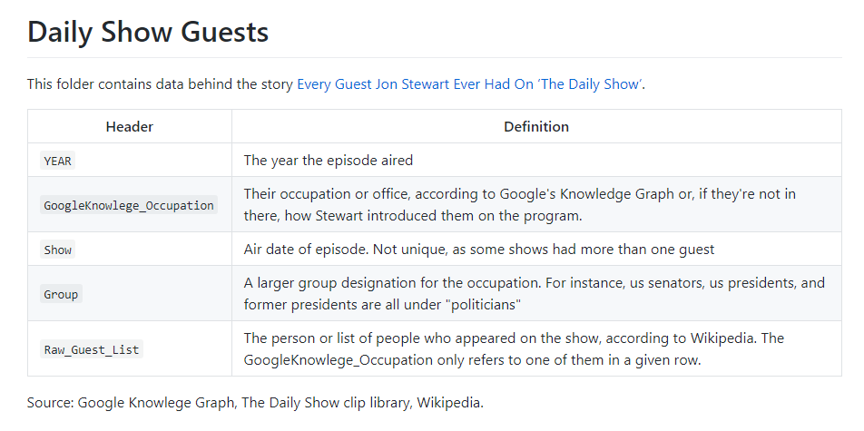

```{r setup, include=FALSE}
knitr::opts_chunk$set(echo = TRUE)
```

```{r, include=FALSE}
library(dplyr)
library(tidyverse)
library(tidyr)
library(knitr)
library(stringr)
```

##DATA 607 - Tidyverse Recipes 

###Tidy The Daily Show Dataset


In this recipe, we will clean a FiveThirtyEight.com dataset behind an article on Jon Stewart's final show listing all of the guests that he had on the show, [Every Guest Jon Stewart Ever Had On 'The Daily Show'](https://fivethirtyeight.com/features/every-guest-jon-stewart-ever-had-on-the-daily-show/)

The dataset was downloaded from this Github repository:

[GitHub Repo](https://github.com/fivethirtyeight/data/tree/master/daily-show-guests)



####Load the Dataset
```{r}
daily_show_guests <- read.csv('https://raw.githubusercontent.com/fivethirtyeight/data/master/daily-show-guests/daily_show_guests.csv')


```


####Exploratory Analysis

The dataset consists of 2,693 observations and five variables, "Year", "GoogleKnowlege_Occupation" (a Google determination of the guest's occupation), ""Date the Show Aired","Show" (date that the show aired), "Group", and "Raw_Guest_List" (taken from Wikipedia).


```{r}
dim(daily_show_guests)
```


#####1. Variable Names
Variable names need to be updated to better reflect the data.

```{r}
names(daily_show_guests)
```


#####2. GoogleKnowlege_Occupation
GoogleKnowlege_Occupation shows a considerable number of errors, mis-spellings, title case errors. etc.

```{r}
GoogleKnowlege_Occupation <- daily_show_guests %>% 
              group_by(GoogleKnowlege_Occupation) %>% 
              summarise(n = n())

head(GoogleKnowlege_Occupation, 10)
```


#####3. Group

```{r}
Category <- daily_show_guests %>% 
              group_by(Group) %>% 
              summarise(n = n())
Category


```


####Recipe Steps:

1. Change the variable names to improve the accurarcy of what it's capturing.
2. Delete rows where "Group" is NA which means that there was no guest.
3. Convert the Occupation variable to Title case and correct mis-spellings of each title
4. Conform the Group data to more distinct categories, i.e. "Political Aide" and "Politician" should be "Politics".

```{r, include=FALSE}
library(plyr)
new_daily_show_df <- daily_show_guests %>% 
                     rename(c(Year = 'Year',
                            GoogleKnowlege_Occupation = 'Occupation',
                            Show = 'Air Date', 
                            Group = 'Category',
                            Raw_Guest_List = 'Guest')) %>% 
                            filter(!is.na(Category) ) %>% 
                            mutate(Occupation = str_to_title(Occupation)) %>% 
                            mutate(Occupation = case_when(Occupation=="Aei President"~"AEI President",
                    Occupation == "American Football Wide Reciever"~"American Football Wide Receiver",
                    Occupation == "Assistant Secretary Of Defense"~"Assistant Secretary of Defense",
                    Occupation == "Assistant To The President For Communications"~"Assistant to the  President For Communications",
                    Occupation == "Associate Justice Of The Supreme Court Of The United States"~"Associate Justice of the  Supreme Court of the  United States",
                    Occupation == "Attorney At Law"~"Attorney",
                    Occupation == "Author Of Novels"~"Author",
                    Occupation == "Baseball Athlete"~"Baseball Player",
                    Occupation == "Busines Magnate"~"Business Person",
                    Occupation == "Business Magnate"~"Business Person",
                    Occupation == "Businessman"~"Business Person",
                    Occupation == "Businesswoman"~"Business Person",
                    Occupation == "Celbrity Chef"~"Chef",
                    Occupation == "Chief Technology Officer Of United States"~"Chief Technology Officer of United States",
                    Occupation == "Comic"~"Comedian",
                    Occupation == "Comptroller Of The Us"~"Comptroller of the  United States",
                    Occupation == "Coorespondant"~"Correspondent",
                    Occupation == "Director Of The Consumer Financial Protection Bureau"~"Director of the  Consumer Financial Protection Bureau",
                    Occupation == "Epa Administrator"~"EPA Administrator",
                    Occupation == "Fbi Agent"~"FBI Agent",
                    Occupation == "Film-Maker"~"Filmmaker",
                    Occupation == "Film Actor"~"Actor",
                    Occupation == "Film Actress"~"Actress",
                    Occupation == "First Lady Of Egypt"~"First Lady of Egypt",
                    Occupation == "First Lady Of The United States"~"First Lady of the  United States",
                    Occupation == "First Minister Of Scotland"~"First Minister of Scotland",
                    Occupation == "Former Assistant To The President For Communications"~"Former Assistant to the  President For Communications",
                    Occupation == "Former Associate Justice Of The Supreme Court Of The United States"~"Former Associate Justice of the  Supreme Court of the  United States",
                    Occupation == "Former Cia Director"~"Former CIA Director",
                    Occupation == "Former Director Of The National Economic Counscil"~"Former Director of the  National Economic Council",
                    Occupation == "Former Director Of The Office Of Management And Budget"~"Former Director of the  Office of Management and Budget",
                    Occupation == "Former First Lady Of The United States"~"Former First Lady of the  United States",
                    Occupation == "Former Governor Of Arizona"~"Former Governor of Arizona",
                    Occupation == "Former Governor Of Arkansas"~"Former Governor of Arkansas",
                    Occupation == "Former Governor Of California"~"Former Governor of California",
                    Occupation == "Former Governor Of Illinois"~"Former Governor of Illinois",
                    Occupation == "Former Governor Of Indiana"~"Former Governor of Indiana",
                    Occupation == "Former Governor Of Louisiana"~"Former Governor of Louisiana",
                    Occupation == "Former Governor Of Massachusetts"~"Former Governor of Massachusetts",
                    Occupation == "Former Governor Of Michigan"~"Former Governor of Michigan",
                    Occupation == "Former Governor Of Minnesota"~"Former Governor of Minnesota",
                    Occupation == "Former Governor Of Missouri"~"Former Governor of Missouri",
                    Occupation == "Former Governor Of Montans"~"Former Governor of Montana",
                    Occupation == "Former Governor Of Nebraska"~"Former Governor of Nebraska",
                    Occupation == "Former Governor Of New Hampshire"~"Former Governor of New Hampshire",
                    Occupation == "Former Governor Of New Jersey"~"Former Governor of New Jersey",
                    Occupation == "Former Governor Of New Mexico"~"Former Governor of New Mexico",
                    Occupation == "Former Governor Of New York"~"Former Governor of New York",
                    Occupation == "Former Governor Of Pennsylvania"~"Former Governor of Pennsylvania",
                    Occupation == "Former Governor Of Rhode Island"~"Former Governor of Rhode Island",
                    Occupation == "Former Governor Of Texas"~"Former Governor of Texas",
                    Occupation == "Former Governor Of Vermont"~"Former Governor of Vermont",
                    Occupation == "Former Governor Of Washington"~"Former Governor of Washington",
                    Occupation == "Former Govrnor Of Masssachusetts"~"Former Governor of Massachusetts",
                    Occupation == "Former Hhs Secretary"~"Former HHS Secretary",
                    Occupation == "Former Lieutenant Governor Of Maryland"~"Former Lieutenant Governor of Maryland",
                    Occupation == "Former Majority Leader"~"Former Majority Leader",
                    Occupation == "Former Mayor Of Cincinatti"~"Former Mayor of Cincinnati",
                    Occupation == "Former Mayor Of Cincinnati"~"Former Mayor of Cincinnati",
                    Occupation == "Former Mayor Of New Orleans"~"Former Mayor of New Orleans",
                    Occupation == "Former Mayor Of New York"~"Former Mayor of New York City",
                    Occupation == "Former Mayor Of New York City"~"Former Mayor of New York City",
                    Occupation == "Former Mayor Of San Antonio"~"Former Mayor of San Antonio",
                    Occupation == "Former Member Of The United States Senate"~"Former Member of the United States Senate",
                    Occupation == "Former Mjority Leader"~"Former Majority Leader",
                    Occupation == "Former National Security Advisio\\R"~"Former National Security Advisor",
                    Occupation == "Former Omb Director"~"Former OMB Director",
                    Occupation == "Former President"~"Former President",
                    Occupation == "Former President Of Mexico"~"Former President of Mexico",
                    Occupation == "Former President Of Pakistan"~"Former President of Pakistan",
                    Occupation == "Former President Of The Maldives"~"Former President of the  Maldives",
                    Occupation == "Former Press Secretary"~"Former Press Secretary",
                    Occupation == "Former Secretary Of Defense"~"Former Secretary of Defense",
                    Occupation == "Former Senator"~"Former Senator",
                    Occupation == "Former Senator From Kansas"~"Former Senator From Kansas",
                    Occupation == "Former Senior Advisor To The Presidnet"~"Former Senior Advisor to the  President",
                    Occupation == "Former Speaker Of The The House"~"Former Speaker of the House",
                    Occupation == "Former U.s. Congressman"~"Former United States Congressman",
                    Occupation == "Former U.s. Representative"~"Former United States Representative",
                    Occupation == "Former U.s. Senator"~"Former United States Senator",
                    Occupation == "Former United States Deputy Secretary Of State"~"Former United States Deputy Secretary of State",
                    Occupation == "Former United States National Security Advisor"~"Former United States National Security Advisor",
                    Occupation == "Former United States Secretary Of Education"~"Former United States Secretary of Education",
                    Occupation == "Former United States Secretary Of Energy"~"Former United States Secretary of Energy",
                    Occupation == "Former United States Secretary Of Labor"~"Former United States Secretary of Labor",
                    Occupation == "Former United States Secretary Of State"~"Former United States Secretary of State",
                    Occupation == "Former United States Secretary Of The Interior"~"Former United States Secretary of the  Interior",
                    Occupation == "Former United States Secretary Of The Treasury"~"Former United States Secretary of the  Treasury",
                    Occupation == "Former United States Secretary Of Transportation"~"Former United States Secretary of Transportation",
                    Occupation == "Former United States Senator"~"Former United States Senator",
                    Occupation == "Former Us Representativ"~"Former United States Representative",
                    Occupation == "Former Us Representative"~"Former United States Representative",
                    Occupation == "Former Us Secretary Of Defense"~"Former United States Secretary of Defense",
                    Occupation == "Former Us Secretary Of Education"~"Former United States Secretary of Education",
                    Occupation == "Former Us Secretary Of State"~"Former United States Secretary of State",
                    Occupation == "Former Us Senator"~"Former United States Senator",
                    Occupation == "Former Vice President"~"Former Vice President",
                    Occupation == "Former White House Chief Of Staff"~"Former White House Chief of Staff",
                    Occupation == "Governor Of New Jersey"~"Governor of New Jersey",
                    Occupation == "Governor Of Virginia"~"Governor of Virginia",
                    Occupation == "Inspector General Of Homeland Security Department"~"Inspector General of Homeland Security Department",
                    Occupation == "Mayor Of Chicago"~"Mayor of Chicago",
                    Occupation == "Mayor Of London"~"Mayor of London",
                    Occupation == "Minister Of Defense"~"Minister of Defense",
                    Occupation == "Minority Leader Of The United States House Of Representatives"~"Minority Leader of the  United States House of Representatives",
                    Occupation == "Nyc Mayor"~"New York City Mayor",
                    Occupation == "President Of Liberia"~"President of Liberia",
                    Occupation == "Presidnet"~"President",
                    Occupation == "Rnc Chairman"~"Republican National Committee Chairman",
                    Occupation == "Secretary Of State"~"Secretary of State",
                    Occupation == "Television Actor"~"Actor",
                    Occupation == "Television Actress"~"Actress",
                    Occupation == "Televison Actor"~"Actor",
                    Occupation == "Telvision Actor"~"Actor",
                    Occupation == "Telvision Personality"~"Television Personality",
                    Occupation == "Track And Field Athlete"~"Track and Field Athlete",
                    Occupation == "Tv Producer"~"Television Producer",
                    Occupation == "United States Ambassador To The United Nations"~"United States Ambassador to the  United Nations",
                    Occupation == "United States Secretary Of Agriculture"~"United States Secretary of Agriculture",
                    Occupation == "United States Secretary Of Defense"~"United States Secretary of Defense",
                    Occupation == "United States Secretary Of Housing And Urban Development"~"United States Secretary of Housing and Urban Development",
                    Occupation == "United States Secretary Of The Navy"~"United States Secretary of the  Navy",
                    Occupation == "Us Assistant Attorney"~"United States Assistant Attorney",
                    Occupation == "Us Official"~"United States Official",
                    Occupation == "Us Permanent Representative To Nato"~"United States Permanent Representative to NATO",
                    Occupation == "Us President"~"United States President",
                    Occupation == "Us Representative"~"United States Representative",
                    Occupation == "Us Secetary Of Education"~"United States Secretary of Education",
                    Occupation == "Us Secretary Of Defense"~"United States Secretary of Defense",
                    Occupation == "Us Secretary Of Energy"~"United States Secretary of Energy",
                    Occupation == "Us Senator"~"United States Senator",
                    Occupation == "White House Sommunications Director"~"White House Communications Director", TRUE ~ as.character(Occupation))) %>% 
                    mutate(Category = case_when(Category=="Academic"~"Academia",
                            Category=="Acting"~"Actor",
                            Category=="media"~"Media",
                            Category=="Musician"~"Music",
                            Category=="Political Aide"~"Politics",
                            Category=="Politician"~"Politics", TRUE ~ as.character(Category)))
                                                        
    

detach(package:plyr)
                    
```


```{r}
Occupation <- new_daily_show_df %>% 
              group_by(Occupation, Category) %>% 
              summarise(n = n())
Occupation

```

```{r}
head(new_daily_show_df,35)
```

####Suggestions for further cleaning:
1. Update the Misc
2. Unnest the names. Some of the Guest values are multi-entry.
3. Add a frequency variable.


```{r}
new_daily_show_df[new_daily_show_df$Category == "Misc",]
```


